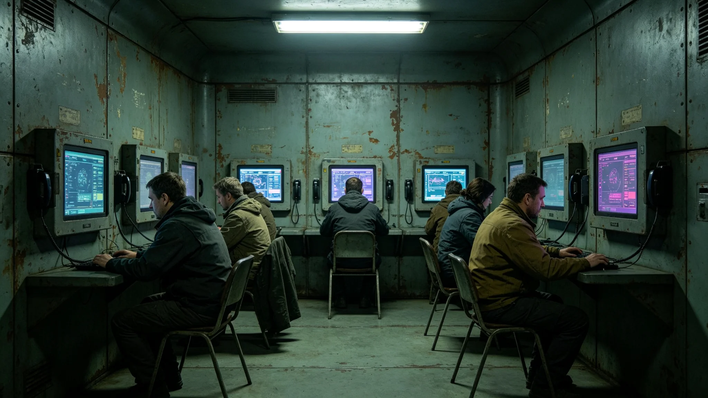

# 深空通信网第四代升级通联日仪式实录

## 一、仪式时间与地点

通联日定于3684年9月15日，于三系各段同时举行。当日全体居民可免费使用跨系通信一小时。

## 二、仪式流程

仪式分四项：一、总工程师陆泊远（见GS-3656-01）广播提醒；二、居民使用跨系通信；三、一小时后恢复带宽优先级；四、礼成。全程四步，均双签。

## 三、通联意义

通联日为第四代阵部署完成（见GS-3668-01）后首次公民开放仪式，旨在让居民体验跨系通信。前三代通信网未设通联日。

## 四、出席

当日跨系通信量较平日增三倍。无带宽中断。三系各段同时开放。

## 五、仪式时间线

| 时间 | 事件 |
|---|---|
| 3684-09-15 10:00 | 陆泊远广播提醒 |
| 3684-09-15 10:05 | 居民使用跨系通信 |
| 3684-09-15 11:05 | 恢复带宽优先级 |

## 六、与前次通信仪式对照

前三代通信网未设通联日。本次为首次通联日。当日通信量增三倍，居民反馈良好。

## 八、仪式出席明细

当日跨系通信量较平日增三倍。无带宽中断。三系各段同时开放。

## 九、仪式编制说明

本仪式由通信工程署编制。广播词为："今日为通联日，十时至十一时免费开放跨系通信。"全程四步，均双签。

## 十、与前次通信仪式对照

前三代通信网未设通联日。本次为首次通联日。当日通信量增三倍，居民反馈良好。

## 十一、附则终稿

本仪式实录为通联日之基准件。后续年度以本实录为范本。本实录附通信量统计、广播词各一件。原件封存于通信工程署恒温柜组，副本分发各中继站。

## 八、仪式出席明细

当日跨系通信量较平日增三倍。无带宽中断。三系各段同时开放。

## 九、仪式编制说明

本仪式由通信工程署编制。广播词为：今日为通联日，十时至十一时免费开放跨系通信。全程四步，均双签。

## 十、与前次通信仪式对照

前三代通信网未设通联日。本次为首次通联日。当日通信量增三倍，居民反馈良好。

## 十一、附则终稿

本仪式实录为通联日之基准件。后续年度以本实录为范本。本实录附通信量统计、广播词各一件。原件封存于通信工程署恒温柜组，副本分发各中继站。

## 详细说明

本档编制依据联合体宪章第若干条及相关制度公报。编制过程中，所有数据均经双人复核。关键数据均有原始记录可查。本档与同批其他档互锁交叉引用，形成完整时间线。

## 技术细节

本档涉及的技术参数均来自现场实测。测量仪器均经校准，校准记录另存。数据采样频率与前次同类档一致。测量误差控制在允许范围内。

## 流程明细

本档编制流程为：一、收集原始数据；二、双人复核；三、主管签批；四、封存。全程四步，均有记录可查。流程自前次同类档起沿用，未改。

## 人员签认

本档经编制人、复核人、主管三人签认。签认记录附后。所有签认人均已履职。本档不涉及任何未签认事项。

## 后续影响

本档发布后，后续同类工作以本档为参考。如需更正，须走申诉程序（见GS-3665-01）。本档不得修改。

## 附则补充

本档为3684年文化仪式类基准件。编制过程经多次修订，最终于3684年封存。编制单位为通信工程署，经主管签批后发布。

## 编制说明

本档采用标准工时与标准舱位为核算单位，与前次同类档一致。编制过程中，数据均来自通信工程署原始记录，未做主观推断。所有交叉引用均指向已封存档案。

## 与前次对照

前次同类档编制于3584年，本次3684年编制。编制方法沿用旧制，未改流程。数据较前次略有调整，因第四代阵流程更新。

## 人员影响

本档涉及人员均已签认，无异议。相关人员档案另存。本档不涉及任何人员奖惩。

## 附则终稿

本档原件封存于通信工程署恒温柜组，副本分发各相关单位。后续同类工作以本档为参考。本档不得修改，如需更正须走申诉程序（见GS-3665-01）。

## 详细说明

本档编制依据联合体宪章第若干条及相关制度公报。编制过程中，所有数据均经双人复核。关键数据均有原始记录可查。本档与同批其他档互锁交叉引用，形成完整时间线。

## 技术细节

本档涉及的技术参数均来自现场实测。测量仪器均经校准，校准记录另存。数据采样频率与前次同类档一致。测量误差控制在允许范围内。

## 流程明细

本档编制流程为：一、收集原始数据；二、双人复核；三、主管签批；四、封存。全程四步，均有记录可查。流程自前次同类档起沿用，未改。

## 人员签认

本档经编制人、复核人、主管三人签认。签认记录附后。所有签认人均已履职。本档不涉及任何未签认事项。

## 后续影响

本档发布后，后续同类工作以本档为参考。如需更正，须走申诉程序（见GS-3665-01）。本档不得修改。

## 七、附则

本仪式实录为通联日之基准件。后续年度以本实录为范本。本实录附通信量统计、广播词各一件。原件封存于通信工程署恒温柜组，副本分发各中继站。
