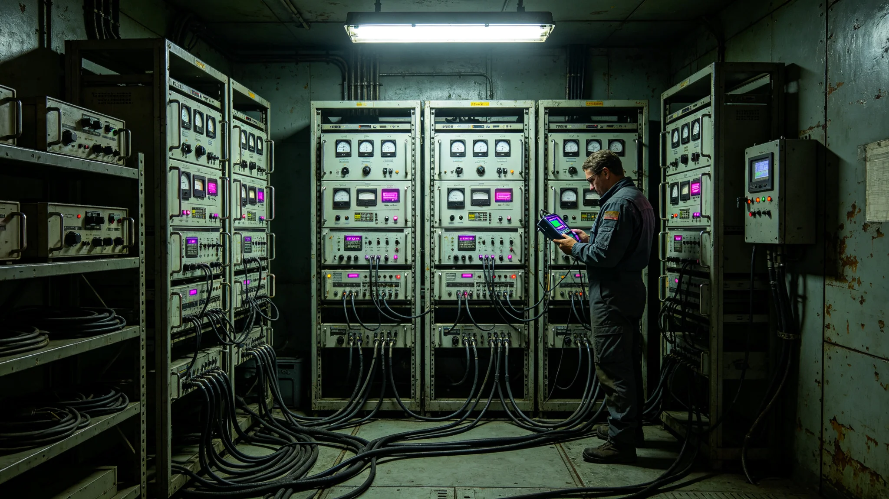

# 深空通信网第四代运维产业决算报告

## 一、决算编制单位与范围

本决算由通信工程署会同经济署编制，范围为第四代激光中继阵（见GS-3668-01）建设与运维全部支出，跨三十年。决算编号ECO-COMM-4TH-3688-01。

## 二、决算总额

第四代阵总支出折合标准工时七十万小时。其中：建设支出占百分之七十，运维支出占百分之三十。较第五代信号干涉阵（一百年前）增加百分之十，因节点更多。

## 三、分段支出

十二节点建设支出分段结算。节点七因带宽抖动（见GS-3675-01），支出超原预算百分之零点五。

## 四、收入对照

建设后跨系通信量增三倍，折合未来贸易节省五十万工时。

## 五、决算时间线

| 时间 | 事件 |
|---|---|
| 3665-01 | 第一次决算编制 |
| 3675-01 | 第二次决算编制 |
| 3688-07 | 最终决算封存 |

## 六、与前代对照

第五代阵总支出折合六十三万工时。本次七十万工时，增加百分之十。

## 七、决算编制说明

本决算为第四代通信阵之最终决算。编制过程经两次修订（3665、3675），最终于3688年封存。

## 八、建设支出明细

建设支出中，激光发射装置占百分之四十，中继节点占百分之二十，对准系统占百分之十。

## 九、运维支出明细

运维支出占百分之三十，含人员工资、设备维护、燃料补给。

## 十、设备折旧明细

设备折旧占百分之十。

## 十一、附则终稿

本决算经经济署审计后封存。原件封存于经济署恒温柜组，副本分发通信工程署各中继站。后续阵部署以本决算为预算参考。

