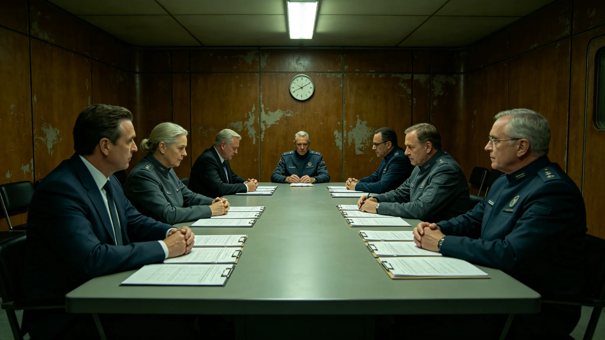

# 文明存续七百周年中期评估咨询审计产业决算报告

## 一、决算编制单位与范围

本决算由中期评估审计署会同经济署编制，范围为七百周年中期评估（见GS-3658-01、GS-3665-01）全部支出，跨十年。决算编号ECO-REVIEW-700TH-3691-01。

## 二、决算总额

中期评估总支出折合标准工时五万小时。其中：人员支出占百分之七十，设备支出占百分之二十，咨询支出占百分之十。较六百周年评估增加百分之十。

## 三、分段支出

三系各段评估支出分段结算。

## 四、收入对照

评估后整改建议折合未来维护节省十万工时。

## 五、决算时间线

| 时间 | 事件 |
|---|---|
| 3682-01 | 第一次决算编制 |
| 3691-12 | 最终决算封存 |

## 六、与前次评估对照

六百周年评估总支出折合四万五千工时。本次五万工时，增加百分之十。

## 七、决算编制说明

本决算为七百周年中期评估之最终决算。编制过程经一次修订（3682），最终于3691年封存。

## 八、人员支出明细

人员支出中，审计官工资占百分之五十，咨询顾问占百分之二十。

## 九、设备支出明细

设备支出中，审计工具占百分之十五，检测仪占百分之五。

## 十、咨询支出明细

咨询支出占百分之十，含外部专家咨询费。

## 十一、附则终稿

本决算经经济署审计后封存。原件封存于经济署恒温柜组，副本分发审计署各段。后续评估以本决算为预算参考。

