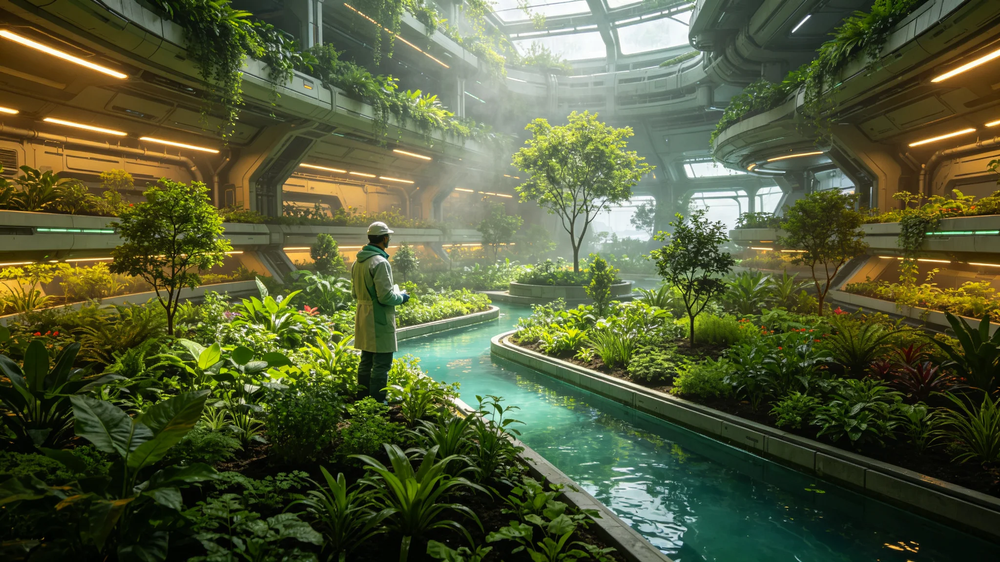

# 世代飞船生态系统第十次大轮换后稳态运行十年监测报告

## 一、监测编制单位与范围

本报告由生保工程署编制，范围为第十次大轮换（见GS-3669-01）后稳态运行十年（3682~3692）监测数据。报告编号ECOLOG-10TH-10Y-3692-01。

## 二、稳态指标

十年间生态系统各项指标稳定：氧气浓度波动小于百分之零点五，二氧化碳浓度稳定，水循环效率百分之九十八，氮循环完整。

## 三、菌剂谱系

第十次大轮换菌剂谱系（见GS-3669-01）十年后存活良好，无退化。关键菌种浓度稳定。

## 四、动植物

轮换后动植物群落稳定，无灭绝事件。垂直森林（见GS-3693-01）第四百年运行良好。

## 五、监测时间线

| 时间 | 事件 |
|---|---|
| 3682 | 轮换后第一年监测 |
| 3687 | 轮换后第五年监测 |
| 3692 | 轮换后第十年监测 |

## 六、与前次轮换对照

第九次大轮换后稳态十年指标本次一致。轮换成功。

## 七、监测编制说明

本报告为第十次大轮换后稳态十年之监测报告。监测由生保工程署执行，每季度采样一次。报告编号ECOLOG-10TH-10Y-3692-01。

## 八、氧气浓度监测明细

十年间氧气浓度稳定在百分之二十点九至二十一点一之间，波动小于百分之零点二。无超阈事件。

## 九、水循环监测明细

水循环效率百分之九十八，与轮换前一致。水处理膜（见GS-3594-01）运行良好。

## 十、氮循环监测明细

氮循环完整，无积累。关键菌种浓度稳定。

## 十一、附则终稿

本报告经生保工程署审计后封存。原件封存于生保工程署恒温柜组，副本分发各生态舱。后续轮换以本报告为参考。

