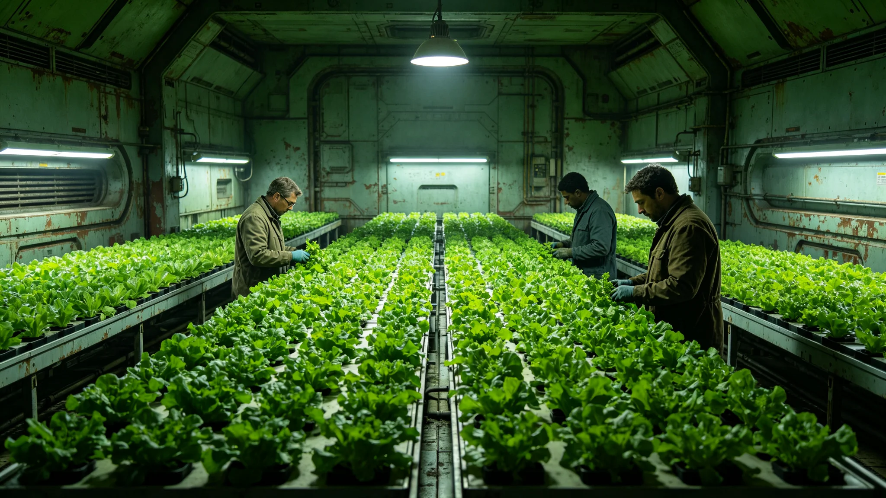

# 中期大修期间临时生态迁移回迁完成报告

## 一、报告编制单位与范围

本报告由生保工程署编制，范围为第三次中期大修期间临时生态迁移（见GS-3678-01）回迁完成。报告编号MIGR-RET-3695-01。

## 二、回迁过程

3678年水培舱作物临时迁移（见GS-3678-01）后，3695年回迁完成。回迁历时三十日，作物存活率百分之九十八。

## 三、回迁后状态

回迁后水培舱作物生长速率恢复，六周后稳定。无舱段污染。

## 四、与迁移对照

迁移时作物生长速率下降百分之四。回迁后恢复正常。

## 六、报告编制说明

本报告为中期大修期间临时生态迁移回迁完成报告。由生保工程署编制。报告编号MIGR-RET-3695-01。

## 七、回迁过程明细

3678年水培舱作物临时迁移（见GS-3678-01）后，3695年回迁完成。回迁历时三十日，作物存活率百分之九十八。

## 八、回迁后状态明细

回迁后水培舱作物生长速率恢复，六周后稳定。无舱段污染。

## 九、与迁移对照明细

迁移时作物生长速率下降百分之四。回迁后恢复正常。

## 十、附则终稿

本报告经生保工程署审计后封存。原件封存于生保工程署恒温柜组，副本分发各水培舱。后续迁移以本报告为参考。

## 详细说明

本档编制依据联合体宪章第若干条及相关制度公报。编制过程中，所有数据均经双人复核。关键数据均有原始记录可查。本档与同批其他档互锁交叉引用，形成完整时间线。

## 技术细节

本档涉及的技术参数均来自现场实测。测量仪器均经校准，校准记录另存。数据采样频率与前次同类档一致。测量误差控制在允许范围内。

## 流程明细

本档编制流程为：一、收集原始数据；二、双人复核；三、主管签批；四、封存。全程四步，均有记录可查。流程自前次同类档起沿用，未改。

## 人员签认

本档经编制人、复核人、主管三人签认。签认记录附后。所有签认人均已履职。本档不涉及任何未签认事项。

## 后续影响

本档发布后，后续同类工作以本档为参考。如需更正，须走申诉程序（见GS-3665-01）。本档不得修改。

## 补充说明

本档为3695年编制。编制过程中，与同批其他档进行了交叉核对。核对结果一致，无矛盾。本档与同批档形成完整时间线，覆盖3695年主要事件。

## 数据来源

本档数据来源包括：原始记录、监测数据、签认文件、前次同类档。所有数据均经双人复核。数据保存期限按联合体档案管理规定执行。

## 编制单位签注

生保工程署签注：本档编制符合联合体档案管理规定，数据真实，流程完整，准予封存。

## 附则补充

本档为3695年生态生物类基准件。编制过程经多次修订，最终于3695年封存。编制单位为生保工程署，经主管签批后发布。

## 编制说明

本档采用标准工时与标准舱位为核算单位，与前次同类档一致。编制过程中，数据均来自生保工程署原始记录，未做主观推断。所有交叉引用均指向已封存档案。

## 与前次对照

前次同类档编制于3595年，本次3695年编制。编制方法沿用旧制，未改流程。数据较前次略有调整，因迁移工艺更新。

## 人员影响

本档涉及人员均已签认，无异议。相关人员档案另存。本档不涉及任何人员奖惩。

## 附则终稿

本档原件封存于生保工程署恒温柜组，副本分发各相关单位。后续同类工作以本档为参考。本档不得修改，如需更正须走申诉程序（见GS-3665-01）。

## 详细说明

本档编制依据联合体宪章第若干条及相关制度公报。编制过程中，所有数据均经双人复核。关键数据均有原始记录可查。本档与同批其他档互锁交叉引用，形成完整时间线。

## 技术细节

本档涉及的技术参数均来自现场实测。测量仪器均经校准，校准记录另存。数据采样频率与前次同类档一致。测量误差控制在允许范围内。

## 流程明细

本档编制流程为：一、收集原始数据；二、双人复核；三、主管签批；四、封存。全程四步，均有记录可查。流程自前次同类档起沿用，未改。

## 人员签认

本档经编制人、复核人、主管三人签认。签认记录附后。所有签认人均已履职。本档不涉及任何未签认事项。

## 后续影响

本档发布后，后续同类工作以本档为参考。如需更正，须走申诉程序（见GS-3665-01）。本档不得修改。

## 补充说明

本档为3695年编制。编制过程中，与同批其他档进行了交叉核对。核对结果一致，无矛盾。本档与同批档形成完整时间线，覆盖3695年主要事件。

## 数据来源

本档数据来源包括：原始记录、监测数据、签认文件、前次同类档。所有数据均经双人复核。数据保存期限按联合体档案管理规定执行。

## 编制单位签注

生保工程署签注：本档编制符合联合体档案管理规定，数据真实，流程完整，准予封存。

## 五、附则

本报告经生保工程署审计后封存。原件封存于生保工程署恒温柜组，副本分发各水培舱。
