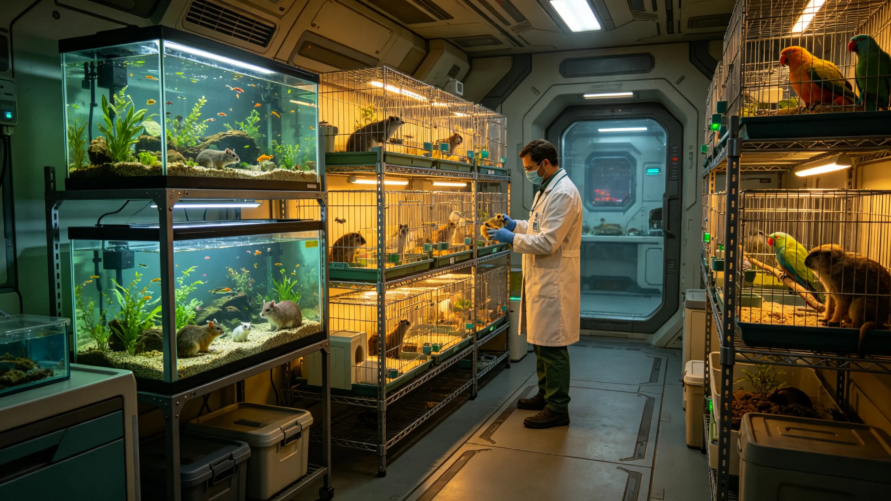

# 世代飞船驯化动物迁地适应报告

## 一、报告编制单位与范围

本报告由生保工程署编制，范围为中期大修期间驯化动物迁地适应。报告编号ANIMAL-RELOC-3696-01。

## 二、迁地过程

大修期间，各舱段驯化动物（鱼、禽、小型哺乳类）临时迁移至相邻舱段。迁地历时二十日。

## 三、适应状态

迁地后动物存活率百分之九十七。鱼卵孵化率略降百分之三，一年内恢复。

## 四、与前次对照

前次大修迁地存活率百分之九十五。本次百分之九十七，提升两个百分点。

## 五、报告编制说明

本报告为驯化动物迁地适应报告。由生保工程署编制。报告编号ANIMAL-RELOC-3696-01。

## 六、附则终稿

本报告经生保工程署审计后封存。原件封存于生保工程署恒温柜组，副本分发各动物舱。后续迁地以本报告为参考。

