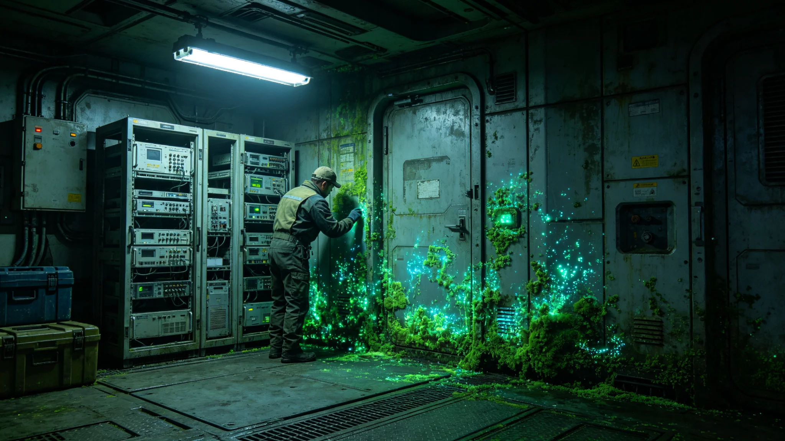

# 深空通信阵旁生物膜生长监测报告

## 一、报告编制单位与范围

本报告由生保工程署会同通信工程署编制，范围为第四代激光中继阵旁生物膜生长监测。报告编号BIOFILM-COMM-3697-01。

## 二、生物膜状态

通信阵旁舱壁表面生物膜生长正常。主要菌种为无害菌，未侵入阵体。监测显示生物膜厚度稳定，未影响通信。

## 三、清理记录

每半年清理一次阵旁生物膜，防止侵入阵体。本次清理记录完好。

## 四、与前次对照

第五代阵旁生物膜监测（见GS-3565-01）显示无异常。本次第四代阵旁亦无异常。

## 五、报告编制说明

本报告为通信阵旁生物膜生长监测报告。由生保工程署会同通信工程署编制。报告编号BIOFILM-COMM-3697-01。

## 六、附则终稿

本报告经生保工程署会同通信工程署审计后封存。原件封存于生保工程署恒温柜组，副本分发各中继站。后续监测以本报告为参考。

