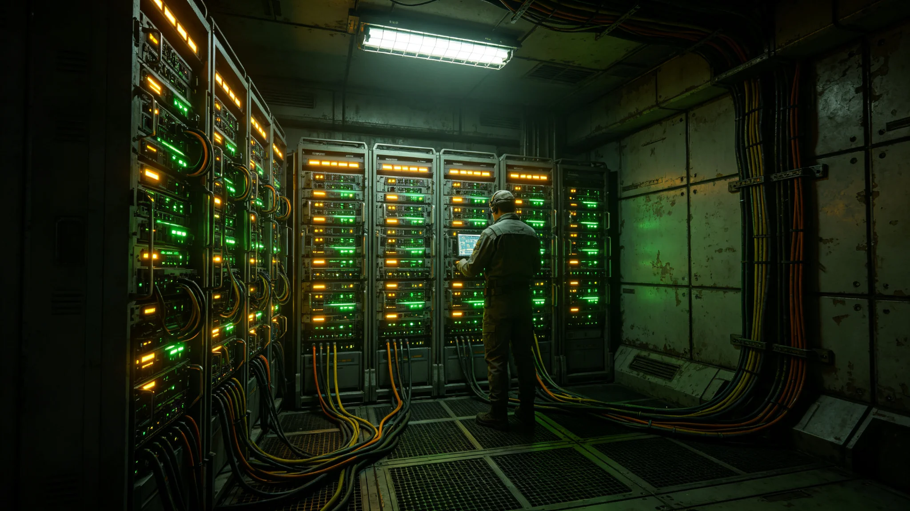

# 深空通信网第四代升级期间加密算法同步升级公报

## 一、公报编制单位与范围

本公报由通信工程署会同防御司令部编制，范围为第四代激光中继阵（见GS-3668-01）部署期间加密算法同步升级。公报编号DEF-ENC-3699-01。

## 二、加密升级内容

第四代阵部署期间，通信加密算法从第八代升级至第九代。新算法密钥长度翻倍，抗破译能力提升。

## 三、升级时间

加密升级与阵体部署同步完成。升级期间无通信中断。

## 四、防护效果

升级后，跨系通信抗破译能力较前代提升一倍。防御司令部签注：加密升级及时。

## 五、与前代对照

第五代阵部署时加密升级至第八代。本次升级至第九代，密钥长度翻倍。

## 六、公报编制说明

本公报为第四代通信阵加密升级公报。由通信工程署会同防御司令部编制。公报编号DEF-ENC-3699-01。

## 七、附则终稿

本公报经通信工程署会同防御司令部签批后发布。原件封存于通信工程署恒温柜组，副本分发各中继站。后续升级以本公报为参考。

