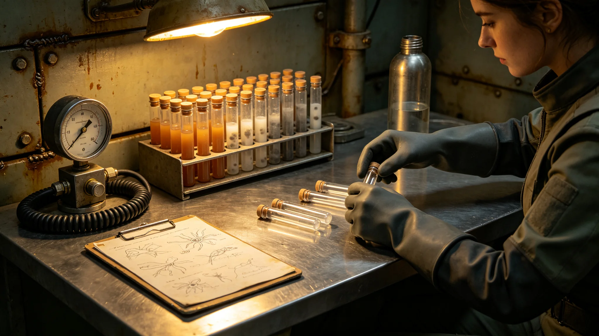

# 砾石前哨站首席生态学家牧云笈在职考核记录

本件为砾石前哨站首席生态学家牧云笈（编号QS-ECO-3702-007）第二个考核年度之在职考核记录，由前哨医疗官兼考核组代签。记录不以事迹叙事成篇，唯列考勤、采样台账、体检、三次评审意见、一次科研事故处置摘要与交叉监测安排，凡八页，封皮贴一张培养架菌落照片。

考勤台账显示，前哨建设第二年全年，牧云笈出勤三百四十二日，其中野外采样一百一十七次，单人携密闭采样箱步行往返，单程最远一次为十二公里。考勤机读数显示其多次在交接班后滞留生态舱逾两小时，系统未计加班，其本人亦未申报。考勤备注栏由考勤员补注："多次补取丢弃样管，按惯例不计工时。"年终考勤汇总表上，其有效工时登记为全岗第一，但申报加班时长为零；汇总表上考勤员另注"其本人拒绝任何补休折算"。

采样台账载明其全年处理异星本土微生物分离样本四百一十管，其中送入培养柜存活者六十二管，存活率百分之十五点一。台账附一张培养架照片登记号，可见菌落颜色以赭褐、灰白为主，未见鲜艳色素。她在台账边批注："本地微生物嗜低温、怕氧，培养柜氧分压须再降两成；温度须降至零下五度区间。"她据此修订了培养规程，次季存活率升至百分之二十二。台账后附她手绘的一株本土菌形态草图，标注其分裂速率随温度变化的曲线。

体检通报由前哨医疗官签发，归档于记录第四页。受检者指端皮肤因长期操作密闭采样箱出现压痕与局部湿疹，建议轮换手套内衬；余无异常。通报附其自行申请的一项长期观察："本人愿作为低剂量本土气溶胶暴露观察对象，期限五年。"医疗官批："须经伦理复核，暂不准；改由自动采样臂代操作。"她在批语旁又写一行："自动臂采样距培养柜过远，样本活性会损。"医疗官再批："活性与安全之间，取安全。"

三次评审意见分别来自生态舱投产前评估、人工生物圈中期评估、异星植物驯化立项评审。第一次评审她坚持推迟生态舱加压运行一个季度，理由为本土菌群背景值未测全，加压后再测将失真；第二次评审她提出人工生物圈须预留百分之十五的冗余缓冲，不得按理论满负荷设计，理由为异星大气组分波动超预期；第三次评审她反对仓促驯化未经两轮检疫的异星植物种子，主张分三批试植，每批间隔一个生长季。三次评审她均持保留意见，三次均被采纳，采纳意见逐条记入会议纪要。

科研事故处置摘要记前哨建设第二年年冬一次小型事故：一只本土菌样管在转移中密封失效，污染相邻三管地球引入菌液。牧云笈当场启动封闭消毒，自身留在污染舱内两小时完成样本转移，未戴全脸面罩，事后做连续七日照片与血检，结果阴性。事故报告将其定级为"操作疏忽"，扣当月绩效一成；她在报告上签收，未申诉。事故后她修订了转移操作规程，要求双人操作、双人复核密封，新规程印成袖珍册发生态舱人手一册。

记录另附其与采矿区的交叉监测安排：她要求在矿区下风侧设三处空气监测点，每月取样一次，监测采矿扬尘是否携带本土微生物扩散。前哨建设第二年共取样十二次，未检出异常扩散。她在监测表后写："矿区与生态舱之间须有隔离带，不可省。"这条意见后被写入《异星生态保护法》（GS-3712-01）第三章。

记录末页附其年度科研产出清单：本土微生物初名录初稿一份、培养条件手册一册、驯化植物试种记录七箱、空气监测月报十二份。清单后有考核组签注："其科研节奏与前哨建设节奏不匹配，多次主张慢半拍；但三次坚持均被证为必要。留任，观察其驯化进度。"本记录至此封卷，下一考核年度另立新卷；其培养手册留生态舱，为在岗操作依据。

本记录另附三份旁证。其一为其与采矿区之交叉监测安排附表，列三处空气监测点坐标、采样频次、责任人。其二为其与医疗官岑未明之往来便签，讨论低剂量本土气溶胶暴露观察申请——她坚持，岑未明坚持伦理复核，两人往返三次，最终定为自动臂采样。其三为其错题本式之"生态舱操作规程"修订记录，共修订七次，每次修订均附理由。

考核组在末页签注后另附一行："其科研节奏慢半拍，但三次坚持均被证为必要。"本记录封存后，下一考核年度另立新卷；其培养手册留生态舱，不随人走。
本记录另附两份材料。其一为考核组签注后另附一行：其科研节奏慢半拍，但三次坚持均被证为必要。其二为下一考核年度计划：扩大野外采样点至二十处，培养本土菌基因库。本记录封存后，下一考核年度另立新卷。
