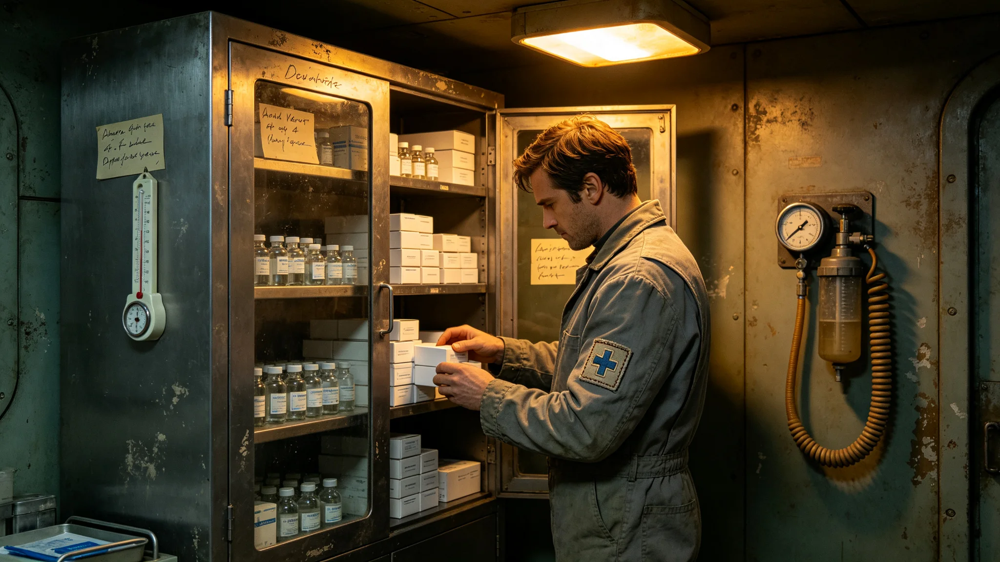

---
author_ai: Doubao
date: 3704-02-01
archive_id: GS-3704-01
coord: 人物×多星纪元×第六恒星系带×科医学派×前哨医疗官
school: 科医学派
threads: [person/cen-weiming, system/outpost-medical]
image: world/生图集/1204.webp
title: 砾石前哨站医疗官岑未明首四年医疗台账与排班记要
canon_check: 本档为砾石前哨站医疗官岑未明首四年医疗台账与排班记要，3704年；正文用世界内历法，无纪元名；与同批事件档互锁。
---# 砾石前哨站医疗官岑未明首四年医疗台账与排班记要

本记要由砾石前哨站医疗官岑未明（编号QS-MED-3704-021）整理，覆盖前哨建设第一至第四年医疗舱运行台账与本人排班，依《前哨医疗档案条例》归档。记要不列病例故事，唯列接诊量、药品库存、骨密度随访、急救演练、一次医疗紧急处置摘要与药柜盘点，凡十页，封皮贴一张药柜盘点照。

台账总量：四年间前哨医疗舱累计接诊二千一百余人次，其中外伤类占四成三，因沙暴暴露所致眼部与呼吸道刺激占两成一，骨密度相关随访占一成七，其余为常规体检与配药。接诊量逐年递增，与前哨人口增长曲线吻合：第一年四百余人次，第四年六百余人次。每月接诊汇总表均由值班护士双人复核签字，汇总表附于记要卷首，按季装订成四册。

药品库存记要：四年间累计消耗抗生素类、镇痛类、抗辐射类三大类。库存周转最紧的一次是前哨建设第三年冬，一批抗辐射药因运输延误到货滞后三周，岑未明将用量压缩至人均最低有效量，优先配给露天作业人员。台账附其手写一行："下次订货须提前两季度，不可赌运输。"他据此修订了药品订货周期，此后各药库存均保持三个月以上安全线；订货周期表贴在药柜内侧，按月勾销。

骨密度随访是其长期工作。前哨人员在薄重力与辐照环境下，骨量流失速率较母星高约三成。他为每名在册人员建立骨密度季度档，前哨建设第二年起推行强制负重训练，并把训练完成率与配给挂钩。四年随访数据显示，坚持训练者骨量流失率下降约一半。他在随访年报后写："不练者流失率不降，此条须写入前哨守则。"年报附一张全员骨密度分布直方图，偏离下限者以红笔圈出，逐一谈话。

急救演练台账：四年间组织全员急救演练十二次，平均每季一次。演练科目含氧中断、辐照暴露、外伤止血、母婴应急。每次演练后他记录一项最薄弱环节：第三次是气闸内氧气佩戴顺序，第七次是伤员后送通道被工程物料占用，第十一次是夜间沙暴下担架视线不足。每条薄弱项均列入下季整改，整改后复测合格方销项；销项清单附台账末页。

一次医疗紧急处置摘要记于前哨建设第四年秋：一名移民在野外作业中突发急性辐射暴露，医疗舱于四十分钟内完成初步去污与剂量评估。记要只列时间线与处置步骤，不渲染。处置后他在台账后记："应急去污间仅够一人同时处理，若两名以上同时暴露将溢出；须扩建第二去污间。"此条后列入前哨扩建需求，第六年批建（见同批子事件档GS-3728-01）。

药柜盘点记要附于卷末：第四年末盘点，抗生素类在库四十二疗程、镇痛类一百二十支、抗辐射类十八疗程、外伤敷料三十包。盘点由两人逐项点验，签字封柜。他在盘点表后写："药品有效期须按月标红，过期即报损，不可误配。"盘点表后附过期药报损记录两页，四年共报损三批，均经站长签批。

记要末页附其本人健康签注：岑未明自到岗起坚持每半年自体检一次，四年七次记录齐备，各项指标稳定。他在签注栏写："医者不自医为戒，故自检不落。"本记要封存于医疗舱档案柜，调阅须经站长签批；其病例明细另存加密卷，不在此记要范围。

本记要另附三份附表。其一为四年接诊量季度统计表，按季列外伤、沙暴暴露、骨密度随访、常规体检四类。其二为药品库存周转表，列各药最高最低库存与补货周期。其三为急救演练薄弱点清单，列十二次演练各自发现之问题与整改结果。

记要末页医疗官签注后另写一行："医者不自医为戒，故自检不落。"本记要正本存医疗舱，副本送自治会；其病例明细另存加密卷，不在此记要范围。
本记要另附两份附表。其一为四年接诊量季度统计表，按季列四类接诊。其二为急救演练薄弱点清单，列十二次演练各自发现之问题与整改。记要末页医疗官签注后另写一行：医者不自医为戒。记要另附本人健康签注：岑未明自到岗起坚持每半年自体检一次，四年七次记录齐备，各项指标稳定。他在签注栏写：医者不自医为戒，故自检不落。本记要封存于医疗舱档案柜，调阅须经站长签批；其病例明细另存加密卷，不在此记要范围。记要另附药柜盘点记录：第四年末盘点，抗生素类在库四十二疗程、镇痛类一百二十支、抗辐射类十八疗程、外伤敷料三十包。盘点由两人逐项点验，签字封柜。他在盘点表后写：药品有效期须按月标红，过期即报损，不可误配。记要末页附其本人健康签注：每半年自体检一次，四年七次记录齐备。本记要另附四年接诊量季度统计表，按季列外伤、沙暴暴露、骨密度随访、常规体检四类。急救演练薄弱点清单列十二次演练各自发现之问题与整改，整改后复测合格方销项。记要末页医疗官签注后另写一行：医者不自医为戒，故自检不落。
