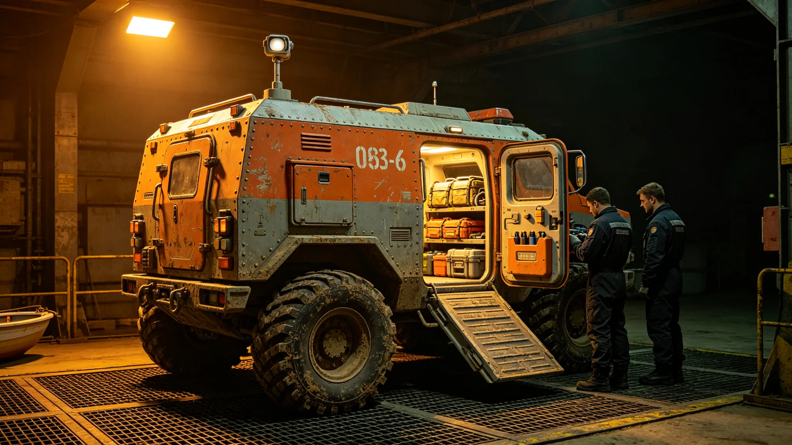

# 砾石前哨站救援队长尉迟海救援出动记录与体能考核

本件为砾石前哨站救援队长尉迟海（编号QS-RES-3706-041）前哨建设第一至第六年救援出动记录与其本人体能考核表合卷。记录按出动时间排列，含任务类型、出动人数、用时、结果；体能考核表单独附于卷末，凡九页，封皮贴一张救援舱加压车辆出动记录照。

六年累计出动救援四十一次。其中因沙暴失联出动十四次，设备故障被困出动九次，野外采样迷路出动六次，车辆故障出动七次，其余为常规协助。四十一次出动中，成功救出并送返者三十九次，两次为迟误——一次因沙暴能见度近乎零，救援车被迫中途折返待命；一次为移民船抵达延误期间一名工人因过度疲劳在途中倒下，就地处置后送返。迟误两次均记录原因，未隐瞒。

每次出动记录均不渲染场面，只列：接报时刻、出舱时刻、抵达时刻、带回人数、设备损耗。尉迟海在最早一次出动记录的空白处写了一句："沙暴里不靠眼睛，靠车距和对讲节奏。"此后所有出动记录首行均固定车距与对讲频次。他把沙暴出动流程总结为三步：放探测球、定方位、低车距跟进，三步缺一不出车；流程印成卡挂救援舱壁。

卷内有一次出动被记为"处置不当"：第四年一次失联搜救中，他判断失联人员在岩脊另一侧，实际风向把人吹向了下风谷地，搜救绕行两小时才定位。事故复盘会上他未辩解，只在复盘表上把"风向推断"一栏改为"先放无人探测球再定人，不靠队长经验"。此后所有沙暴搜救首步必放探测球；复盘表上七名队员逐一签字，无人推责。

救援装备台账记其反复主张增配加压救援车与探测球。前哨建设第三年批下一辆加压救援车，第五年批下第二辆，探测球至第六年末仍只配六台。他在台账后写："六台不够覆盖整个矿区，沙季须增至十台。"此申请列在前哨扩建预算中，未获当年批复；申请附沙季出动热区图一张，标出探测球覆盖盲区。

训练台账记救援队七人轮三班，每周两次沙地拉动训练。第三年一次拉动中，一名队员在低温下加压服内失温，尉迟海令全队就地折返，事后把训练温度下限下调十度。他在训练日志写："救人的人先倒，比不出车更糟。"训练记录另载他要求每次拉动后留一份沙样，以对照出车路线与能见度。

体能考核表单独附卷。尉迟海每半年考核一次，科目含加压服穿脱、氧瓶更换、负重越野、沙地拖拽。六年十二次考核，成绩始终在合格线以上、优秀线以下。表上有一次成绩下滑——第三年那次误判出动后半月，其负重越野用时多出十一秒。考核员未扣分，只注："疲劳期，建议休整。"他拒绝休整，次半年成绩恢复；考核表后附其本人一行："成绩不滑坡是本分，不必表扬。"

卷末附救援队人员名单与排班表，共七人轮三班，另列轮休替补三人。本卷封存于救援舱值班室，每次出动后由值班员补记一行；连续两月无出动，亦须补记一次拉练记录，拉练记录附于出动卷后。

本卷另附三份附表。其一为六年出动记录表，列每次出动之接报时刻、出舱时刻、抵达时刻、带回人数。其二为救援装备清册，列加压车、探测球、担架之数量与状态。其三为人员名单与排班表，列七人三班。

卷末他本人在签注栏写一行："救人的人先倒，比不出车更糟。"本卷封存于救援舱值班室，每次出动后由值班员补记一行。
本卷另附两份附表。其一为六年出动记录表，列每次出动之各时刻。其二为人员名单与排班表，列七人三班。卷末他本人写一行：救人的人先倒，比不出车更糟。训练台账记救援队七人轮三班，每周两次沙地拉动训练。第三年一次拉动中一名队员在低温下加压服内失温，尉迟海令全队就地折返，事后把训练温度下限下调十度。他在训练日志写：救人的人先倒，比不出车更糟。卷末附人员名单与排班表。卷内有一次出动被记为处置不当：第四年一次失联搜救中，他判断失联人员在岩脊另一侧，实际风向把人吹向下风谷地，搜救绕行两小时才定位。事故复盘会上他未辩解，把风向推断一栏改为先放无人探测球再定人。此后所有沙暴搜救首步必放探测球。救援装备台账记其反复主张增配加压救援车与探测球。第六年末探测球仍只配六台。他在台账后写：六台不够覆盖整个矿区，沙季须增至十台。此申请列在前哨扩建预算中，未获当年批复。卷末附人员名单与排班表。救援装备台账记其反复主张增配加压救援车与探测球。第六年末探测球仍只配六台。他在台账后写：六台不够覆盖整个矿区，沙季须增至十台。此申请列在前哨扩建预算中，未获当年批复。卷末附人员名单与排班表。
