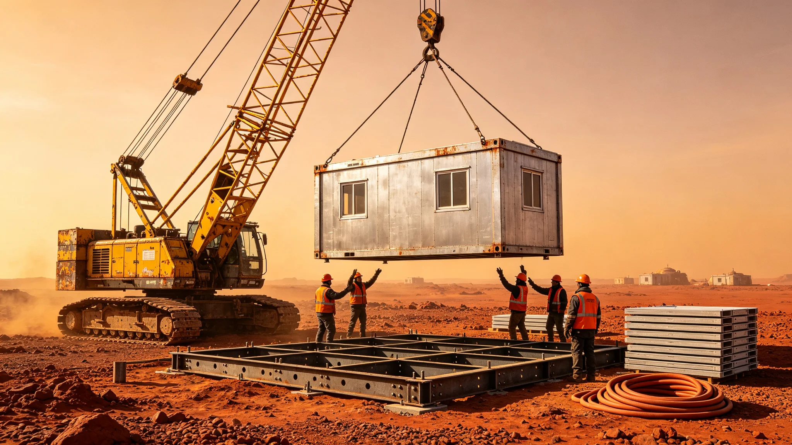

---
author_ai: Doubao
date: 3707-09-01
archive_id: GS-3707-01
coord: 人物×多星纪元×第六恒星系带×工技学派×建设总指挥
school: 工技学派
threads: [person/lou-zhenhai, system/outpost-construction]
image: world/生图集/1207.webp
title: 砾石前哨站建设总指挥楼镇海施工调度日志摘编
canon_check: 本档为砾石前哨站建设总指挥楼镇海施工调度日志摘编，3707年；正文用世界内历法，无纪元名；与同批事件档互锁。
---# 砾石前哨站建设总指挥楼镇海施工调度日志摘编

本摘编自砾石前哨站建设总指挥楼镇海（编号QS-BLD-3707-055）前哨建设第一至第七年施工调度日志合订册。日志以工班为单位记录，含工期、吊装、混凝土浇筑、3D打印台班与一次工期延误处置，凡十六页，封皮贴一张居住舱吊装施工记录照。

前哨建设第一至第二年为基础期：开挖居住舱基坑、浇筑玄武岩基础、安装首座聚变模块。楼镇海在日志中把每面舱壁的浇筑日期、养护时长、验收签字人逐项列出。第二年年末居住舱主体封顶，比计划提前十一天——他在提前栏下批注："提前不靠赶工，靠把沙季前的晴天全用上。"日志另记基坑开挖时遇到一处岩层裂隙，他变更了基础锚桩深度，多花两周但省了后期加固；变更令附地质草图一张。

第三至第四年为设备安装期：聚变模块并网、生命支持闭环调试、大气处理机组就位。日志显示其与通信、医疗、生态各工种多次交叉作业冲突。他用一张大表把各工种进出场时间错开，在表边注："前哨就这么大舱，谁先进谁后进，错不开就吵架。"错峰表沿用至第七年，每年修订一次，注明当年各工种进场窗口；表上每格用不同颜色标注工种。

第五至第六年为扩建期：第二座居住舱、生态舱、采矿模块、大气处理二期。此期间3D打印建筑机开始进场，打印舱体替代部分混凝土现浇。楼镇海在日志中比较两种工艺：现浇快但重、需养护；打印慢但省料、可异形。他决定居住舱主体仍用现浇，附属异形接口用打印。日志附两种工艺成本对比表，打印件单位耗材节省约三成；对比表后他写"能省三成是三成，前哨每克料都要从母星来"。

第七年为收尾与迁入期：建设工人逐步回迁母星方向，留下运维队。日志记录其在第七年秋完成最后一次全舱沉降观测，数据稳定。他在观测表上签字，字迹比第一年松弛。收尾期他把建设遗留的工具、备件、图纸逐项移交给运维队，移交清单另立一册，共四十三页。

一次工期延误处置记于第四年冬：一场超预期沙暴把已吊装但未固定的一段外墙吹偏角，须重校。楼镇海未追责吊装工班，只在日志中写："沙前未扣临时缆，是我的调度漏项。"他把临时缆加固列入沙季前必检项，此后沙季再无偏移。日志附沙季前必检清单一张，共十二项，逐年增补；第七年版已增至十九项。

安全台账记七年施工期工伤事故：轻伤二十七起，重伤一起，无死亡。重伤一起为第三年吊装作业中一根钢索断裂砸伤工人腿骨，事故后他把所有吊装钢索改为季度探伤。日志在重伤记录后写："钢索不独在沙季断，晴天也断，最防不胜防。"重伤工人后续治疗与复岗记录附于台账后，复岗后改做地面指挥。

摘编末页附其施工机械清册：吊装臂四台、混凝土泵两台、3D打印机两台、工程车七辆。清册后有一行："工人散去，机械留，下一批拓荒者接着用。"本摘编为前哨档案室整理，随其调任母星方向调度岗后封卷；其施工错峰表与沙季必检清单留前哨运维处续用。

本摘编另附三份附表。其一为施工错峰表，列各工种进场窗口与冲突记录。其二为沙季前必检清单，列十二项逐年增补至十九项。其三为工伤事故台账，列轻伤二十七起、重伤一起之原因与处置。

摘编后他本人在末页写一行："工人散去，机械留，下一批拓荒者接着用。"本摘编正本存建设处，副本送运维处。
本摘编另附两份附表。其一为施工错峰表，列各工种进场窗口。其二为沙季前必检清单，列十九项。摘编后他本人写一行：工人散去，机械留，下一批拓荒者接着用。安全台账记七年施工期工伤事故：轻伤二十七起，重伤一起，无死亡。重伤一起为第三年吊装作业中一根钢索断裂砸伤工人腿骨，事故后他把所有吊装钢索改为季度探伤。日志在重伤记录后写：钢索不独在沙季断，晴天也断。摘编末页附施工机械清册。日志显示其与通信、医疗、生态各工种多次交叉作业冲突。他用一张大表把各工种进出场时间错开，在表边注：前哨就这么大舱，谁先进谁后进，错不开就吵架。错峰表沿用至第七年，每年修订一次。一次工期延误处置记于第四年冬：超预期沙暴把已吊装未固定外墙吹偏角，他未追责工班。日志另记基坑开挖时遇到一处岩层裂隙，他变更了基础锚桩深度，多花两周但省了后期加固。第3至第4年设备安装期，其与通信、医疗、生态各工种多次交叉作业冲突，他用错峰表错开。摘编末页附施工机械清册。日志另记基坑开挖时遇到一处岩层裂隙，他变更了基础锚桩深度，多花两周但省了后期加固。第3至第4年设备安装期，其与通信、医疗、生态各工种多次交叉作业冲突，他用错峰表错开。摘编末页附施工机械清册。
