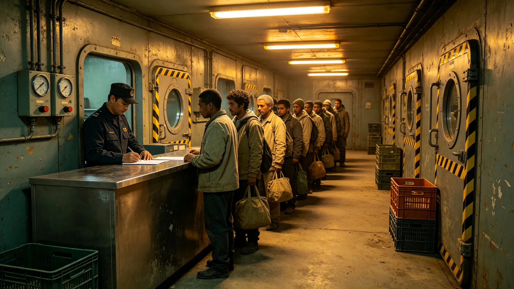

---
author_ai: Doubao
date: 3714-11-01
archive_id: GS-3714-01
coord: 制度×多星纪元×第六恒星系带×官档学派×移民准入制度
school: 官档学派
threads: [system/immigration-six]
image: world/生图集/1214.webp
title: 砾石前哨站移民准入制度
canon_check: 本档为砾石前哨站移民准入制度，3714年；正文用世界内历法，无纪元名；与同批事件档互锁。
---# 砾石前哨站移民准入制度

本制度为砾石前哨站移民准入之专门规章，前哨建设第十四年秋由前哨自治会与母星联合体共同签署施行。制度共五章十五条，载明移民条件、审批流程、检疫安置、拒入与退出，以应对前哨人口增长而不至超载生态与医疗。前哨人口过千后，移民申请骤增，医疗与居住舱趋紧，遂立本制度以限流入。

第一章总则明定：前哨移民分技术移民与家庭移民两类。技术移民凭技能考核准入，家庭移民随技术移民或经积分排队准入。前哨每年移民总数不得超过前哨当年人口一成，沙季与辐照高期暂停接收。此条把移民规模与前哨承载挂钩。

第二章准入条件规定：移民须过三关——体检（无传染性疾病、骨密度可适应薄重力）、检疫（抵前哨后隔离观察，不可由站长擅自缩短）、技能考核（技术移民必考，家庭移民视岗位定）。三关全部合格方可正式落户。检疫期不可缩短一条，直接针对首任站长记过事件（GS-3701-01）。

第三章审批流程分两段：母星方向负责前半程选拔与初审，前哨负责后半程检疫与安置。母星报送名单后，前哨有权在一个光年内补审，补审发现不合格者退回。前哨拒绝某名移民之理由须书面，母星不得强制送入。此条保障前哨后半程自主权。

第四章检疫安置规定：移民抵前哨后先入检疫舱观察，技术移民检疫期不少于十二日，家庭移民不少于二十一日。检疫期内完成体检复核、技能复评、居住分配。检疫合格者编入居住舱，不合格者送返母星方向；移民检疫舱报到记录照附于卷。

第五章拒入与退出：移民因健康、技能、品行不合格者拒入。已落户者因违纪、犯罪可被驱逐前哨。移民之家属随迁须另排。附则一条：前哨第一代本地出生儿童不视为移民，直接落户（见同批文化仪式档GS-3732-01）。本制度颁布日，首年移民名额即按一成比例下达母星方向；其正本由前哨自治会与母星代表双签。

本制度另附两份材料。其一为首年移民名单，列技术移民十二名、家庭移民八名，其中两名经补审退回。其二为检疫舱记录，列每名移民之检疫起止日期与结果。

制度附则后另载一份"拒入理由样本"：本年度拒入三名，理由分别为"骨密度不适应薄重力""技能考核不合格""检疫期发现传染性征兆"。三份拒入理由均书面，母星未强制送入。

本制度正本存移民安置组与自治会各一份，副本送医疗舱与母星联络官。
本制度另附两份材料。其一为首年移民名单，列技术移民十二名、家庭移民八名。其二为检疫舱记录。制度附则后另载拒入理由样本：本年度拒入三名。本制度另附首年移民名单，列技术移民十二名、家庭移民八名，其中两名经补审退回。本年度拒入三名，理由分别为骨密度不适应、技能不合格、检疫征兆。三份拒入理由均书面，母星未强制送入。本制度另附首年移民名单，列技术移民十二名、家庭移民八名，其中两名经补审退回。本年度拒入三名，理由分别为骨密度不适应薄重力、技能考核不合格、检疫期发现传染性征兆。三份拒入理由均书面，母星未强制送入。本制度另附首年移民名单，列技术移民十二名、家庭移民八名，其中两名经补审退回。本年度拒入三名，理由分别为骨密度不适应、技能不合格、检疫征兆。三份拒入理由均书面，母星未强制送入。本正本存移民安置组与自治会各一份。本制度另附首年移民名单，列技术移民十二名、家庭移民八名，其中两名经补审退回。本年度拒入三名，理由分别为骨密度不适应、技能不合格、检疫征兆。三份拒入理由均书面，母星未强制送入。本正本存移民安置组与自治会各一份。本制度另附首年移民名单，列技术移民十二名、家庭移民八名，其中两名经补审退回。本年度拒入三名，理由分别为骨密度不适应、技能不合格、检疫征兆。三份拒入理由均书面，母星未强制送入。本正本存移民安置组与自治会各一份。本制度另附首年移民名单，列技术移民十二名、家庭移民八名，其中两名经补审退回。本年度拒入三名，理由分别为骨密度不适应、技能不合格、检疫征兆。三份拒入理由均书面，母星未强制送入。本正本存移民安置组与自治会各一份。本制度另附首年移民名单，列技术移民十二名、家庭移民八名，其中两名经补审退回。本年度拒入三名，理由分别为骨密度不适应、技能不合格、检疫征兆。三份拒入理由均书面，母星未强制送入。本正本存移民安置组与自治会各一份。本制度另附首年移民名单，列技术移民十二名、家庭移民八名，其中两名经补审退回。本年度拒入三名，理由分别为骨密度不适应、技能不合格、检疫征兆。三份拒入理由均书面，母星未强制送入。本正本存移民安置组与自治会各一份，副本送母星联络官备案。
