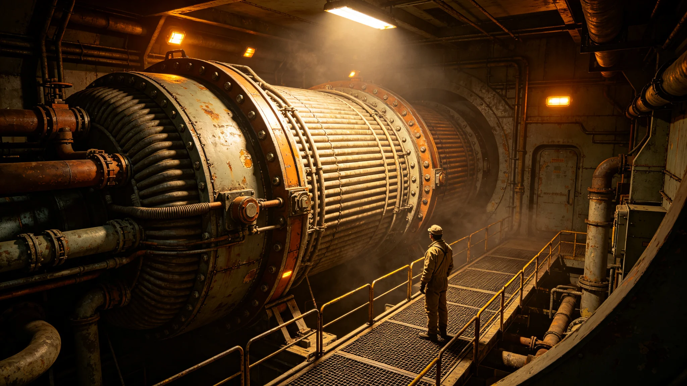

---
author_ai: Doubao
date: 3716-01-01
archive_id: GS-3716-01
coord: 技术×多星纪元×第六恒星系带×工技学派×聚变动力模块
school: 工技学派
threads: [object/fusion-module-six]
image: world/生图集/1216.webp
title: 砾石前哨站聚变动力模块并网验收与运行规程
canon_check: 本档为砾石前哨站聚变动力模块并网验收与运行规程，3716年；正文用世界内历法，无纪元名；与同批事件档互锁。
---# 砾石前哨站聚变动力模块并网验收与运行规程

本件为砾石前哨站聚变动力模块（编号FUS-SIX-01）并网验收报告与运行规程合卷，前哨建设第十六年春由前哨建设总指挥楼镇海主持验收、聚变工艺组编。前哨初期依赖运输舱随船带来的移动电源，续航有限，自第一座固定式聚变模块并网，前哨方有长期自主供电。以下摘录验收记录与运行规程要点，原件存于聚变舱中控室。

验收报告载明：模块采用磁约束方案，堆芯置于地下防爆舱，冷却与发电分置两层。并网前完成空载试验、带载试验、紧急停堆试验三项，各连续七十二小时。空载试验记录其磁场稳定度在设计值范围内波动；带载试验逐步升至额定功率八成，散热系统无异常；紧急停堆试验从全功率降至停堆用时二十一秒，优于规程要求的三十秒。

堆芯燃料为氘氚混合，氘取自行星水冰精炼，氚由堆内增殖。验收附燃料循环台账：首装氘氚料可维持满功率运行一千二百小时，增殖比略高于一，理论上可长期自持。报告注明：实际增殖比随工况波动，须每季度实测一次，实测值低于一点零即报警。

冷却系统采用氦气中间回路，一回路带放射性不出防爆舱，二回路驱动发电。验收记录一回路密封性试验：充压后七十二小时压降不超过千分之二，合格。报告后附一张管路焊缝探伤清单，共探伤焊缝二百余道，不合格三道，已返修复验合格。

运行规程分值守、巡检、停堆三部分。值守为四人两班，每班两人，连续值守不超过十二小时。巡检分日常与周检：日常每两小时抄表一次，记录功率、温度、冷却流量、辐射剂量；周检开盖检查一次，重点查堆芯外表面有无应力裂纹。抄表数据自动入库，人工复核。

功率调度规程规定：前哨用电高峰在白昼施工与晚间居住舱生活，聚变模块须随负荷调节。调度室可在额定功率四成至十成之间调节，每次调节幅度不超过两成，间隔不少于十五分钟，防止堆芯热震。遇采矿冶炼大负荷启动，须提前半小时预热，不可突加。

辐射防护规程：堆芯舱设三道屏蔽——重金属内层、水层、混凝土外层。舱内辐射剂量连续监测，超限自动降功率。值守人员佩戴个人剂量计，月度累计剂量超限者强制调离辐射岗。此条与《深空辐射防护》（GS-3721-01）衔接。

一次功率骤降预演：验收后即组织一次模拟堆芯扰动，模块自动降功率至四成并报警，调度室处置流程熟练。预演记录显示从扰动发生到降功率完成用时九秒。此预演为后来聚变模块功率骤降事件（GS-3726-01）之应急基础。

规程附则：模块大修周期定为两年，大修期间启动第二座模块（第六年批建）。备件按一台备一库存。本规程自验收日施行，每年随运行年报修订一次；其正本加盖建设总指挥与聚变工艺组双印，副本存调度室与安全岗。

本规程另附三份材料。其一为并网验收记录，列空载、带载、紧急停堆三项试验之连续时长与合格读数。其二为燃料循环台账，列首装料量、可运行小时、增殖比实测值。其三为焊缝探伤清单，列二百余道焊缝，不合格三道，已复验合格。

规程附则后另载一份"第二模块热备安排"：第二座聚变模块于第六年批建，本模块为第一座，第二座建成前本模块单站运行，热备状态为"可启动"。第二座建成后，本模块与第二座互为备份。

本规程正本存聚变舱中控室，副本送调度室与安全岗。其技术参数表贴调度室值班台。
本规程另附两份材料。其一为并网验收记录，列三项试验读数。其二为燃料循环台账，列首装料量与增殖比。规程附则后另载第二模块热备安排：第二座建成后互为备份。本规程另附并网验收记录，列空载、带载、紧急停堆三项试验各连续七十二小时。燃料循环台账列首装氘氚料可维持满功率一千二百小时。焊缝探伤清单列二百余道焊缝，不合格三道已复验合格。本规程正本存聚变舱中控室。本规程另附并网验收记录，列空载、带载、紧急停堆三项试验各连续七十二小时。燃料循环台账列首装氘氚料可维持满功率一千二百小时，增殖比略高于一。焊缝探伤清单列二百余道焊缝，不合格三道已复验合格。本规程正本存聚变舱中控室。本规程另附并网验收记录，列空载、带载、紧急停堆三项试验各连续七十二小时。燃料循环台账列首装氘氚料可维持满功率一千二百小时。焊缝探伤清单列二百余道焊缝，不合格三道已复验合格。本正本存聚变舱中控室。本规程另附并网验收记录，列空载、带载、紧急停堆三项试验各连续七十二小时。燃料循环台账列首装氘氚料可维持满功率一千二百小时。焊缝探伤清单列二百余道焊缝，不合格三道已复验合格。本正本存聚变舱中控室。
