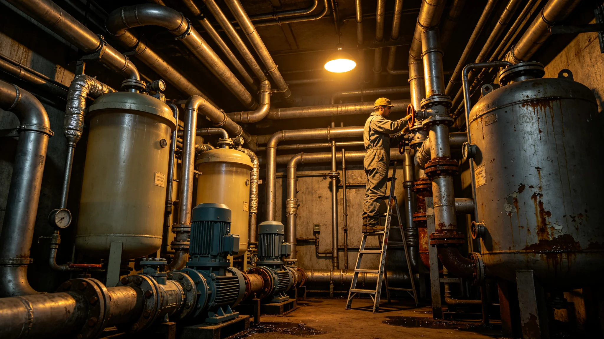

# 砾石前哨站生命支持闭环系统年度运行监测报告

本报告为砾石前哨站生命支持闭环系统（编号CLS-SIX）前哨建设第十九年年度运行监测报告，由生态舱与医疗官联合编。系统负责居住舱内空气、水、废物之循环，目标是把前哨对外补给依赖降至最低。以下摘录年度运行数据与三次偏差处置。

闭环原理：人呼二氧化碳，植物与藻类吸收释氧；人排废水，处理后灌溉；固废堆肥回土。报告载明本年度闭环自给率：氧自给率九成二，水自给率八成八，食物自给率三成五（其余靠补给与生态农业）。自给率逐年提升，氧与水已近闭环，食物仍依赖部分补给。

空气监测：居住舱氧分压维持在设计值百分之二十点九，二氧化碳分压低于千分之五。报告附全年二十四小时曲线，仅两次短时偏离，均因某舱多人聚集致二氧化碳短时升高，通风自动加大后复常。

水循环：废水经过滤、紫外、膜分离三步回灌。报告记录膜组件更换周期为半年，本年度更换两次。废水中盐分逐年累积，须定期排盐一次，排盐水储于盐库。一次排盐操作失误致灌溉水含盐偏高，三株试植植物叶片萎黄，纠正后复常。

废物循环：固废堆肥为生态舱土壤来源。报告记录本年度堆肥产出约两吨，用于生态农业（见GS-3740-01）。一次堆肥箱温度失控，发酵过盛致异味渗入居住舱，降温通风后复常，堆肥箱加装温控报警。

三次偏差处置：一为氧分压短时偏低，查明为某通风管脱落；二为水回收膜效率下降，查明为膜污染；三为堆肥异味，查明为温控失灵。三次均未危及人员，处置时间均在半日之内。报告把三次偏差列入巡检清单，相应点位加密监测。

冗余与补给：闭环系统设手动旁路，一旦闭环失效可切换至储存氧与水。报告载明储存氧可维持全员七日，储存水可维持十日。此冗余为紧急状态法（GS-3715-01）之物资基础。

报告结语：闭环运行稳定，自给率达标。改进方向：提高食物自给率、缩短排盐周期、增加堆肥温控。风险点为膜污染与堆肥温控，已列入下年度技术改进。本报告随生态年报一并报送，正本存生态舱。

本报告另附三份材料。其一为闭环自给率表，列氧、水、食物三项之年度自给率。其二为空气监测曲线，列全年二十四小时氧分压与二氧化碳分压读数。其三为三次偏差处置记录，列各次偏差之原因、处置、时间。

报告附则后另载一份"冗余安排"：储存氧七日、储存水十日，为紧急状态法（GS-3715-01）之物资基础。冗余值随人口增长每年复核。

本报告正本存生态舱，副本送调度室与医疗舱。
本报告另附两份材料。其一为闭环自给率表。其二为空气监测曲线。报告附则后另载冗余安排：储存氧七日、储存水十日。本报告另附闭环自给率表，列氧、水、食物三项之年度自给率。空气监测曲线列全年二十四小时氧分压与二氧化碳分压读数。三次偏差处置记录列各次偏差之原因与时间。冗余安排：储存氧七日、储存水十日。本报告另附闭环自给率表，列氧自给率九成二、水自给率八成八、食物自给率三成五。空气监测曲线列全年氧分压与二氧化碳分压读数。冗余安排：储存氧七日、储存水十日。本报告正本存生态舱。本报告另附闭环自给率表，列氧自给率九成二、水自给率八成八、食物自给率三成五。空气监测曲线列全年氧分压与二氧化碳分压读数。冗余安排：储存氧七日、储存水十日。本正本存生态舱。本报告另附闭环自给率表，列氧自给率九成二、水自给率八成八、食物自给率三成五。空气监测曲线列全年氧分压与二氧化碳分压读数。冗余安排：储存氧七日、储存水十日。本正本存生态舱。本报告另附闭环自给率表，列氧自给率九成二、水自给率八成八、食物自给率三成五。空气监测曲线列全年氧分压与二氧化碳分压读数。冗余安排：储存氧七日、储存水十日。本正本存生态舱。本报告另附闭环自给率表，列氧自给率九成二、水自给率八成八、食物自给率三成五。空气监测曲线列全年氧分压与二氧化碳分压读数。冗余安排：储存氧七日、储存水十日。本正本存生态舱，副本送医疗舱与自治会。本报告另附闭环自给率表，列氧自给率九成二、水自给率八成八、食物自给率三成五。空气监测曲线列全年氧分压与二氧化碳分压读数。冗余安排：储存氧七日、储存水十日。本正本存生态舱，副本送医疗舱与自治会。本报告另附闭环自给率表，列氧自给率九成二、水自给率八成八、食物自给率三成五。空气监测曲线列全年氧分压与二氧化碳分压读数。冗余安排：储存氧七日、储存水十日。本正本存生态舱，副本送医疗舱与自治会。
