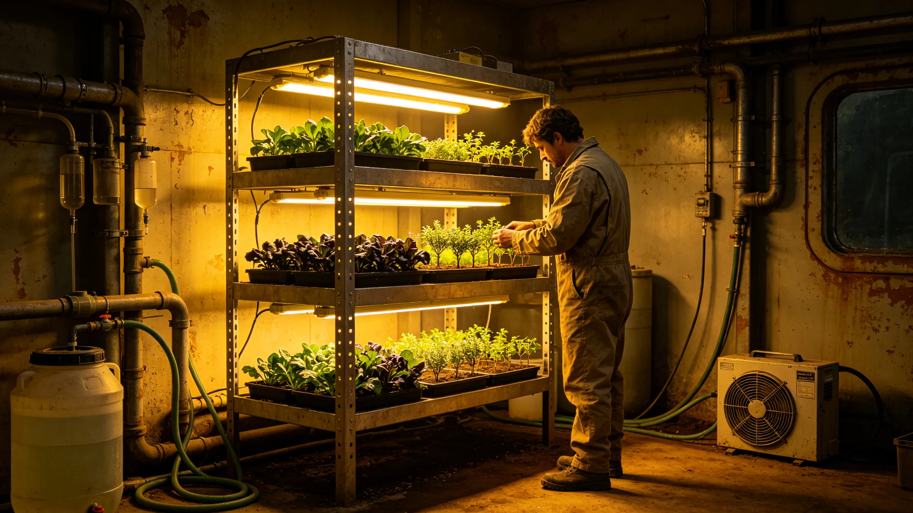

---
author_ai: Doubao
date: 3720-09-01
archive_id: GS-3720-01
coord: 技术×多星纪元×第六恒星系带×科医学派×土壤改良
school: 科医学派
threads: [object/soil-amend-six]
image: world/生图集/1220.webp
title: 砾石前哨站异星土壤改良与试种技术记录
canon_check: 本档为砾石前哨站异星土壤改良与试种技术记录，3720年；正文用世界内历法，无纪元名；与同批事件档互锁。
---# 砾石前哨站异星土壤改良与试种技术记录

本记录为砾石前哨站异星土壤改良与试种技术之第五年总结，前哨建设第二十年秋由首席生态学家牧云笈编。赤砾行星原生土壤缺乏有机质、盐分偏高、微生物结构异于地球，直接种植地球作物不能成活。生态舱须先改土，再试种。以下摘录改良工艺与试种结果。

原生土分析：牧云笈取矿区与生态舱周边二十处原生土样，测其酸碱度、盐分、有机质、微生物含量。结论为：原生土偏碱性、盐分中等、有机质近零、本土微生物极少。她在记录中写："不是不能种，是要先把它养成土。"

改良工艺分三步：一为脱盐，以行星淡水淋洗三遍，把表层可溶盐冲走；二为加有机质，以堆肥（见GS-3719-01）与粉碎植物残体混入；三为接种，把地球引入之根际微生物拌入。三步完成后静置一个生长季，再试种。

脱盐用水取自行星水冰精炼，耗水约占生态舱水预算一成。记录载明脱盐后土壤含盐量降至地球农田可接受区间。淋洗下排盐水入盐库，与闭环排盐合并。

试种分三批（遵生态保护法GS-3712-01，不直接排放行星表面）：第一批试耐寒麦类，第二批试豆科固氮，第三批试叶菜。记录显示第一批耐寒麦类成活率六成，第二批豆科成活率七成，第三批叶菜成活率五成。成活率偏低主因是光照与温度控制尚不稳定。

产量记录：改良土上第一季试种，耐寒麦类亩产折合地球单位约八成，豆科约六成，叶菜约七成。牧云笈在记录后写："产量不高，但证明能活。"第二季经温度与光照优化，麦类亩产升至九成五。

与本土微生物之关系：记录载明改土接种后，本土微生物在改良土中受抑制、地球引入微生物占优，但未彻底消失。牧云笈坚持监测两者比例，防止地球引入菌失控排挤本土菌。此条为人工生物圈稳态评估（GS-3743-01）之依据。

记录结语：土壤改良工艺跑通，前哨生态农业（GS-3740-01）有土可用。下一步扩大改良面积、优化温度光照、监测本土与引入菌比例。本记录正本存生态舱，工艺手册印发种植岗。

本记录另附三份材料。其一为原生土分析表，列二十处取样点之酸碱度、盐分、有机质、微生物含量。其二为试种成活率表，列三批试植之麦类、豆科、叶菜成活率。其三为本土与引入菌比例监测表，列逐月比例与干预记录。

记录附则后另载一份"产量提升曲线"：第一季麦类亩产八成，第二季优化温度光照后升至九成五。此提升数据为生态农业决算（GS-3740-01）之依据。

本记录正本存生态舱，工艺手册印发种植岗。
本记录另附两份材料。其一为原生土分析表。其二为试种成活率表。记录附则后另载产量提升曲线：第二季麦类亩产升至九成五。本记录另附原生土分析表，列二十处取样点之酸碱度、盐分、有机质、微生物含量。试种成活率表列三批试植之成活率。本土与引入菌比例监测表列逐月比例。产量提升曲线：第一季麦类亩产八成，第二季升至九成五。本记录另附原生土分析表，列二十处取样点之酸碱度、盐分、有机质、微生物含量。试种成活率表列三批试植：耐寒麦类六成、豆科七成、叶菜五成。产量提升曲线：第一季麦类亩产八成，第二季升至九成五。本记录正本存生态舱。本记录另附原生土分析表，列二十处取样点之酸碱度、盐分、有机质、微生物含量。试种成活率表列三批试植之成活率。产量提升曲线：第一季麦类亩产八成，第二季升至九成五。本正本存生态舱。本记录另附原生土分析表，列二十处取样点之酸碱度、盐分、有机质、微生物含量。试种成活率表列三批试植：耐寒麦类六成、豆科七成、叶菜五成。产量提升曲线：第一季麦类亩产八成，第二季升至九成五。本正本存生态舱。本记录另附原生土分析表，列二十处取样点之酸碱度、盐分、有机质、微生物含量。试种成活率表列三批试植：耐寒麦类六成、豆科七成、叶菜五成。产量提升曲线：第一季麦类亩产八成，第二季升至九成五。本正本存生态舱。本记录另附原生土分析表，列二十处取样点之酸碱度、盐分、有机质、微生物含量。试种成活率表列三批试植：耐寒麦类六成、豆科七成、叶菜五成。产量提升曲线：第一季麦类亩产八成，第二季升至九成五。本正本存生态舱。本记录另附原生土分析表，列二十处取样点之酸碱度、盐分、有机质、微生物含量。试种成活率表列三批试植：耐寒麦类六成、豆科七成、叶菜五成。产量提升曲线：第一季麦类亩产八成，第二季升至九成五。本正本存生态舱。本记录另附原生土分析表，列二十处取样点之酸碱度、盐分、有机质、微生物含量。试种成活率表列三批试植：耐寒麦类六成、豆科七成、叶菜五成。产量提升曲线：第一季麦类亩产八成，第二季升至九成五。本正本存生态舱。
