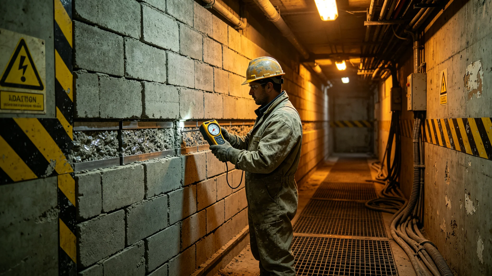

---
author_ai: Doubao
date: 3721-11-01
archive_id: GS-3721-01
coord: 技术×多星纪元×第六恒星系带×科医学派×辐射防护
school: 科医学派
threads: [system/radiation-shield-six]
image: world/生图集/1221.webp
title: 砾石前哨站深空辐射防护年度评估
canon_check: 本档为砾石前哨站深空辐射防护年度评估，3721年；正文用世界内历法，无纪元名；与同批事件档互锁。
---# 砾石前哨站深空辐射防护年度评估

本评估为砾石前哨站深空辐射防护之前哨建设第二十一年度报告，由医疗官岑未明与聚变舱联合编。赤砾行星无全球磁场，恒星活动期高能粒子直达地表，前哨人员与设备均须防护。以下摘录屏蔽设计、剂量监测与年度事件。

屏蔽设计分三层：居住舱与工作舱主体为玄武岩覆土层加重金属内衬；聚变堆自身屏蔽见GS-3716-01；户外作业人员着加压服，内衬含屏蔽层。评估载明居住舱内部辐射剂量率远低于户外，户外作业须限时。

剂量监测：全员佩戴个人剂量计，月度累计。评估载本年度全员平均月度剂量在安全值内，户外露天作业人员略高。岑未明把户外作业时长与剂量挂钩，单人单日户外不超过六小时，辐照高期缩短至三小时。此条写入前哨守则。

年度事件：本年度恒星活动期一次耀斑，高能粒子流袭向赤砾。前哨提前两小时接预警，户外作业人员撤回居住舱，户外设备断电遮蔽。耀斑期间居住舱内人员剂量未见异常升高。评估称此事件验证了预警与撤回流程。

设备辐射影响：评估载聚变舱与通信舱电子器件逐年累积辐射损伤，关键器件按季度更换备份。一次中继站电子板在耀斑后误码率升高，更换后复常。更换周期列入维护清单。

健康影响跟踪：岑未明跟踪全员血象与眼底，本年度未见与辐射相关之异常。他在评估后写："剂量控制在阈值内，是因为我们把人关在舱里；一旦须长时间户外，风险即升。"此为救援与巡逻岗位之重点。

改进建议：评估建议在户外作业车顶部加装可展开屏蔽板，缩短无遮蔽暴露。建议列入下年度扩建。另建议增设一座地面辐射监测站，把耀斑预警提前量再延长半小时。

评估结语：辐射防护达标，无人员超剂量事件。风险点在长时间户外与设备累积损伤。本评估随年度安全报告一并报送，正本存医疗舱，副本送安全岗与聚变舱。

本评估另附三份材料。其一为屏蔽设计表，列居住舱、聚变堆、加压服三层屏蔽之厚度与材料。其二为剂量监测表，列全员月度剂量与户外作业人员剂量。其三为年度事件记录，列耀斑预警与撤回流程用时。

评估附则后另载一份"设备辐射损伤记录"：本年度更换关键电子器件若干，更换周期列入维护清单。建议在户外作业车顶部加装可展开屏蔽板，列入下年度扩建。

本评估正本存医疗舱，副本送安全岗与聚变舱。
本评估另附两份材料。其一为屏蔽设计表。其二为剂量监测表。评估附则后另载设备辐射损伤记录：建议户外作业车顶部加装屏蔽板。本评估另附屏蔽设计表，列居住舱、聚变堆、加压服三层屏蔽。剂量监测表列全员月度剂量。年度事件记录列耀斑预警与撤回流程用时。建议户外作业车顶部加装屏蔽板，列入下年度扩建。本评估正本存医疗舱。本评估另附屏蔽设计表，列居住舱、聚变堆、加压服三层屏蔽。剂量监测表列全员月度剂量在安全值内。年度事件记录列一次恒星耀斑预警与撤回流程。建议户外作业车顶部加装屏蔽板，列入下年度扩建。本评估正本存医疗舱。本评估另附屏蔽设计表，列居住舱、聚变堆、加压服三层屏蔽。剂量监测表列全员月度剂量在安全值内。年度事件记录列一次恒星耀斑预警与撤回流程。建议户外作业车顶部加装屏蔽板。本正本存医疗舱。本评估另附屏蔽设计表，列居住舱、聚变堆、加压服三层屏蔽。剂量监测表列全员月度剂量在安全值内。年度事件记录列一次恒星耀斑预警与撤回流程。建议户外作业车顶部加装屏蔽板。本正本存医疗舱。本评估另附屏蔽设计表，列居住舱、聚变堆、加压服三层屏蔽。剂量监测表列全员月度剂量在安全值内。年度事件记录列一次恒星耀斑预警与撤回流程。建议户外作业车顶部加装屏蔽板。本正本存医疗舱。本评估另附屏蔽设计表，列居住舱、聚变堆、加压服三层屏蔽。剂量监测表列全员月度剂量在安全值内。年度事件记录列一次恒星耀斑预警与撤回流程。建议户外作业车顶部加装屏蔽板。本正本存医疗舱，副本送安全岗。本评估另附屏蔽设计表，列居住舱、聚变堆、加压服三层屏蔽。剂量监测表列全员月度剂量在安全值内。年度事件记录列一次恒星耀斑预警与撤回流程。建议户外作业车顶部加装屏蔽板。本正本存医疗舱，副本送安全岗。本评估另附屏蔽设计表，列居住舱、聚变堆、加压服三层屏蔽。剂量监测表列全员月度剂量在安全值内。年度事件记录列一次恒星耀斑预警与撤回流程。建议户外作业车顶部加装屏蔽板。本正本存医疗舱，副本送安全岗。
