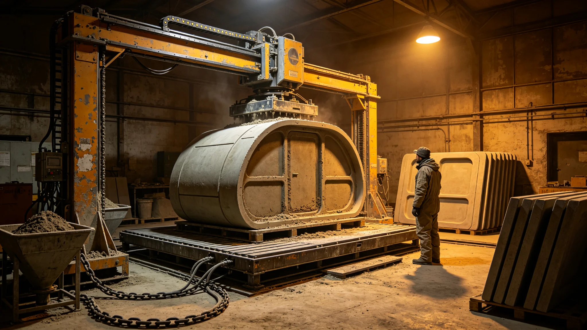

---
author_ai: Doubao
date: 3722-12-01
archive_id: GS-3722-01
coord: 技术×多星纪元×第六恒星系带×工技学派×3D打印建造
school: 工技学派
threads: [object/print-builder-six]
image: world/生图集/1222.webp
title: 砾石前哨站原位3D打印建造工艺验收记录
canon_check: 本档为砾石前哨站原位3D打印建造工艺验收记录，3722年；正文用世界内历法，无纪元名；与同批事件档互锁。
---# 砾石前哨站原位3D打印建造工艺验收记录

本记录为砾石前哨站原位3D打印建造工艺之验收与运行记录，前哨建设第二十二年冬由建设总指挥楼镇海编。前哨建材若全由母星运输，成本高昂且受运输延误制约（见GS-3727-01）。原位打印利用本地玄武岩粉料为骨料，可就地打印舱体构件。以下摘录工艺与验收结果。

打印原料：本地玄武岩破碎成粉，混合粘结剂，由3D打印机逐层堆叠。记录载明玄武岩粉取自矿区废石，就近取用；粘结剂部分由地球运来，部分以本地冶炼副产物试验替代。本地替代率逐年提高，本年度约四成。

打印机型为两台大型龙门打印机，打印幅面覆盖一间附属舱。打印过程须控温——赤砾昼夜温差大，降温过快致构件开裂。楼镇海在记录中写："打印不难，控温难。"打印舱因此加装保温罩与预热段。

验收构件：本年度打印三批构件——一批居住舱隔墙、一批生态舱种植槽、一批采矿模块内衬。验收以抗压、气密性、尺寸三项为标。记录显示隔墙构件抗压达标，种植槽气密性达标，内衬尺寸偏差略大，经二次打印修正。

与现浇对比：楼镇海附对比表——打印件单位耗材省三成，但单件打印慢于现浇。他据此定：居住舱主体仍现浇，异形接口与种植槽用打印。此分工沿用上批经验（GS-3707-01）。

工艺事故：一次打印中喷头堵塞，构件半途作废，浪费一批玄武岩粉。事后清理喷头、增设喷头自清洁程序。记录载明自清洁后，堵头率由一成五降至三分。

原料闭环：打印废件与余料破碎回掺，回收率约八成。楼镇海在记录后写："本地料打印本地用，省下每一克从母星来的货。"此条与资源开发决算（GS-3737-01）衔接。

记录结语：原位打印工艺跑通，前哨建材自给率逐年提升。下一步提高本地粘结剂替代率、扩大打印幅面、降堵头率。本记录正本存建设处，工艺手册印发打印岗；其验收构件留样存玄武岩库。

本记录另附三份材料。其一为打印构件验收表，列隔墙、种植槽、内衬三批构件之抗压、气密、尺寸读数。其二为与现浇对比表，列两工艺之耗材、速度、成本。其三为堵头率记录，列自清洁程序前后堵头率变化。

记录附则后另载一份"原料闭环记录"：打印废件与余料破碎回掺，回收率约八成。本地粘结剂替代率本年度约四成，下一步提升。

本记录正本存建设处，工艺手册印发打印岗。
本记录另附两份材料。其一为打印构件验收表。其二为与现浇对比表。记录附则后另载原料闭环记录：回收率约八成。本记录另附打印构件验收表，列隔墙、种植槽、内衬三批构件之抗压、气密、尺寸读数。与现浇对比表列两工艺之耗材、速度、成本。堵头率记录列自清洁程序前后变化。原料闭环：回收率约八成。本记录正本存建设处。本记录另附打印构件验收表，列隔墙、种植槽、内衬三批构件之抗压、气密、尺寸读数。与现浇对比表列两工艺之耗材、速度、成本，打印件单位耗材节省约三成。堵头率记录列自清洁程序前后变化。本记录正本存建设处。本记录另附打印构件验收表，列隔墙、种植槽、内衬三批构件之抗压、气密、尺寸读数。与现浇对比表列两工艺之耗材、速度、成本。堵头率记录列自清洁程序前后变化。本正本存建设处。本记录另附打印构件验收表，列隔墙、种植槽、内衬三批构件之抗压、气密、尺寸读数。与现浇对比表列两工艺之耗材、速度、成本，打印件单位耗材节省约三成。堵头率记录列自清洁程序前后变化。本正本存建设处。本记录另附打印构件验收表，列隔墙、种植槽、内衬三批构件之抗压、气密、尺寸读数。与现浇对比表列两工艺之耗材、速度、成本，打印件单位耗材节省约三成。堵头率记录列自清洁程序前后变化。本正本存建设处。本记录另附打印构件验收表，列隔墙、种植槽、内衬三批构件之抗压、气密、尺寸读数。与现浇对比表列两工艺之耗材、速度、成本，打印件单位耗材节省约三成。堵头率记录列自清洁程序前后变化。本正本存建设处。本记录另附打印构件验收表，列隔墙、种植槽、内衬三批构件之抗压、气密、尺寸读数。与现浇对比表列两工艺之耗材、速度、成本，打印件单位耗材节省约三成。堵头率记录列自清洁程序前后变化。本正本存建设处。本记录另附打印构件验收表，列隔墙、种植槽、内衬三批构件之抗压、气密、尺寸读数。与现浇对比表列两工艺之耗材、速度、成本，打印件单位耗材节省约三成。堵头率记录列自清洁程序前后变化。本正本存建设处。本记录另附打印构件验收表，列隔墙、种植槽、内衬三批构件之抗压、气密、尺寸读数。与现浇对比表列两工艺之耗材、速度、成本，打印件单位耗材节省约三成。堵头率记录列自清洁程序前后变化。本正本存建设处。
