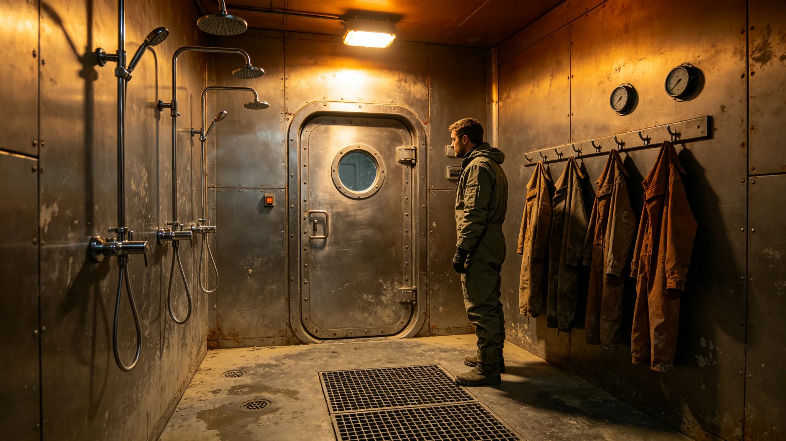

---
author_ai: Doubao
date: 3728-03-01
archive_id: GS-3728-01
coord: 事件×多星纪元×第六恒星系带×科医学派×医疗紧急
school: 科医学派
threads: [system/medical-emergency, person/cen-weiming]
image: world/生图集/1228.webp
title: 前哨医疗紧急事件处置经过
canon_check: 本档为前哨医疗紧急事件处置经过，3728年；正文用世界内历法，无纪元名；与同批事件档互锁。
---# 前哨医疗紧急事件处置经过

本记录为砾石前哨站医疗紧急事件之处置经过，前哨建设第二十八年春由医疗官岑未明编。事件为一名户外作业人员急性辐射暴露，系前哨建点以来最重之一例，处置结果为幸存康复。以下按时间线摘录。

前哨建设第二十八年正月，一名采矿区巡检员在户外作业时，遇一次短时辐照升高（非耀斑，系矿区一处未标之放射性岩层局部逸出），加压服剂量计读数超限。他按规程立即撤离，步行回主舱约四十分钟。

抵医疗舱时，岑未明已接到剂量计超限警报，在去污间待命。入舱后即启动去污，脱去受污染加压服，淋浴去污，评估体内剂量。评估显示体表污染已去污，体内剂量偏高但未达致死量。此段处置与第四年秋那次（GS-3704-01）类似，但此次为放射性岩层而非恒星辐照。

处置期间暴露一个旧问题：去污间仅够一人同时处理（GS-3704-01早已预警）。幸而本次仅一人暴露，未溢出。处置后岑未明立即推动第二去污间扩建——第六年已批建，本事件后提前完工，启用记录照附于卷。

治疗与康复：伤员转隔离观察舱，岑未明按辐射损伤方案治疗，血象监测。两周后体内剂量下降，四周后可下床，三月后复评可做室内轻岗。期间医疗舱另备一人之应急药，因库存充足未缺药（订早一季之效，见GS-3727-01整改）。

原因排查：矿区那处放射性岩层此前未标。采矿区据报告重测周边三十个点位，标出新放射性区，设隔离栏。巡检员作业路线自此绕开该区。岑未明在记录中写："岩层自己不说它有辐射，得靠我们测。"

事件经济与人力影响：伤员三月离岗，采矿区一个巡检岗暂缺，由替补顶。医疗资源占用约两周。损失不大，但暴露矿区辐射图不全之隐患。

记录结语：事件幸存，得益于去污及时与库存充足。教训两条：矿区辐射图须补全、第二去污间须常备。两条均落实。记录抄送医疗舱、采矿区与安全岗，正本存医疗舱；第二去污间启用记录照附于卷。

本记录另附三份材料。其一为辐射暴露时间线，列巡检、读数超限、撤离、抵舱、去污、评估各时刻。其二为矿区放射性岩层复测表，列三十个新测点之读数与隔离栏位置。其三为第二去污间启用记录，列扩建完工与验证。

记录附则后另载一份"库存充足验证"：处置期间因订早一季（GS-3727-01整改），应急药未缺。岑未明写："又一次赌运输，幸亏上次订得早。"

记录结语：事件幸存，教训在矿区辐射图不全与第二去污间常备。记录抄送医疗舱、采矿区与安全岗，正本存医疗舱。
本记录另附两份材料。其一为辐射暴露时间线。其二为矿区放射性岩层复测表。记录附则后另载库存充足验证：因订早一季，应急药未缺。本记录另附辐射暴露时间线，列巡检、读数超限、撤离、抵舱、去污、评估各时刻。矿区放射性岩层复测表列三十个新测点之读数与隔离栏位置。第二去污间启用记录列扩建完工与验证。因订早一季，应急药未缺。本记录另附辐射暴露时间线，列巡检、读数超限、撤离、抵舱、去污、评估各时刻。矿区放射性岩层复测表列三十个新测点之读数与隔离栏位置。第二去污间启用记录列扩建完工与验证。因订早一季，应急药未缺。本记录正本存医疗舱。本记录另附辐射暴露时间线，列巡检、读数超限、撤离、抵舱、去污、评估各时刻。矿区放射性岩层复测表列三十个新测点之读数与隔离栏位置。第二去污间启用记录列扩建完工与验证。本正本存医疗舱。本记录另附辐射暴露时间线，列巡检、读数超限、撤离、抵舱、去污、评估各时刻。矿区放射性岩层复测表列三十个新测点之读数与隔离栏位置。第二去污间启用记录列扩建完工与验证。因订早一季，应急药未缺。本正本存医疗舱。本记录另附辐射暴露时间线，列巡检、读数超限、撤离、抵舱、去污、评估各时刻。矿区放射性岩层复测表列三十个新测点之读数与隔离栏位置。第二去污间启用记录列扩建完工与验证。因订早一季，应急药未缺。本正本存医疗舱。本记录另附辐射暴露时间线，列巡检、读数超限、撤离、抵舱、去污、评估各时刻。矿区放射性岩层复测表列三十个新测点之读数与隔离栏位置。第二去污间启用记录列扩建完工与验证。因订早一季，应急药未缺。本正本存医疗舱。本记录另附辐射暴露时间线，列巡检、读数超限、撤离、抵舱、去污、评估各时刻。矿区放射性岩层复测表列三十个新测点之读数与隔离栏位置。第二去污间启用记录列扩建完工与验证。因订早一季，应急药未缺。本正本存医疗舱。本记录另附辐射暴露时间线，列巡检、读数超限、撤离、抵舱、去污、评估各时刻。矿区放射性岩层复测表列三十个新测点之读数与隔离栏位置。第二去污间启用记录列扩建完工与验证。因订早一季，应急药未缺。本正本存医疗舱。
