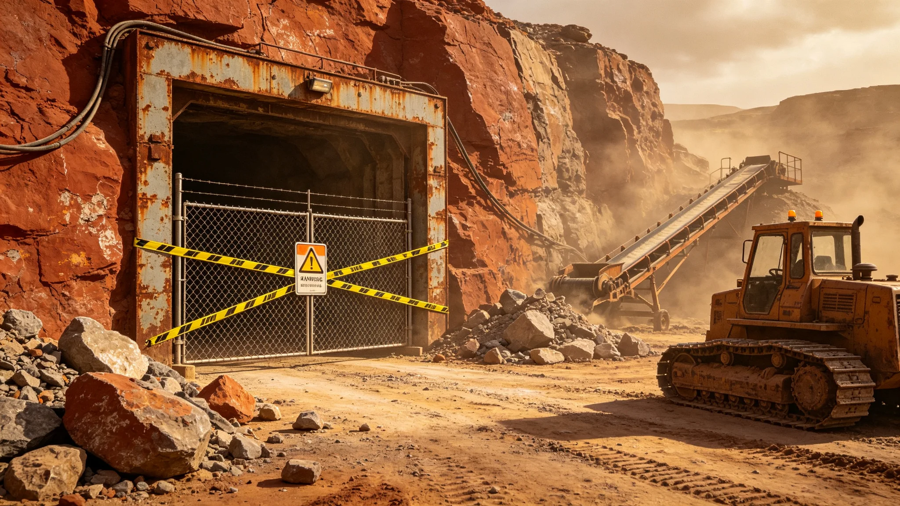

# 前哨资源开采事故处置与责任认定

本通报为砾石前哨站资源开采事故之处置经过与责任认定，前哨建设第二十九年夏由矿务处与资源开发总工艺师沙百川联合编。事故为露天采矿面一次塌方，致一名工人重伤，无死亡。以下按时间线摘录。

前哨建设第二十九年五月，北坡富矿带一处露天作业面，因连续作业后边坡松动，在一次爆破后局部塌方。作业面当时有四名工人，三人及时撤离，一人被落石压伤腿骨。救援队（GS-3706-01）十分钟内抵达，救出伤员送医疗舱。

伤员经医疗舱处置，腿骨骨折，无生命危险，三月康复（与第三年钢索重伤工人复岗类似，见GS-3707-01）。期间采矿区暂停该作业面，封锁待查。矿区作业面封锁记录照附于卷。

事故原因调查：矿务处与沙百川联合查，结论为边坡支护未随开采深度加深而加强——作业面已挖到第三层，支护仍按第一层标准。沙百川在调查报告上签认："支护升级未跟上开采深度，是我的工艺漏项。"他自请记过，并把当月绩效扣发。

处置措施：一、全矿区各作业面边坡支护统一复查，按当前深度重新加固；二、开采深度每加一层，支护方案即升级一次，写入工艺规程；三、爆破后加一段边坡稳定观察期，观察合格方复工。

责任认定：直接原因为支护未升级，责任在工艺组，沙百川签认记过。一线工班按规程撤离，无违章。矿务处未追究工人。此认定与此前传送带事故（GS-3705-01）、外墙吹偏（GS-3707-01）一致——凡工艺调度漏项，不推工人。

复工与损失：全矿区停工复查约十日，损失工时与产量约当半月。复工后按新规程运行，半年内无二次塌方。伤员复岗后改做室内选矿调度，不回露天面。

通报结语：事故可预防，教训在支护须随深度升级。沙百川后写："矿挖得越深，边坡越不听话。"通报抄送自治会与母星联络官，正本存矿务处；其边坡支护复查清单印塑挂作业面首端。

本通报另附三份材料。其一为塌方作业面现场记录，列作业深度、支护状态、塌方范围。其二为事故原因调查书，列边坡支护未随深度升级之结论。其三为整改清单，列全矿区支护复查、深度升级、爆破后观察期三条。

通报附则后另载一份"责任认定"：直接原因在工艺组，沙百川签认记过；一线工班按规程撤离，无违章。此认定与此前传送带事故、外墙吹偏一致——凡工艺调度漏项，不推工人。

通报结语沙百川写："矿挖得越深，边坡越不听话。"通报抄送自治会与母星联络官，正本存矿务处。
本通报另附两份材料。其一为塌方作业面现场记录。其二为事故原因调查书。通报附则后另载责任认定：直接原因在工艺组，不推工人。本通报另附塌方作业面现场记录，列作业深度、支护状态、塌方范围。事故原因调查书列边坡支护未随深度升级之结论。整改清单列全矿区支护复查、深度升级、爆破后观察期三条。直接原因在工艺组，不推工人。本通报另附塌方作业面现场记录，列作业深度、支护状态、塌方范围。事故原因调查书列边坡支护未随深度升级之结论。整改清单列全矿区支护复查、深度升级、爆破后观察期三条。直接原因在工艺组，不推工人。本通报正本存矿务处。本通报另附塌方作业面现场记录，列作业深度、支护状态、塌方范围。事故原因调查书列边坡支护未随深度升级之结论。整改清单列全矿区支护复查、深度升级、爆破后观察期三条。本正本存矿务处。本通报另附塌方作业面现场记录，列作业深度、支护状态、塌方范围。事故原因调查书列边坡支护未随深度升级之结论。整改清单列全矿区支护复查、深度升级、爆破后观察期三条。直接原因在工艺组，不推工人。本正本存矿务处。本通报另附塌方作业面现场记录，列作业深度、支护状态、塌方范围。事故原因调查书列边坡支护未随深度升级之结论。整改清单列全矿区支护复查、深度升级、爆破后观察期三条。直接原因在工艺组，不推工人。本正本存矿务处。本通报另附塌方作业面现场记录，列作业深度、支护状态、塌方范围。事故原因调查书列边坡支护未随深度升级之结论。整改清单列全矿区支护复查、深度升级、爆破后观察期三条。直接原因在工艺组，不推工人。本正本存矿务处。本通报另附塌方作业面现场记录，列作业深度、支护状态、塌方范围。事故原因调查书列边坡支护未随深度升级之结论。整改清单列全矿区支护复查、深度升级、爆破后观察期三条。直接原因在工艺组，不推工人。本正本存矿务处。本通报另附塌方作业面现场记录，列作业深度、支护状态、塌方范围。事故原因调查书列边坡支护未随深度升级之结论。整改清单列全矿区支护复查、深度升级、爆破后观察期三条。直接原因在工艺组，不推工人。本正本存矿务处。
