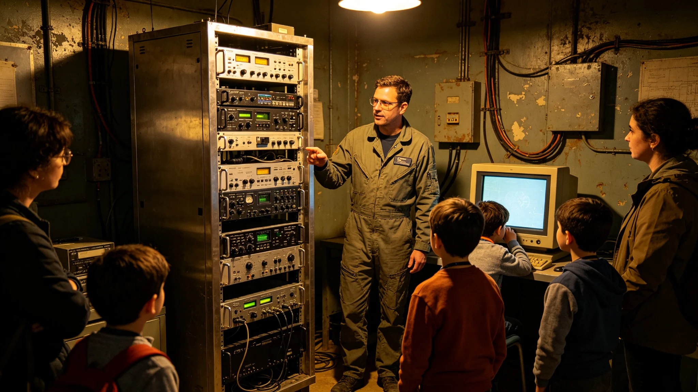

# 前哨深空通信日规程

本规程为砾石前哨站"深空通信日"之规程，前哨建设第三十四年秋颁。通信日定于每年一次，以纪念系内中继环线建成（GS-3718-01）与对母星链路之维系。规程定其开放日、科普与仪式，使前哨人知通信为何物。

规程定通信日为通信台每年一次开放日：当日非通信岗人员可入通信台参观一次，看译算台、镜面对准、链路监测。规程写明"只看不动手"，参观须通信台人员陪同。

仪式一节：当日班前会读一段通信中断七十二小时事件（GS-3724-01）之经过，提醒众人链路并非理所当然。规程写："能通信是修出来的，不是天上掉的。"

科普：通信台编一份极简手册，讲单程光时延为何约四年又两个月、中继环线为何能绕行。规程写明手册发给每名新移民，使其知自己与母星之距离。手册不写技术细节，只写"你发的信，四年后到"。

规程与译算员：通信日当日，译算台不额外加班，但集中清积压家信。闻人柚（GS-3708-01）当年已转中继站，仍应邀回前哨做一次错题本讲解。规程写："错题本是通信日最好的教材。"

规程附则：通信日若逢沙暴或紧急状态，顺延。开放日不影响通信值守。本规程正本存通信台与自治会，副本分发各居住舱；通信台开放记录照附于卷。

深空通信日规程，其立法本意，通信台序言写："前哨人多不知通信为何物，以为话自然能传；须让他们知道，信号是修出来的、对出来的、守出来的。"

规程一节记定位：通信日为通信台每年一次开放日，非法定假日，不放假。规程写："只开门看，不放假。"

规程二节记参观：当日非通信岗人员可入通信台参观一次，看译算台、镜面对准、链路监测。规程写明参观须通信台人员陪同，只看不动手，不碰旋钮。参观每组不超过四人，时长不超过二十分钟。

规程三节记班前会：当日班前会读一段通信中断七十二小时事件（GS-3724-01）之经过，提醒众人链路并非理所当然。规程写："能通信是修出来的，不是天上掉的。"

规程四节记科普：通信台编一份极简手册，讲单程光时延为何约四年又两个月、中继环线为何能绕行。手册不写技术细节，只写"你发的信，四年后到"。手册发给每名新移民。

规程五节记译算员：通信日当日不额外加班，但集中清积压家信。闻人柚（GS-3708-01）此年已转中继站，仍应邀回前哨做一次错题本讲解。规程写："错题本是通信日最好的教材。"

规程六节附则：通信日若逢沙暴或紧急状态，顺延。开放日不影响通信值守。规程正本存通信台与自治会，副本分发各居住舱；通信台开放记录照附于卷。
本规程另附两份材料。其一为通信台参观路线图。其二为极简科普手册样本。规程附则后另载顺延条款：逢沙暴或紧急状态顺延。本规程另附通信台参观路线图，列参观动线。极简科普手册样本列单程光时延与中继环线原理。顺延条款：逢沙暴或紧急状态顺延。本规程正本存通信台与自治会。本规程另附通信台参观路线图，列参观动线。极简科普手册样本列单程光时延与中继环线原理。顺延条款：逢沙暴或紧急状态顺延。本规程正本存通信台与自治会，副本分发各居住舱。本规程另附通信台参观路线图，列参观动线。极简科普手册样本列单程光时延与中继环线原理。顺延条款：逢沙暴或紧急状态顺延。本正本存通信台与自治会。本规程另附通信台参观路线图，列参观动线。极简科普手册样本列单程光时延与中继环线原理。顺延条款：逢沙暴或紧急状态顺延。本正本存通信台与自治会，副本分发各居住舱。本规程另附通信台参观路线图，列参观动线。极简科普手册样本列单程光时延与中继环线原理。顺延条款：逢沙暴或紧急状态顺延。本正本存通信台与自治会，副本分发各居住舱。本规程另附通信台参观路线图，列参观动线。极简科普手册样本列单程光时延与中继环线原理。顺延条款：逢沙暴或紧急状态顺延。本正本存通信台与自治会，副本分发各居住舱。本规程另附通信台参观路线图，列参观动线。极简科普手册样本列单程光时延与中继环线原理。顺延条款：逢沙暴或紧急状态顺延。本正本存通信台与自治会，副本分发各居住舱。本规程另附通信台参观路线图，列参观动线。极简科普手册样本列单程光时延与中继环线原理。顺延条款：逢沙暴或紧急状态顺延。本正本存通信台与自治会，副本分发各居住舱。本规程另附通信台参观路线图，列参观动线。极简科普手册样本列单程光时延与中继环线原理。顺延条款：逢沙暴或紧急状态顺延。本正本存通信台与自治会，副本分发各居住舱。
