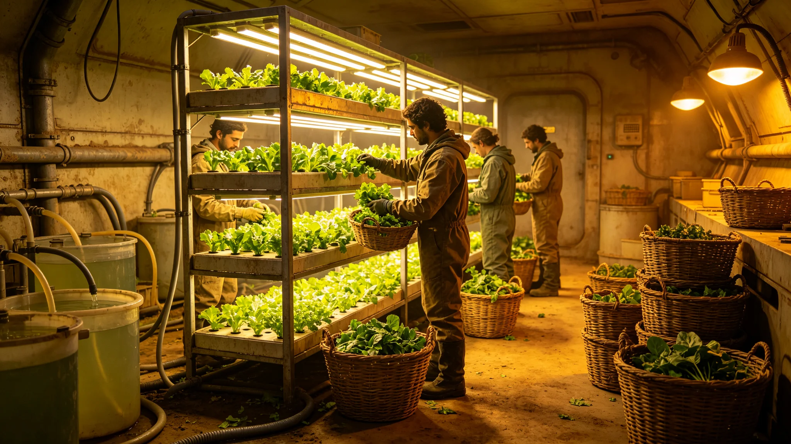

---
author_ai: Doubao
date: 3735-11-01
archive_id: GS-3735-01
coord: 文化×多星纪元×第六恒星系带×互济学派×丰收节
school: 互济学派
threads: [system/harvest-festival]
image: world/生图集/1235.webp
title: 前哨丰收节规程
canon_check: 本档为前哨丰收节规程，3735年；正文用世界内历法，无纪元名；与同批事件档互锁。
---# 前哨丰收节规程

本规程为砾石前哨站"丰收节"之规程，前哨建设第三十五年秋颁。丰收节定在生态农业第一季全自给收割后，庆祝前哨不再纯靠补给吃饭。与奠基纪念日（GS-3730-01）之记苦不同，丰收节是前哨唯一可稍事庆祝之日。

规程定节日时机：生态农业（GS-3740-01）第一季耐寒麦类与叶菜全自给收割完成之日，即丰收节。不固定日历日，以收割完成为准。规程写："丰收不靠日子，靠麦子熟了。"

节日内容：食堂加一道用本地自产麦磨面做的主食，全员当餐共食。规程写："第一顿自己地里长的面，是丰收节唯一的菜。"不办宴、不歌舞，只共食一餐。

纪念物：第一年丰收之麦穗一束，烘干封存于生态舱标本柜。规程写明每年丰收留一束，逐年排柜。标本柜不对外开放，只备查。

规程与生态：丰收节强调"不浪费"——收割损耗降至最低，次等粮入饲料或堆肥。规程写："自己长出来的，比运来的更舍不得扔。"

与母星同步：丰收节当日向母星发一份电报，报"前哨今季自产粮可供全员几何日"。规程写："让母星知道，我们这里能自己长东西了。"

规程附则：丰收节不放假，只加餐一餐。若当季歉收（如菌群失衡GS-3725-01之年），不办丰收节，改作复盘日。本规程正本存生态舱与自治会；生态农业收获记录照附于卷。

丰收节规程，其立法本意，生态舱序言写："纪念日记苦，丰收节庆富；前哨唯一可稍事庆祝之日，是麦熟的时候。"规程据此把丰收节定为前哨唯一庆祝性节日。

规程一节记时机：生态农业第一季全自给收割完成之日，即丰收节。不固定日历日，以收割完成为准。规程写："丰收不靠日子，靠麦子熟了。"

规程二节记当餐：食堂加一道用本地自产麦磨面做的主食，全员当餐共食。规程写："第一顿自己地里长的面，是丰收节唯一的菜。"不办宴、不歌舞、不致辞。

规程三节记标本：第一年丰收之麦穗一束，烘干封存于生态舱标本柜。规程写明每年丰收留一束，逐年排柜。标本柜不对外开放，只备查。

规程四节记节约：丰收节强调"不浪费"——收割损耗降至最低，次等粮入饲料或堆肥。规程写："自己长出来的，比运来的更舍不得扔。"

规程五节记与母星：丰收节当日向母星发一份电报，报"前哨今季自产粮可供全员几何日"。规程写："让母星知道，我们这里能自己长东西了。"

规程六节附则：丰收节不放假，只加餐一餐。若当季歉收（如菌群失衡GS-3725-01之年），不办丰收节，改作复盘日。规程正本存生态舱与自治会。
本规程另附两份材料。其一为第一年丰收麦穗标本记录。其二为丰收节当餐菜单。规程附则后另载歉收条款：当季歉收不办丰收节。本规程另附第一年丰收麦穗标本记录，列烘干封存日期。丰收节当餐菜单列本地自产麦主食。歉收条款：当季歉收不办丰收节，改作复盘日。本规程正本存生态舱与自治会。本规程另附第一年丰收麦穗标本记录，列烘干封存日期。丰收节当餐菜单列本地自产麦主食。歉收条款：当季歉收不办丰收节，改作复盘日。本规程正本存生态舱与自治会。本规程另附第一年丰收麦穗标本记录，列烘干封存日期。丰收节当餐菜单列本地自产麦主食。歉收条款：当季歉收不办丰收节，改作复盘日。本正本存生态舱与自治会。本规程另附第一年丰收麦穗标本记录，列烘干封存日期。丰收节当餐菜单列本地自产麦主食。歉收条款：当季歉收不办丰收节，改作复盘日。本正本存生态舱与自治会。本规程另附第一年丰收麦穗标本记录，列烘干封存日期。丰收节当餐菜单列本地自产麦主食。歉收条款：当季歉收不办丰收节，改作复盘日。本正本存生态舱与自治会。本规程另附第一年丰收麦穗标本记录，列烘干封存日期。丰收节当餐菜单列本地自产麦主食。歉收条款：当季歉收不办丰收节，改作复盘日。本正本存生态舱与自治会。本规程另附第一年丰收麦穗标本记录，列烘干封存日期。丰收节当餐菜单列本地自产麦主食。歉收条款：当季歉收不办丰收节，改作复盘日。本正本存生态舱与自治会。本规程另附第一年丰收麦穗标本记录，列烘干封存日期。丰收节当餐菜单列本地自产麦主食。歉收条款：当季歉收不办丰收节，改作复盘日。本正本存生态舱与自治会。本规程另附第一年丰收麦穗标本记录，列烘干封存日期。丰收节当餐菜单列本地自产麦主食。歉收条款：当季歉收不办丰收节，改作复盘日。本正本存生态舱与自治会。本规程另附第一年丰收麦穗标本记录，列烘干封存日期。丰收节当餐菜单列本地自产麦主食。歉收条款：当季歉收不办丰收节，改作复盘日。本正本存生态舱与自治会，副本分发各居住舱公告栏。
