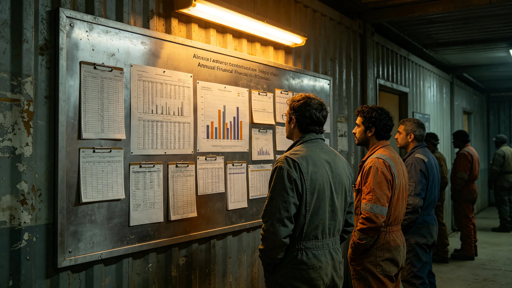

# 砾石前哨站建设产业链年度决算报告

本报告为砾石前哨站建设产业链前哨建设第三十六年度决算，由前哨财政处编。建设产业链含居住舱、生态舱、采矿模块、大气处理、3D打印等建设期投入。报告列岁入岁出、自给率与盈亏，以下摘录要点。

岁入：本年度建设投入之资金来源有三——母星拨款、资源外销分成、通信服务收费。决算载母星拨款占六成，外销分成占两成五，通信服务占一成五。较往年母星拨款比例下降，因前哨自给渐增。

岁出：建设支出分四项——土建（居住舱与走廊）、设备（聚变与大气处理）、材料（3D打印与运输）、人工。决算载土建占三成五，设备占三成，材料占两成，人工占一成五。人工比例低，因建设工人逐年回迁（GS-3707-01）。

自给率：本年度建材自给率——本地玄武岩打印件占新增建材约五成，其余仍自母星运入。决算载运输成本占材料支出四成五，为最大单项。财政处写："每一克自母星来的料，都贵在运费上。"

盈亏：本年度建设支出略超预算，因沙暴掩埋事件（GS-3723-01）与聚变功率骤降（GS-3726-01）两项整改追加。决算载超支由应急储备金支付，未动下年度预算。

与往年对照：建设投入逐年下降——前五年为高峰，后五年为收尾与运维。本年为建设高峰后第十一年，支出已降至高峰之三成。财政处写："建设不是年年建，是建完运维。"

报告结语：建设产业链决算平衡，无亏空。风险点仍在运输成本与母星拨款比例。下一步推进建材本地替代（GS-3722-01）与多船错峰运输（GS-3727-01）。本报告正本存财政处，副本送自治会与母星联络官；决算公示记录照附于卷。

本报告另附三份附表。其一为岁入岁出对照表，列母星拨款、外销分成、通信收费三项岁入，与土建、设备、材料、人工四项岁出。其二为自给率表，列本地打印件占新增建材之比例与逐年变化。其三为超支说明，列沙暴掩埋（GS-3723-01）与聚变功率骤降（GS-3726-01）两项整改追加。

报告附则后另载一份"与往年对照"：前五年为建设高峰，后五年为收尾运维；本年度为高峰后第十一年，支出降至高峰三成。财政处写："建设不是年年建，是建完运维。"

报告结语：建设产业链决算平衡，无亏空。下一步推进建材本地替代（GS-3722-01）与多船错峰运输（GS-3727-01）。本报告正本存财政处，副本送自治会与母星联络官。
本报告另附两份附表。其一为岁入岁出对照表。其二为超支说明。报告附则后另载与往年对照：本年度为高峰后第十一年，支出降至高峰三成。本报告另附岁入岁出对照表，列母星拨款、外销分成、通信收费三项岁入与四项岁出。超支说明列沙暴掩埋与聚变功率骤降两项整改追加。与往年对照：本年度为高峰后第十一年，支出降至高峰三成。本正本存财政处。本报告另附岁入岁出对照表，列母星拨款、外销分成、通信收费三项岁入与四项岁出。超支说明列沙暴掩埋与聚变功率骤降两项整改追加。与往年对照：本年度为高峰后第十一年，支出降至高峰三成。本正本存财政处。本报告另附岁入岁出对照表，列母星拨款、外销分成、通信收费三项岁入与四项岁出。超支说明列沙暴掩埋与聚变功率骤降两项整改追加。与往年对照：本年度支出降至高峰三成。本正本存财政处。本报告另附岁入岁出对照表，列母星拨款、外销分成、通信收费三项岁入与四项岁出。超支说明列沙暴掩埋与聚变功率骤降两项整改追加。与往年对照：本年度支出降至高峰三成。本正本存财政处。本报告另附岁入岁出对照表，列母星拨款、外销分成、通信收费三项岁入与四项岁出。超支说明列沙暴掩埋与聚变功率骤降两项整改追加。与往年对照：本年度支出降至高峰三成。本正本存财政处。本报告另附岁入岁出对照表，列母星拨款、外销分成、通信收费三项岁入与四项岁出。超支说明列沙暴掩埋与聚变功率骤降两项整改追加。与往年对照：本年度支出降至高峰三成。本正本存财政处。本报告另附岁入岁出对照表，列母星拨款、外销分成、通信收费三项岁入与四项岁出。超支说明列沙暴掩埋与聚变功率骤降两项整改追加。与往年对照：本年度支出降至高峰三成。本正本存财政处。本报告另附岁入岁出对照表，列母星拨款、外销分成、通信收费三项岁入与四项岁出。超支说明列沙暴掩埋与聚变功率骤降两项整改追加。与往年对照：本年度支出降至高峰三成。本正本存财政处。本报告另附岁入岁出对照表，列母星拨款、外销分成、通信收费三项岁入与四项岁出。超支说明列沙暴掩埋与聚变功率骤降两项整改追加。与往年对照：本年度支出降至高峰三成。本正本存财政处。
