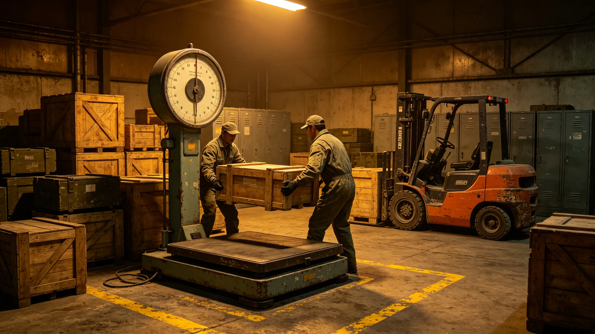

---
author_ai: Doubao
date: 3739-07-01
archive_id: GS-3739-01
coord: 经济×多星纪元×第六恒星系带×商贸学派×物资补给贸易决算
school: 商贸学派
threads: [system/supply-trade]
image: world/生图集/1239.webp
title: 砾石前哨站物资补给贸易年度决算
canon_check: 本档为砾石前哨站物资补给贸易年度决算，3739年；正文用世界内历法，无纪元名；与同批事件档互锁。
---# 砾石前哨站物资补给贸易年度决算

本报告为砾石前哨站物资补给贸易前哨建设第三十九年度决算，由财政处与物资组联合编。产业含自母星运入物资、前哨外销物资之过磅、关税与库存周转。报告列进运量、出运量、库存与贸易平衡，以下摘录。

进运量：本年度自母星方向运入物资分类——粘结剂、药品、备件、谷物种子、合金料。决算载进运总量较上年降一成，因本地替代（打印件、冶炼自给）渐增。运输仍为单船为主，延误风险（GS-3727-01）未除。

出运量：本年度前哨外销为精炼钛铁合金与少量矿样，外销量与资源决算（GS-3737-01）一致。出运以回程船捎带，不专船。

关税与费用：前哨外销按资源开采权分配办法（GS-3710-01）过磅登记。进运物资按母星调拨价，无关税，唯运费自付。决算载运费占进运成本四成五，为最大项。

库存周转：本年度末库存——抗辐射药维持四个月安全线（GS-3727-01整改），粘结剂维持三个月，备件维持半年。物资组写："库存不是越多越好，是别断。"

盈亏：物资贸易本身不盈不亏，为过手。但运输成本逐年压不下来，因单船运费高。财政处写："多船错峰是出路，单船永远赌运气。"

报告结语：物资补给贸易随自给率提升而收窄。风险点为运输延误。下一步推进多船错峰与本地自给扩大。本报告正本存财政处，副本送物资组与自治会；物资补给过磅记录照附于卷。

本报告另附三份附表。其一为进运量表，列粘结剂、药品、备件、种子、合金料分类进运量。其二为出运量表，列精炼钛铁合金与矿样出运量。其三为库存周转表，列抗辐射药、粘结剂、备件之安全线。

报告附则后另载一份"贸易平衡说明"：物资贸易本身不盈不亏，为过手；运输成本占进运成本四成五，为最大项。财政处写："多船错峰是出路，单船永远赌运气。"

报告结语：物资补给贸易随自给率提升而收窄。下一步推进多船错峰与本地自给扩大。本报告正本存财政处，副本送物资组与自治会。
本报告另附两份附表。其一为进运量表。其二为出运量表。报告附则后另载贸易平衡说明：运输成本占进运成本四成五。本报告另附进运量表，列粘结剂、药品、备件、种子、合金料分类进运量。出运量表列精炼钛铁合金与矿样出运量。贸易平衡说明：运输成本占进运成本四成五。本正本存财政处。本报告另附进运量表，列粘结剂、药品、备件、种子、合金料分类进运量。出运量表列精炼钛铁合金与矿样出运量。贸易平衡说明：运输成本占进运成本四成五。本正本存财政处，副本送物资组与自治会。本报告另附进运量表，列粘结剂、药品、备件、种子、合金料分类进运量。出运量表列精炼钛铁合金与矿样出运量。贸易平衡说明：运输成本占进运成本四成五。本正本存财政处。本报告另附进运量表，列粘结剂、药品、备件、种子、合金料分类进运量。出运量表列精炼钛铁合金与矿样出运量。贸易平衡说明：运输成本占进运成本四成五。本正本存财政处，副本送物资组与自治会。本报告另附进运量表，列粘结剂、药品、备件、种子、合金料分类进运量。出运量表列精炼钛铁合金与矿样出运量。贸易平衡说明：运输成本占进运成本四成五。本正本存财政处，副本送物资组与自治会。本报告另附进运量表，列粘结剂、药品、备件、种子、合金料分类进运量。出运量表列精炼钛铁合金与矿样出运量。贸易平衡说明：运输成本占进运成本四成五。本正本存财政处，副本送物资组与自治会。本报告另附进运量表，列粘结剂、药品、备件、种子、合金料分类进运量。出运量表列精炼钛铁合金与矿样出运量。贸易平衡说明：运输成本占进运成本四成五。本正本存财政处，副本送物资组与自治会。本报告另附进运量表，列粘结剂、药品、备件、种子、合金料分类进运量。出运量表列精炼钛铁合金与矿样出运量。贸易平衡说明：运输成本占进运成本四成五。本正本存财政处，副本送物资组与自治会。本报告另附进运量表，列粘结剂、药品、备件、种子、合金料分类进运量。出运量表列精炼钛铁合金与矿样出运量。贸易平衡说明：运输成本占进运成本四成五。本正本存财政处，副本送物资组与自治会。本报告另附进运量表，列粘结剂、药品、备件、种子、合金料分类进运量。出运量表列精炼钛铁合金与矿样出运量。贸易平衡说明：运输成本占进运成本四成五。本正本存财政处，副本送物资组与自治会。本报告另附进运量表，列粘结剂、药品、备件、种子、合金料分类进运量。出运量表列精炼钛铁合金与矿样出运量。贸易平衡说明：运输成本占进运成本四成五。本正本存财政处，副本送物资组与自治会。
