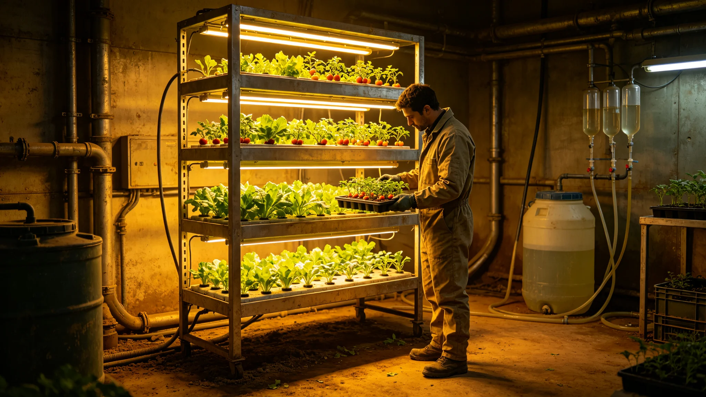

# 砾石前哨站生态农业产业年度决算

本报告为砾石前哨站生态农业产业前哨建设第四十年度决算，由生态舱与财政处联合编。产业含改良土上之耐寒麦类、豆科、叶菜种植，与堆肥闭环。报告列产量、自给率、成本与盈亏，以下摘录。

产量：本年度生态农业总产折合口粮可供前哨全员约三成五（GS-3719-01）。耐寒麦类亩产稳定在地球单位九成五，豆科约七成，叶菜约七成五。较改良首年（GS-3720-01）大幅提升。

自给率：口粮自给率三成五，其余六成五仍靠母星补给谷物。生态舱写："自己长的还不够吃饱，但够省下三成运费。"丰收节（GS-3735-01）即以此自给率为庆。

成本：生态农业成本为电费（补光与控温）、水、堆肥人工。本年度经温度光照优化，电费降一成五。改良土面积逐年扩，本年度较上年增两成。

盈亏：生态农业不盈利，为"省下的就是赚的"——省下三成口粮运费即盈余。财政处把这部分省下运费计入前哨财政节支。

风险与事件：本年度遇一次菌群失衡（GS-3725-01），发病种植架一季作物损失约一成。复盘后监测扩充，未再发。生态舱写："养地比种地金贵。"

报告结语：生态农业自给率逐年升，已非可有可无。下一步扩改良土面积、提口粮自给率至五成。本报告正本存生态舱与财政处，副本送自治会；生态农业种植架记录照附于卷。

本报告另附三份附表。其一为产量表，列耐寒麦类、豆科、叶菜之亩产与自给率。其二为成本表，列电费、水、堆肥人工之年度支出。其三为菌群失衡损失表，列发病种植架一季损失约一成。

报告附则后另载一份"与往年对照"：自改良首年（GS-3720-01），产量逐年提升，本年度口粮自给率三成五。生态舱写："自己长的还不够吃饱，但够省下三成运费。"

报告结语：生态农业自给率逐年升。下一步扩改良土面积、提口粮自给率至五成。本报告正本存生态舱与财政处，副本送自治会。
本报告另附两份附表。其一为产量表。其二为成本表。报告附则后另载与往年对照：本年度口粮自给率三成五。本报告另附产量表，列耐寒麦类、豆科、叶菜之亩产与自给率。成本表列电费、水、堆肥人工之年度支出。与往年对照：本年度口粮自给率三成五。本正本存生态舱与财政处。本报告另附产量表，列耐寒麦类、豆科、叶菜之亩产与自给率。成本表列电费、水、堆肥人工之年度支出。与往年对照：本年度口粮自给率三成五。本正本存生态舱与财政处，副本送自治会。本报告另附产量表，列耐寒麦类、豆科、叶菜之亩产与自给率。成本表列电费、水、堆肥人工之年度支出。与往年对照：本年度口粮自给率三成五。本正本存生态舱与财政处。本报告另附产量表，列耐寒麦类、豆科、叶菜之亩产与自给率。成本表列电费、水、堆肥人工之年度支出。与往年对照：本年度口粮自给率三成五。本正本存生态舱与财政处，副本送自治会。本报告另附产量表，列耐寒麦类、豆科、叶菜之亩产与自给率。成本表列电费、水、堆肥人工之年度支出。与往年对照：本年度口粮自给率三成五。本正本存生态舱与财政处，副本送自治会。本报告另附产量表，列耐寒麦类、豆科、叶菜之亩产与自给率。成本表列电费、水、堆肥人工之年度支出。与往年对照：本年度口粮自给率三成五。本正本存生态舱与财政处，副本送自治会。本报告另附产量表，列耐寒麦类、豆科、叶菜之亩产与自给率。成本表列电费、水、堆肥人工之年度支出。与往年对照：本年度口粮自给率三成五。本正本存生态舱与财政处，副本送自治会。本报告另附产量表，列耐寒麦类、豆科、叶菜之亩产与自给率。成本表列电费、水、堆肥人工之年度支出。与往年对照：本年度口粮自给率三成五。本正本存生态舱与财政处，副本送自治会。本报告另附产量表，列耐寒麦类、豆科、叶菜之亩产与自给率。成本表列电费、水、堆肥人工之年度支出。与往年对照：本年度口粮自给率三成五。本正本存生态舱与财政处，副本送自治会。本报告另附产量表，列耐寒麦类、豆科、叶菜之亩产与自给率。成本表列电费、水、堆肥人工之年度支出。与往年对照：本年度口粮自给率三成五。本正本存生态舱与财政处，副本送自治会。本报告另附产量表，列耐寒麦类、豆科、叶菜之亩产与自给率。成本表列电费、水、堆肥人工之年度支出。与往年对照：本年度口粮自给率三成五。本正本存生态舱与财政处，副本送自治会。本报告另附产量表，列耐寒麦类、豆科、叶菜之亩产与自给率。成本表列电费、水、堆肥人工之年度支出。与往年对照：本年度口粮自给率三成五。本正本存生态舱与财政处，副本送自治会。
