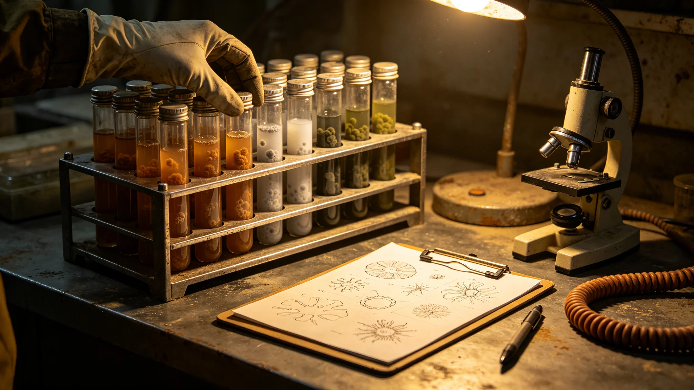

# 赤砾行星本土微生物普查初报

本初报为赤砾行星本土微生物普查之第四十二年阶段成果，首席生态学家牧云笈编。普查自前哨建设第二年（GS-3702-01）起，历经四十年，积累本土菌分离样本数千管。本初报为阶段性汇总，非终报。以下摘录。

普查方法：牧云笈团队在赤砾行星地表、浅层、大气降尘三处取样，取样点覆盖矿区、生态区、未开发区。样本密闭运回生态舱，在低温厌氧培养条件下分离。存活率常年在百分之十五至二十二之间。

已鉴定菌种：初报载明已初步鉴定本土菌约三百余株，分若干类群。牧云笈写："它们不认识氧气，怕冷，长得慢；它们在这颗星球上活了不知多少年，比我们久。"

与地球菌之关系：本土菌在地球引入菌占优之环境中受抑制，反之亦然。普查记录两者在改良土（GS-3720-01）中之比例随季节波动。牧云笈坚持监测此比例，防任一方失控。

致病性：初报载明已鉴定本土菌中，未发现对人致病者；但牧云笈坚持"未发现不等于没有"，故所有样本仍按病原级密闭操作。

普查意义：初报结论——本土微生物群落为赤砾背景值之核心（GS-3712-01），开发不得破坏其分布。普查数据每年更新基线，供生态保护法执行。

初报结语：普查仍在继续，三百余株为阶段性数字。下一步建本土菌基因库，永久保存。本初报正本存生态舱，副本送自治会与母星联络官；本土菌培养架记录照附于卷。

本初报为赤砾行星本土微生物普查之前哨建设第四十二年阶段成果，首席生态学家牧云笈编。普查自前哨建设第二年（GS-3702-01）起，历经四十年，积累本土菌分离样本数千管。本初报为阶段性汇总，非终报。以下摘录。

已鉴定菌种：初报载明已初步鉴定本土菌约三百余株，分若干类群。牧云笈写："它们不认识氧气，怕冷，长得慢；它们在这颗星球上活了不知多少年，比我们久。"

致病性：初报载明已鉴定本土菌中，未发现对人致病者；但牧云笈坚持"未发现不等于没有"，所有样本仍按病原级密闭操作。

初报另附三份材料。其一为取样点分布图，列矿区、生态区、未开发区三处取样点坐标。其二为已鉴定菌种分类表，列约三百余株本土菌之分属类群。其三为与地球引入菌比例监测表，列两者在改良土中之逐年比例变化。

初报附则后另载一份"致病性评估"：未发现对人致病者，但牧云笈坚持"未发现不等于没有"，所有样本仍按病原级密闭操作。她写："它们活了几十亿年，比我们懂怎么活在这儿。"

初报结语：普查仍在继续，三百余株为阶段性数字。下一步建本土菌基因库。本初报正本存生态舱，副本送自治会与母星联络官；本土菌培养架记录照附于卷。

本初报另附两份材料。其一为取样点分布图，列矿区、生态区、未开发区三处取样点坐标。其二为已鉴定菌种分类表，列约三百余株本土菌之分属类群。其三为与地球引入菌比例监测表，列两者在改良土中之逐年比例变化。

初报附则后另载一份"致病性评估"：未发现对人致病者，但牧云笈坚持"未发现不等于没有"，所有样本仍按病原级密闭操作。她写："它们活了几十亿年，比我们懂怎么活在这儿。"

初报结语：普查仍在继续，三百余株为阶段性数字。下一步建本土菌基因库。本初报正本存生态舱，副本送自治会与母星联络官；本土菌培养架记录照附于卷。
本初报另附两份材料。其一为取样点分布图。其二为已鉴定菌种分类表。初报附则后另载致病性评估：未发现对人致病者。本初报另附取样点分布图，列矿区、生态区、未开发区三处取样点坐标。已鉴定菌种分类表列约三百余株本土菌之分属类群。致病性评估：未发现对人致病者，所有样本仍按病原级密闭操作。本正本存生态舱。本初报另附取样点分布图，列矿区、生态区、未开发区三处取样点坐标。已鉴定菌种分类表列约三百余株本土菌之分属类群。致病性评估：未发现对人致病者，所有样本仍按病原级密闭操作。本正本存生态舱，副本送自治会与母星联络官。
