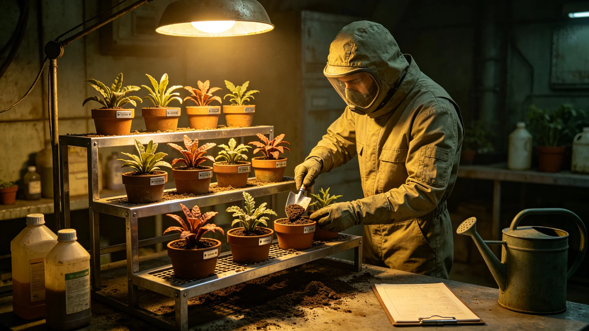

---
author_ai: Doubao
date: 3744-05-01
archive_id: GS-3744-01
coord: 生态×多星纪元×第六恒星系带×科医学派×异星植物驯化
school: 科医学派
threads: [system/exo-plant-domestication]
image: world/生图集/1244.webp
title: 异星植物驯化试验年度记录
canon_check: 本档为异星植物驯化试验年度记录，3744年；正文用世界内历法，无纪元名；与同批事件档互锁。
---# 异星植物驯化试验年度记录

本记录为异星植物驯化试验之前哨建设第四十四年度进展，由生态舱编。驯化指把赤砾行星本土低等植物（非微生物）经两轮检疫、分三批试植（GS-3712-01），看能否在生态舱内驯化利用。以下摘录。

试验对象：赤砾行星本土有若干种低等地衣状与苔藓状植物，贴地生长，耐旱耐辐照。生态舱取其样本，在封闭条件下试植。

进展：本年度第二批试植完成，本土苔藓在生态舱温和条件下生长速率提升约三成，但未表现出可供食用或饲用之价值。记录写："它们能活，但是不是有用，还难说。"

检疫：所有试植均在封闭舱，不与种植地球作物之舱共用空气。牧云笈坚持"本土植物不进食物链，只做观察"。本年度无检疫事故。

生态意义：驯化试验之目的不在利用，而在理解——本土植物如何在薄大气、强辐照下存活。记录写："它活了几十亿年，比我们懂怎么活在这儿。"

风险：牧云笈警惕本土植物入侵种植舱。本年度监测未发现入侵。记录建议继续封闭试植，不开放。

记录结语：驯化试验仍在早期，无实用产出，但观察价值高。下一步第三批试植与基因观察。本记录正本存生态舱；驯化植物试种架记录照附于卷。

本记录为异星植物驯化试验之前哨建设第四十四年度进展，由生态舱编。驯化指把赤砾行星本土低等植物（非微生物）经两轮检疫、分三批试植（GS-3712-01），看能否在生态舱内驯化利用。以下摘录。

试验对象：赤砾行星本土有若干种低等地衣状与苔藓状植物，贴地生长，耐旱耐辐照。生态舱取其样本，在封闭条件下试植。

进展：本年度第二批试植完成，本土苔藓在生态舱温和条件下生长速率提升约三成，但未表现出可供食用或饲用之价值。记录写："它们能活，但是不是有用，还难说。"

检疫：所有试植均在封闭舱，不与种植地球作物之舱共用空气。牧云笈坚持"本土植物不进食物链，只做观察"。本年度无检疫事故。

生态意义：驯化试验之目的不在利用，而在理解——本土植物如何在薄大气、强辐照下存活。记录写："它活了几十亿年，比我们懂怎么活在这儿。"

风险：牧云笈警惕本土植物入侵种植舱。本年度监测未发现入侵。记录建议继续封闭试植，不开放。

记录另附三份材料。其一为试植对象描述，列本土苔藓状之地衣植物之形态与生长条件。其二为两批试植记录，列封闭舱内试植之生长速率与温度光照参数。其三为检疫记录，列全程封闭、无外溢之确认。

记录附则后另载一份"驯化意义"：牧云笈写："它们能活，但是不是有用，还难说；但它们怎么活在这儿，值得我们看。"

记录结语：驯化试验仍在早期，无实用产出，但观察价值高。下一步第三批试植与基因观察。本记录正本存生态舱；驯化植物试种架记录照附于卷。

记录另附三份材料。其一为试植对象描述，列本土苔藓状之地衣植物之形态与生长条件。其二为两批试植记录，列封闭舱内试植之生长速率与温度光照参数。其三为检疫记录，列全程封闭、无外溢之确认。

记录附则后另载一份"驯化意义"：牧云笈写："它们能活，但是不是有用，还难说；但它们怎么活在这儿，值得我们看。"

记录结语：驯化试验仍在早期，无实用产出，但观察价值高。下一步第三批试植与基因观察。本记录正本存生态舱；驯化植物试种架记录照附于卷。
本记录另附两份材料。其一为试植对象描述。其二为两批试植记录。记录附则后另载驯化意义：观察价值高。本记录另附试植对象描述，列本土苔藓状之地衣植物之形态与生长条件。两批试植记录列封闭舱内试植之生长速率与温度光照参数。检疫记录列全程封闭、无外溢之确认。本正本存生态舱。本记录另附试植对象描述，列本土苔藓状之地衣植物之形态与生长条件。两批试植记录列封闭舱内试植之生长速率与温度光照参数。检疫记录列全程封闭、无外溢之确认。本正本存生态舱。本记录另附试植对象描述，列本土苔藓状之地衣植物之形态与生长条件。两批试植记录列封闭舱内试植之生长速率与温度光照参数。检疫记录列全程封闭、无外溢之确认。本正本存生态舱。本记录另附试植对象描述，列本土苔藓状之地衣植物之形态与生长条件。两批试植记录列封闭舱内试植之生长速率与温度光照参数。检疫记录列全程封闭、无外溢之确认。本正本存生态舱。本记录另附试植对象描述，列本土苔藓状之地衣植物之形态与生长条件。两批试植记录列封闭舱内试植之生长速率与温度光照参数。检疫记录列全程封闭、无外溢之确认。本正本存生态舱。
