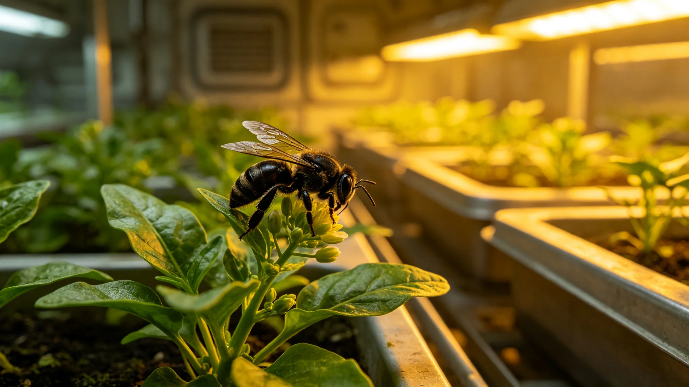

# 前哨伴生昆虫群落普查报告

本报告为前哨生态舱伴生昆虫群落之前哨建设第四十五年度普查，由生态舱编。生态舱内引入少量地球昆虫（如授粉蜂类）以辅助植物结实。普查其种群是否稳定、是否失控。以下摘录。

引入昆虫：生态舱引入授粉蜂类与少量分解性昆虫（如弹尾虫助堆肥）。引入时按检疫，封闭生态舱内放养。

种群状态：本年度普查，授粉蜂类种群稳定，数量在预期区间内，未爆发、未衰减。分解性昆虫在堆肥箱内正常工作。报告写："不多不少，正好干活。"

失控风险：生态舱监控昆虫是否外溢至其他舱。本年度无外溢记录。报告写："昆虫不穿加压服，出不了舱。"

伴生关系：报告记授粉蜂类使叶菜结实率提升，分解性昆虫使堆肥腐熟加快。昆虫为人工生物圈（GS-3743-01）之一环。

年度变动：本年度授粉蜂类冬季种群略降，春后复升，属正常。生态舱记录此年际波动，不干预。

报告结语：伴生昆虫群落稳定，可控。下一步观察其与本土菌之相互影响。本报告正本存生态舱；生态舱授粉昆虫记录照附于卷。

种群状态：本年度普查，授粉蜂类种群稳定，数量在预期区间内，未爆发、未衰减。分解性昆虫在堆肥箱内正常工作。报告写："不多不少，正好干活。"

失控风险：生态舱监控昆虫是否外溢至其他舱。本年度无外溢记录。报告写："昆虫不穿加压服，出不了舱。"

报告另附三份材料。其一为昆虫种类清单，列授粉蜂类与分解性弹尾虫两种。其二为种群状态表，列全年数量波动与季节变化。其三为外溢监测记录，列全年无外溢之确认。

报告附则后另载一份"伴生关系记录"：授粉蜂类使叶菜结实率提升，分解性昆虫使堆肥腐熟加快。报告写："昆虫不多不少，正好干活。"

报告附则后另载一份"伴生关系记录"：授粉蜂类使叶菜结实率提升，分解性昆虫使堆肥腐熟加快。报告写："昆虫不多不少，正好干活。"

报告结语：伴生昆虫群落稳定，可控。下一步观察其与本土菌之相互影响。本报告正本存生态舱；生态舱授粉昆虫记录照附于卷。
本报告另附两份材料。其一为昆虫种类清单。其二为种群状态表。报告附则后另载伴生关系记录：授粉蜂类使叶菜结实率提升。本报告另附昆虫种类清单，列授粉蜂类与分解性弹尾虫两种。种群状态表列全年数量波动与季节变化。外溢监测记录列全年无外溢之确认。伴生关系：授粉蜂类使叶菜结实率提升。本正本存生态舱。本报告另附昆虫种类清单，列授粉蜂类与分解性弹尾虫两种。种群状态表列全年数量波动与季节变化。外溢监测记录列全年无外溢之确认。伴生关系：授粉蜂类使叶菜结实率提升。本正本存生态舱。本报告另附昆虫种类清单，列授粉蜂类与分解性弹尾虫两种。种群状态表列全年数量波动与季节变化。外溢监测记录列全年无外溢之确认。本正本存生态舱。本报告另附昆虫种类清单，列授粉蜂类与分解性弹尾虫两种。种群状态表列全年数量波动与季节变化。外溢监测记录列全年无外溢之确认。伴生关系：授粉蜂类使叶菜结实率提升。本正本存生态舱。本报告另附昆虫种类清单，列授粉蜂类与分解性弹尾虫两种。种群状态表列全年数量波动与季节变化。外溢监测记录列全年无外溢之确认。伴生关系：授粉蜂类使叶菜结实率提升。本正本存生态舱。本报告另附昆虫种类清单，列授粉蜂类与分解性弹尾虫两种。种群状态表列全年数量波动与季节变化。外溢监测记录列全年无外溢之确认。伴生关系：授粉蜂类使叶菜结实率提升。本正本存生态舱。本报告另附昆虫种类清单，列授粉蜂类与分解性弹尾虫两种。种群状态表列全年数量波动与季节变化。外溢监测记录列全年无外溢之确认。伴生关系：授粉蜂类使叶菜结实率提升。本正本存生态舱。
