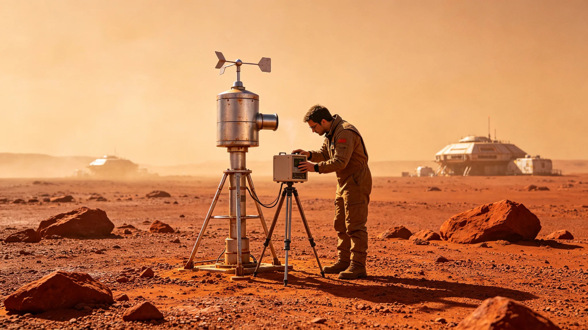

# 异星大气对前哨生态影响年度评估

本评估为异星大气对前哨生态影响之前哨建设第四十六年度报告，由生态舱与大气处理组联合编。赤砾行星原生大气稀薄、含腐蚀性组分，前哨大气处理（GS-3717-01）持续抽排，评估其对行星大气与生态舱之影响。以下摘录。

对行星大气之影响：大气处理机组年抽气量千余立方米（GS-3717-01），占行星大气总量之比例极小。评估载下游监测点大气组分与四十年前基线偏差在背景值一成以内，判为无显著改变。

对生态舱之影响：生态舱氧氮全靠大气处理供给。评估载大气处理稳定率九成九，生态舱氧分压稳定。一次大气处理故障（GS-3717-01）致氧分压短时下降，已整改。

腐蚀性组分：行星大气含腐蚀性微粒，经初滤后入生态舱之空气已净化。评估载净化后空气对人体无刺激，对生态舱金属无蚀损（滤后）。

沙暴与浮尘之影响：沙暴期（GS-3723-01）大气处理滤芯更换频繁，浮尘期（GS-3724-01）镜面污损。评估载大气处理已具备沙季应急能力。

评估结论：前哨大气处理对行星生态影响微小，对自身生态稳定。风险点在长期累积——四十年尚短，须持续监测基线。

报告结语：异星大气生态影响在可控范围。下一步把大气监测点加密至五处，数据公开备查。本报告正本存生态舱与大气处理组；大气监测点记录照附于卷。

报告另附三份材料。其一为行星大气影响评估表，列年抽气量与占行星大气总量比例。其二为生态舱氧氮供给表，列大气处理稳定率与氧分压读数。其三为腐蚀性组分监测表，列净化后空气对人体与金属之影响。

报告附则后另载一份"长期风险"：评估写"四十年尚短，须持续监测基线"。下一步把大气监测点加密至五处。

报告结语：异星大气生态影响在可控范围。本报告正本存生态舱与大气处理组；大气监测点记录照附于卷。

报告结语：异星大气生态影响在可控范围。本报告正本存生态舱与大气处理组；大气监测点记录照附于卷。
本评估另附两份材料。其一为行星大气影响评估表。其二为生态舱氧氮供给表。评估附则后另载长期风险：四十年尚短，须持续监测基线。本评估另附行星大气影响评估表，列年抽气量与占行星大气总量比例。生态舱氧氮供给表列大气处理稳定率与氧分压读数。腐蚀性组分监测表列净化后空气对人体与金属之影响。本正本存生态舱与大气处理组。本评估另附行星大气影响评估表，列年抽气量与占行星大气总量比例。生态舱氧氮供给表列大气处理稳定率与氧分压读数。腐蚀性组分监测表列净化后空气对人体与金属之影响。本正本存生态舱与大气处理组。本评估另附行星大气影响评估表，列年抽气量与占行星大气总量比例。生态舱氧氮供给表列大气处理稳定率与氧分压读数。腐蚀性组分监测表列净化后空气对人体与金属之影响。本正本存生态舱与大气处理组。本评估另附行星大气影响评估表，列年抽气量与占行星大气总量比例。生态舱氧氮供给表列大气处理稳定率与氧分压读数。腐蚀性组分监测表列净化后空气对人体与金属之影响。本正本存生态舱与大气处理组。
