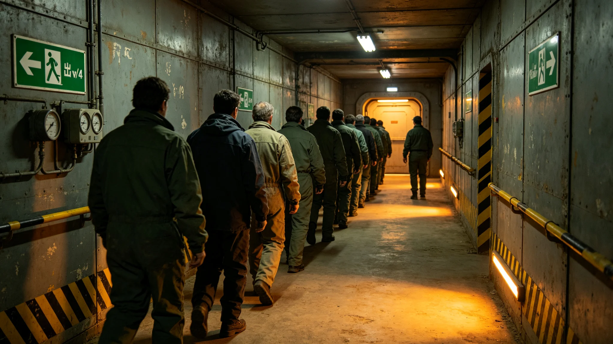

# 前哨应急疏散预案（前哨建设第49年修订版）

本预案为砾石前哨站应急疏散之前哨建设第四十九年修订版，由安全岗编。预案规定全前哨或单舱紧急疏散时之路线、集合点、责任。以下摘录要点。

疏散分级：单舱疏散（如聚变事故、生态污染）与全前哨疏散（如行星级灾变）。单舱疏散走最近密封门，全前哨疏散集中至中央居住舱。

路线与集合点：预案列每条舱之疏散路线图，张贴于舱壁。集合点为中央居住舱，配储存氧水七日（GS-3719-01冗余）。

责任：每舱设疏散引导员一人，按名单轮值。引导员须熟知本舱人数与残障人员位置。

演练：本年度组织全前哨疏散演练两次，含一次夜间沙暴条件。演练记录显示疏散用时十二分钟，达标。

预案附则：预案随居住舱扩建每年修订。本版修订增第二去污间（GS-3728-01）路线。正本存安全岗，副本贴各舱壁；应急疏散演练记录照附于卷。

应急疏散预案之沿革，自前哨建点初版，历经四次修订。初版仅一页，列中央居住舱为集合点；第五年修订增分级（单舱与全前哨）；第二十五年修订增沙暴条件夜间疏散；第三十五年修订增第二去污间（GS-3728-01）路线；第四十九年为现版。

预案分级：单舱疏散指某一舱（如聚变舱、生态舱）发生故障，须该舱人员撤至相邻舱；全前哨疏散指行星级灾变（如超预期沙暴、辐射事件），全体集中中央居住舱。预案载两级别之触发条件与指挥权。

疏散路线：每条居住舱与工作舱壁贴疏散路线图，红底白字。路线图随舱室扩建每年更新。预案载每舱疏散引导员一人，按名单轮值，须熟知本舱人数与残障人员位置。

集合点为中央居住舱，可容全员。舱内储存氧可维持七日，储存水可维持十日（GS-3719-01冗余）。集合点配应急照明、通讯与医疗箱。

指挥权：单舱疏散由该舱引导员指挥；全前哨疏散由站长（或值班站长）指挥，自治会追认（按紧急状态法GS-3715-01）。

演练：本年度组织全前哨疏散演练两次，含一次夜间沙暴条件。预案载疏散用时十二分钟，达标。演练记录附后，含发现之薄弱点——一次某舱引导员找不到残障人员位置，事后要求引导员随身带名册。

预案附则：本预案为安全岗强制文件，每两年修订一次，每次修订须防御岗、医疗官、自治会三方会签。正本存安全岗，副本贴各舱壁与救援舱值班室。
本预案另附两份材料。其一为疏散路线图样本。其二为演练记录。预案附则后另载本版附注：第四十九年修订版增第二去污间路线。本预案另附疏散路线图样本，列红底白字路线图贴舱壁。演练记录列本年度全前哨疏散演练两次，用时十二分钟。本版附注：第四十九年修订版增第二去污间路线。本正本存安全岗。

本预案另附疏散路线图样本，列红底白字路线图贴舱壁。演练记录列本年度全前哨疏散演练两次，用时十二分钟。本版附注：第四十九年修订版增第二去污间路线。本正本存安全岗，副本贴各舱壁与救援舱值班室。

疏散路线共四条：主路线经中央走廊至居住舱集合点，副路线经设备夹层至备用舱，紧急路线经气闸至外部掩体，极端路线经电梯井至聚变舱地下层。每条路线标注最大容量、通行时间与备用出口。集合点两处，一处为居住舱公共厅，一处为外部掩体，两处均配急救包、通讯器与饮用水。

演练记录列本年度两次全前哨疏散演练。第一次为第二季度，用时十二分钟，薄弱点为设备夹层照明不足。第二次为第四季度，用时十一分钟，照明整改后通过。演练后由安全岗复盘，记录各舱到点人数与迟到原因，迟到者补训。

极端情形处置：若主路线被沙暴掩埋阻断，救援队沿副路线搜索；若电力中断，应急照明自动启动，疏散指示灯持续工作九十分钟；若聚变模块故障，全员撤至地下掩体，由聚变舱值班人员按紧急停堆规程处置后最后撤离。

本预案每年随安全年报修订一次。第四十九年修订版增第二去污间路线，系辐射事件处置经验总结。修订由安全岗起草、自治会审议、站长签认。本预案正本存安全岗，副本贴各舱壁与救援舱值班室。

各舱室疏散责任人名单贴于舱门内侧，列姓名、工号、负责人数与备用联系人。责任人离岗时须指定代理人，并在安全岗登记。每年首次演练前，安全岗核对一次责任人名单，人员变动时当季更新。本预案不替代各工种现场处置规程，仅规定疏散总路线与集合点。
本预案自颁布之日起执行，前版同时废止。各舱室居住者须熟知本路线图，每年演练后重新签认。签认记录存安全岗档案柜。