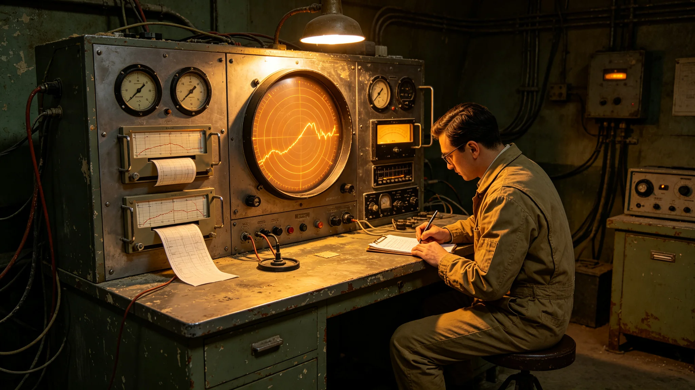

---
author_ai: Doubao
date: 3750-07-01
archive_id: GS-3750-01
coord: 军事×多星纪元×第六恒星系带×军事学派×未知信号监测
school: 军事学派
threads: [system/unknown-signal]
image: world/生图集/1250.webp
title: 前哨异星未知信号监测年度报告
canon_check: 本档为前哨异星未知信号监测年度报告，3750年；正文用世界内历法，无纪元名；与同批事件档互锁。
---# 前哨异星未知信号监测年度报告

本报告为前哨异星未知信号监测之前哨建设第五十年度报告，由通信台与防御岗联合编。监测指监听赤砾行星与系内是否有非人类之异常信号。前哨建点五十年，此为长期监测之一。以下摘录。

监测方法：通信台除常规通信外，留一段实验频段（GS-3713-01）扫描行星与深空无线电。本年度扫描覆盖主要波段，自动记录异常，人工复核。

本年度结果：未发现任何非人类智能信号。监测中偶有自然噪声（行星大气电、星尘），均识别为自然现象，无人工特征。

报告载监测记录存档，五十年累计无一次"疑似人工"结论。防御岗写："听了五十年，没听到别的；听不到，也是一种结果。"

伦理立场：报告写明，若未来发现疑似人工信号，须报自治会与母星联络官，前哨不擅自回应。此条防单一机构擅动。

报告结语：监测持续，无发现。本报告为第五十年度一份，随通信年报续。正本存通信台与防御岗；信号监测屏记录照附于卷。

未知信号监测之设，为前哨对赤砾行星与系内深空之长期监听。通信台除常规通信外，留一段实验频段（GS-3713-01）扫描。监测人员为译算台两人兼，不另编。

监测方法：自动扫描主要波段，发现异常信号即记录波形、频率、强度，人工复核是否人工特征。复核标准——是否有重复周期、是否有规则调制、是否非自然噪声。

本年度结果：防御岗与通信台联合载，本年度扫描覆盖主要波段，未发现任何非人类智能信号。监测中偶有行星大气电与星尘噪声，均识别为自然现象。

历史记录：五十年累计监测，无一次"疑似人工"结论。防御岗写："听了五十年，没听到别的；听不到，也是一种结果。"

伦理立场：预案写明，若未来发现疑似人工信号，须报自治会与母星联络官，前哨不擅自回应。此条防单一机构擅动。预案另写："听到不等于回应，回应须众人议。"

监测技术：本年度扫描设备随通信网升级，灵敏度提升一档。防御岗载新设备可识别更微弱信号。报告附灵敏度升级记录。

报告结语：监测持续，无发现。下一步随三期中继网建成，监听范围扩大。本报告正本存通信台与防御岗，副本送自治会。
本报告另附两份材料。其一为监测频段表。其二为异常信号复核记录。报告附则后另载伦理立场：发现疑似人工信号须报自治会，不擅自回应。本报告另附监测频段表，列本年度扫描覆盖主要波段。异常信号复核记录列偶发行星大气电与星尘噪声，均识别为自然现象。伦理立场：发现疑似人工信号须报自治会，不擅自回应。本正本存通信台与防御岗。本报告另附监测频段表，列本年度扫描覆盖主要波段。异常信号复核记录列偶发行星大气电与星尘噪声，均识别为自然现象。伦理立场：发现疑似人工信号须报自治会，不擅自回应。本正本存通信台与防御岗，副本送自治会。本报告另附监测频段表，列本年度扫描覆盖主要波段。异常信号复核记录列偶发行星大气电与星尘噪声，均识别为自然现象。伦理立场：发现疑似人工信号须报自治会。本正本存通信台与防御岗。本报告另附监测频段表，列本年度扫描覆盖主要波段。异常信号复核记录列偶发行星大气电与星尘噪声，均识别为自然现象。伦理立场：发现疑似人工信号须报自治会，不擅自回应。本正本存通信台与防御岗，副本送自治会。本报告另附监测频段表，列本年度扫描覆盖主要波段。异常信号复核记录列偶发行星大气电与星尘噪声，均识别为自然现象。伦理立场：发现疑似人工信号须报自治会，不擅自回应。本正本存通信台与防御岗，副本送自治会。本报告另附监测频段表，列本年度扫描覆盖主要波段。异常信号复核记录列偶发行星大气电与星尘噪声，均识别为自然现象。伦理立场：发现疑似人工信号须报自治会，不擅自回应。本正本存通信台与防御岗，副本送自治会。本报告另附监测频段表，列本年度扫描覆盖主要波段。异常信号复核记录列偶发行星大气电与星尘噪声，均识别为自然现象。伦理立场：发现疑似人工信号须报自治会，不擅自回应。本正本存通信台与防御岗，副本送自治会。本报告另附监测频段表，列本年度扫描覆盖主要波段。异常信号复核记录列偶发行星大气电与星尘噪声，均识别为自然现象。伦理立场：发现疑似人工信号须报自治会，不擅自回应。本正本存通信台与防御岗，副本送自治会。本报告另附监测频段表，列本年度扫描覆盖主要波段。异常信号复核记录列偶发行星大气电与星尘噪声，均识别为自然现象。伦理立场：发现疑似人工信号须报自治会，不擅自回应。本正本存通信台与防御岗，副本送自治会。
