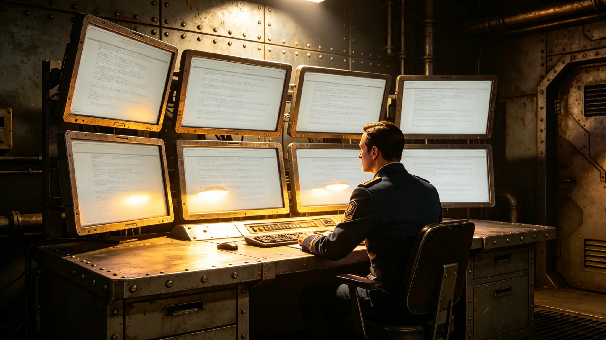

**归档单位**：联合体深空外交署翻译司
**归档日期**：3752年6月20日
**档案等级**：内部人事

## 一、基本登记

- 姓名：苏译川
- 性别：女
- 出生：3715年，跨星系港第三区出生
- 现任：驻异星文明常驻使馆首席翻译官（3749年1月随使团开馆任命，见GS-3751-01）
- 师承：言通津（见GS-3611-01，前使团首席翻译官，其师）
- 工号：FOR-TRN-3749-002

## 二、历轮考勤摘要

苏译川自3733年入役翻译司至3752年5月，共执行跨文明翻译任务十九次，累计在岗约三千四百天。考勤摘要如下：

| 时段 | 职务 | 任务次数 | 缺勤 | 迟到 | 备注 |
|---|---|---|---|---|---|
| 3733-3738 | 见习翻译 | 4 | 0 | 0 | 随言通津进修 |
| 3738-3743 | 翻译 | 5 | 0 | 0 | 参与跨系照会翻译 |
| 3743-3749 | 资深翻译 | 5 | 0 | 0 | 建交预谈判翻译 |
| 3749-3752 | 首席翻译官 | 5 | 0 | 0 | 常驻"晶环"站使馆 |

十九次任务中零缺勤零迟到。

## 三、误译签认记录

苏译川任首席翻译官以来共签认误译四次：

1. 3749年3月，将异星方照会中"三周期"误译为"三周"，实为异星计时单位，经对方翻译指出后更正；
2. 3750年4月，实时翻译系统将"暂缓"误译为"拒绝"，引发外交危机事件（见GS-3773-01），苏译川签认系统译稿复核流程存在漏洞；
3. 3750年11月，将异星方技术术语中某矿物名称误译为"硅晶体"，实为另一种结构类似的化合物，经联合科考队（见GS-3755-01）技术核对后更正；
4. 3751年9月，在贸易谈判中将"逐年递增"误译为"逐年递减"，事后自查发现并立即更正，未影响谈判结果。

四次误译中，第二次最为严重，直接导致外交危机。其余三次均未造成实质性后果。

## 四、体检摘要

| 年份 | 视力 | 听力 | 语音清晰度 | 异星文字识读评分 |
|---|---|---|---|---|
| 3738 | 1.0/1.0 | 正常 | 良好 | 合格 |
| 3743 | 1.0/1.0 | 正常 | 良好 | 良好 |
| 3749 | 0.9/1.0 | 正常 | 良好 | 良好 |
| 3752 | 0.9/0.9 | 正常 | 良好 | 良好 |

苏译川视力稳定略降，系长年对照异星文字缮本所致。

## 五、家庭与家属

苏译川配偶在跨星系港通信站任技术员，未随驻。无子女。苏译川按制度每驻满十八个月轮休一次，3750年10月首次轮休返港，无超假。

## 六、任首席翻译官五年工作摘要

苏译川主持使馆翻译组日常工作，下辖翻译员三人、实时翻译系统维护员一人。五年间签认翻译稿约二千四百页。3750年4月误译事件后，苏译川主持修订翻译复核流程，增设双人复核环节，此后未再发生同类事件。

她在驻节隔间内有一排书架，架上放着言通津所赠老地球汉英词典影印件，以及异星文字字形对照表三册。据馆员笔记，苏译川每日早班先花四十分钟对照异星文字新版字典，再开始排当日翻译稿。

## 七、四次误译的来龙去脉

3749年3月那次"三周期"误译，发生在建交初期。异星计时单位"周期"相当于老地球上的约十一天，苏译川当时刚接触异星文字半年，将"三周期"按字面译为"三周"。对方翻译当场指出，苏译川当场更正，并在当晚整理出一份异星计时单位对照表，分发给使馆全体人员。

3750年4月那次误译最为严重。实时翻译系统将异星方一份照会中的"暂缓审议"误译为"拒绝审议"。苏译川在系统译稿出来后未做人工复核即提交大使沈远谟（见GS-3751-01）。沈远谟据此向异星方提出正式质询，异星方大为惊讶，称从未发出拒绝照会。事件持续四十八小时后澄清，苏译川签认事故责任，并在事后增设双人复核环节。

3750年11月那次矿物名称误译，发生在联合科考队报告翻译中。苏译川将一种异星矿物名称按字形近似译为"硅晶体"，科考队技术人员收到译稿后发现与实际矿物成分不符，反馈后更正。苏译川在签认书上写道：矿物名称不能靠字形猜，必须拿成分分析报告对照。

3751年9月那次"逐年递增"误译为"逐年递减"，发生在贸易谈判现场。苏译川在现场口译时将方向搞反，对方翻译当场提出疑问，苏译川立即自查并更正。她在事后笔记中写：递增递减只差一个字，差出去就是完全不同的贸易条件。

## 八、翻译组日常运作

使馆翻译组共四人，包括苏译川本人。三名翻译员分别负责：照会文书翻译、会谈口译、技术资料翻译。实时翻译系统维护员负责系统每日校准与版本更新。苏译川每日上午主持翻译组例会一次，约二十分钟，主要分配当日翻译任务、通报前一日误译或存疑之处。

据翻译组工作日志，苏译川对译稿的要求是：凡遇异星方原文中出现未收录于现行异文字典的新词，必须标注存疑，不得自行猜测译出。这条规定是3750年4月误译事件后增设的，此后执行良好，未再出现靠字形猜译的情况。

## 九、与异星方翻译的交往记录

苏译川与异星方执政团专职翻译员保持每周一次非正式交流，主要讨论翻译中遇到的疑难术语。双方商定建立跨文明术语对照表，每季度更新一次。对照表已更新至第五版，收录双方术语约二千四百条。

异星方翻译员曾在一次交流中表示：你们的翻译很认真，但有时候太较真，一个词翻来覆去确认三回。苏译川将此话记入工作日志，未作回应。

## 十、末段签批

本档案袋经翻译司审阅，确认苏译川十九次任务考勤、四次误译签认、体检记录完整。档案袋密封后存于翻译司恒温柜。本档案不公开，仅在其再次晋升或再次处分时启封。如有争议，按翻译司业务规程第十一条处理。
