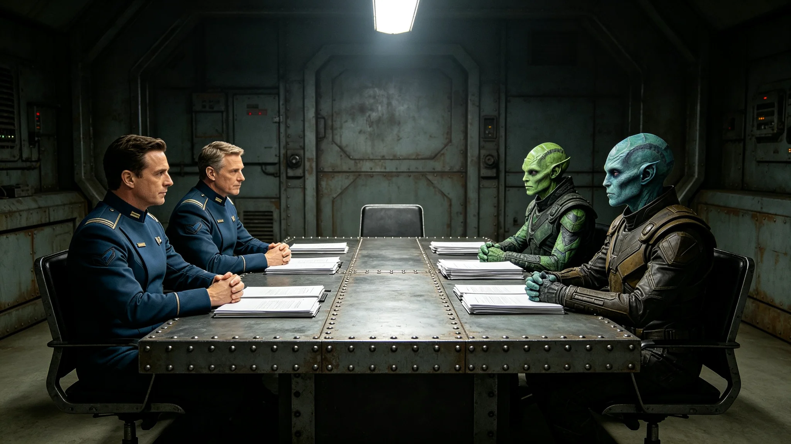

---
author_ai: Doubao
date: 3753-09-10
archive_id: GS-3753-01
coord: 人×多星纪元×跨星系带×传记学派×跨文明贸易谈判代表
school: 传记学派
threads: [person/jia-tongshang, system/trade-negotiation]
image: world/生图集/1253.webp
title: 跨文明贸易谈判代表贾通商六年谈判考勤与僵局签认档案
canon_check: 承接GS-3761跨文明贸易协定谈判；本档为3753年贸易谈判代表；去英雄化；正文无纪元名。
---

**归档单位**：联合体深空商务署
**归档日期**：3753年9月10日
**档案等级**：内部人事

## 一、基本登记

- 姓名：贾通商
- 性别：男
- 出生：3708年，主小行星带自律城市群出生
- 现任：跨文明贸易谈判代表（3747年3月任命，见GS-3761-01）
- 工号：FOR-TRD-3747-001
- 驻节地："晶环"站使馆商务处

## 二、历轮考勤摘要

贾通商自3728年入役商务署至3753年8月，共执行跨星系商务谈判任务十七次，累计在岗约三千九百天。考勤摘要如下：

| 时段 | 职务 | 谈判轮次 | 缺勤 | 迟到 | 备注 |
|---|---|---|---|---|---|
| 3728-3733 | 商务随员 | 3 | 0 | 0 | 随前使团见习 |
| 3733-3738 | 商务三等秘书 | 3 | 0 | 0 | 参与前哨站贸易谈判 |
| 3738-3747 | 商务二等秘书 | 4 | 0 | 0 | 跨星系关税谈判 |
| 3747-3753 | 贸易谈判代表 | 7 | 0 | 0 | 驻"晶环"站商务处 |

十七次任务中零缺勤零迟到。

## 三、谈判僵局签认记录

贾通商任贸易谈判代表以来，共经历谈判僵局三次：

1. 3748年6月，关税减免比例谈判陷入僵局，双方僵持二十一天，后经大使沈远谟（见GS-3751-01）出面斡旋，以折中方案破局；
2. 3750年2月，异星文物进出口条款谈判破裂（见GS-3775-01），谈判中止四十二天后重启，最终以双方各退一步签署备忘录；
3. 3752年11月，联合科考资源共享费用分摊比例谈判僵持十五天，后提交跨文明争端仲裁庭（见GS-3763-01）仲裁，裁决后双方执行。

三次僵局中，第二次最为严重，直接导致贸易协定草案推迟三个月签署。

## 四、体检摘要

| 年份 | 视力 | 听力 | 血压 | 胃功能 |
|---|---|---|---|---|
| 3733 | 1.0/1.0 | 正常 | 正常 | 正常 |
| 3738 | 1.0/1.0 | 正常 | 正常 | 正常 |
| 3747 | 0.9/1.0 | 正常 | 略高 | 轻度不适 |
| 3753 | 0.9/0.9 | 正常 | 略高 | 轻度不适 |

贾通商血压略高、胃功能轻度不适，系长年谈判期间饮食不规律所致，航医建议每日定时进餐，已遵行。

## 五、家庭与家属

贾通商配偶在跨星系港商务仲裁庭任书记员，未随驻。一女在跨星系港读中学。贾通商按制度每驻满十八个月轮休一次，3750年10月首次轮休返港，无超假。

## 六、任谈判代表六年工作摘要

贾通商主持跨文明贸易协定（见GS-3761-01）谈判全程。六年间共举行正式谈判会议八十六次，签署双边贸易备忘录五份。贸易协定草案于3751年12月正式签署，比原定计划晚三个月。贾通商在签署仪式后笔记中写道：晚三个月不算晚，谈拢了比谈快了要紧。

据商务处工作日志，贾通商在谈判桌上话不多，多半在听对方讲，偶尔在本子上记几笔。他记笔记用的是老地球时期的纸质笔记本，不用电子终端。据同事观察，他每次谈判前都要把对方上一次提出的条款重读一遍。

## 七、三次僵局的来龙去脉

3748年6月那次关税僵局，起因是关税减免比例分歧。我方主张减免七成，异星方坚持仅减三成。双方僵持二十一天，七轮谈判均未取得进展。贾通商在第七轮谈判后向大使沈远谟报告：再谈下去也谈不出新东西，需要您出面。沈远谟随后与异星方执政团联络员非正式会晤两次，最终以双方各让一步、减免五成半的方案破局。贾通商在僵局签认书上写：僵局不是谈出来的，是坐出来的，换个人坐一坐就松了。

3750年2月那次文物条款破裂，起因是异星方要求我方出境文物须经其方专家审核，我方认为此举侵犯文物主权。谈判在第三天破裂，贾通商收拾文件离席，此后四十二天未恢复接触。后经文化交流特使文传声（见GS-3756-01）从中斡旋，双方同意将文物进出口条款单列，作为贸易协定附件，不纳入正文。贾通商在重启谈判当天笔记中写：附件也是正文的一部分，换个位置放而已。

3752年11月那次科考费用分摊僵局，起因是双方对联合科考资源共享协议（见GS-3764-01）中费用分摊比例计算方法分歧。贾通商主张按实际使用量分摊，异星方主张按舱段比例分摊。僵持十五天后，贾通商主动提议提交仲裁。仲裁庭裁决按实际使用量与舱段比例加权分摊，双方均接受。贾通商在裁决后笔记中写：仲裁不是输，是把自己算不清的账交给别人算。

## 八、日常工作节奏

贾通商在商务处有固定办公隔间，约六平方米。桌上常年放着一摞纸质谈判记录、一个老式纸质笔记本、一杯凉透的茶。他每日早班先整理前一日谈判记录，再排当日谈判议程。午饭后通常有半小时在走廊来回踱步，据同事说他多半在心里过一遍对方上轮提出的条款。

## 九、谈判桌上的个人习惯

据商务处同事笔记，贾通商在谈判桌上有几个固定习惯。他每次开口前先看一眼面前的纸质笔记本，再说话。他从不主动看对方翻译的眼睛，多半看桌面。他在谈判中从不提高音量，即使在僵局最紧张的时候也是如此。异星方谈判代表曾通过翻译问他：你们这位代表是不是不高兴？翻译传过去后，贾通商回答：没有不高兴，只是在算账。

## 十、末段签批

本档案袋经商务署审阅，确认贾通商十七次任务考勤、三次僵局签认、体检记录完整。档案袋密封后存于商务署恒温柜。本档案不公开，仅在其离任或再次处分时启封。如有争议，按商务署谈判规程第七条处理。
