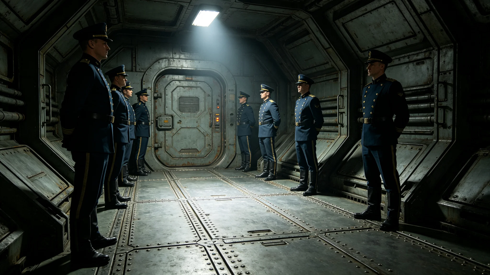

**归档单位**：联合体深空外交署礼宾司
**归档日期**：3754年4月18日
**档案等级**：内部人事

## 一、基本登记

- 姓名：程礼仪
- 性别：女
- 出生：3712年，跨星系港第五区出生
- 现任：外交礼宾总长（3749年1月随使馆开馆任命）
- 工号：FOR-PRO-3749-003
- 驻节地："晶环"站使馆礼宾处

## 二、历轮考勤摘要

程礼仪自3730年入役礼宾司至3754年3月，共主持跨文明礼仪活动三十一次，累计在岗约三千一百天。考勤摘要如下：

| 时段 | 职务 | 活动次数 | 缺勤 | 迟到 | 备注 |
|---|---|---|---|---|---|
| 3730-3735 | 礼宾随员 | 6 | 0 | 0 | 随前使团见习 |
| 3735-3742 | 礼宾三等秘书 | 7 | 0 | 0 | 接触纪联络期礼宾 |
| 3742-3749 | 礼宾二等秘书 | 8 | 0 | 0 | 建交预谈判礼宾 |
| 3749-3754 | 礼宾总长 | 10 | 0 | 0 | 驻"晶环"站使馆 |

三十一次活动中零缺勤零迟到。

## 三、礼仪活动签认记录

程礼仪任礼宾总长以来，主持重要礼仪活动十次，签认记录如下：

1. 3749年2月，沈远谟大使（见GS-3751-01）递交国书仪式，全程按外交礼仪规范（见GS-3765-01）执行，无差错；
2. 3749年6月，异星方驻我使馆开馆仪式，程礼仪负责我方回礼安排；
3. 3750年2月，跨文明文化节开幕式（见GS-3781-01），程礼仪主持主席台座次安排；
4. 3750年9月，联合天文观测共祭仪式（见GS-3782-01），程礼仪负责双方仪仗队排列；
5. 3751年1月，建交一周年纪念宴会（见GS-3780-01），程礼仪负责菜单与座次；
6. 3751年12月，贸易协定签署仪式（见GS-3785-01），程礼仪主持签字台布置；
7. 3752年5月，跨文明艺术展开幕式（见GS-3784-01），程礼仪负责展厅导引；
8. 3753年3月，新任二等秘书递交到任照会仪式，程礼仪指导新秘书执行；
9. 3753年8月，异星方代表团来访接待，程礼仪全程陪同；
10. 3754年1月，建交五周年纪念活动筹备，程礼仪任筹备组组长。

十次活动中无礼仪差错，无投诉记录。

## 四、体检摘要

| 年份 | 视力 | 听力 | 前庭功能 | 步态稳定性 |
|---|---|---|---|---|
| 3735 | 1.0/1.0 | 正常 | 正常 | 正常 |
| 3742 | 1.0/1.0 | 正常 | 正常 | 正常 |
| 3749 | 0.9/1.0 | 正常 | 正常 | 正常 |
| 3754 | 0.9/0.9 | 正常 | 正常 | 正常 |

程礼仪身体状况良好，无长航程适应障碍。

## 五、家庭与家属

程礼仪配偶在跨星系港礼宾司本部任职，未随驻。一子在跨星系港读小学。程礼仪按制度每驻满十八个月轮休一次，3750年10月首次轮休返港，无超假。

## 六、任礼宾总长四年工作摘要

程礼仪主持使馆礼宾处日常工作，下辖礼宾员二人、仪仗队长一人。四年间主持重要礼仪活动十次，未发生礼仪差错。外交礼仪规范（见GS-3765-01）修订期间，程礼仪负责起草异星方礼仪条款章节。

据礼宾处工作日志，程礼仪对礼仪细节要求极严。她要求每次活动前三天必须完成全流程彩排一次，活动当天提前两小时到场检查布置。她在礼宾处墙上挂着一张流程图，图上标明从迎宾到送客每一步的时间节点，精确到分钟。

## 七、一次座次争议的来龙去脉

3751年1月建交一周年纪念宴会，程礼仪在安排主席台座次时遇到争议。异星方代表团中有两位代表，级别相同但资历不同，异星方要求按资历排列，我方按制度应按级别排列。程礼仪在宴会前两天与异星方礼宾官员磋商三次，最终决定：级别相同者按到达时间先后排列，先到者居左。异星方礼宾官员同意，宴会当天无争议。

程礼仪在事后笔记中写：座次这种事，没有对不对，只有对方接不接受。提前问清楚，比当场调整强一百倍。

## 八、日常工作节奏

程礼仪在礼宾处有固定办公隔间，约七平方米。隔间墙上贴着历次活动流程图和座次表。她每日早班先核对当日日程中的礼仪环节，再检查礼宾员到岗情况。午饭后通常有一小时整理下次活动的流程文件。据礼宾员笔记，程礼仪在活动前一天晚上通常还要独自到场检查一遍灯光、音响和座次。

## 九、礼宾处日常管理

程礼仪管理礼宾处两名礼宾员和一名仪仗队长。她每周一上午主持礼宾处例会一次，约三十分钟，主要通报本周活动安排、分配任务、检查上次活动收尾情况。她要求礼宾员每次活动后两天内提交活动总结，总结须包括流程执行情况、有无偏差、改进建议三项内容。

据礼宾员笔记，程礼仪对活动总结的格式要求严格。总结必须用统一模板，不得自行增减栏目。她在一份退回的总结上批注：改进建议栏空着写无，不能什么都不写。

## 十、与异星方礼宾官员的协作

程礼仪与异星方礼宾官员保持每两周一次工作会晤，主要协调双方联合礼仪活动的安排。双方商定建立礼仪活动联合审核机制，任何一方主办的跨文明礼仪活动须提前两周通知对方，对方有权提出修改建议。

异星方礼宾官员曾在一次会晤中表示：你们的流程太细了，每个步骤都要写下来。程礼仪通过翻译回答：细一点好，细了就不会出错。

## 十一、末段签批

本档案袋经礼宾司审阅，确认程礼仪三十一次礼仪活动考勤、签认记录、体检记录完整。档案袋密封后存于礼宾司恒温柜。本档案不公开，仅在其离任或晋升时启封。
