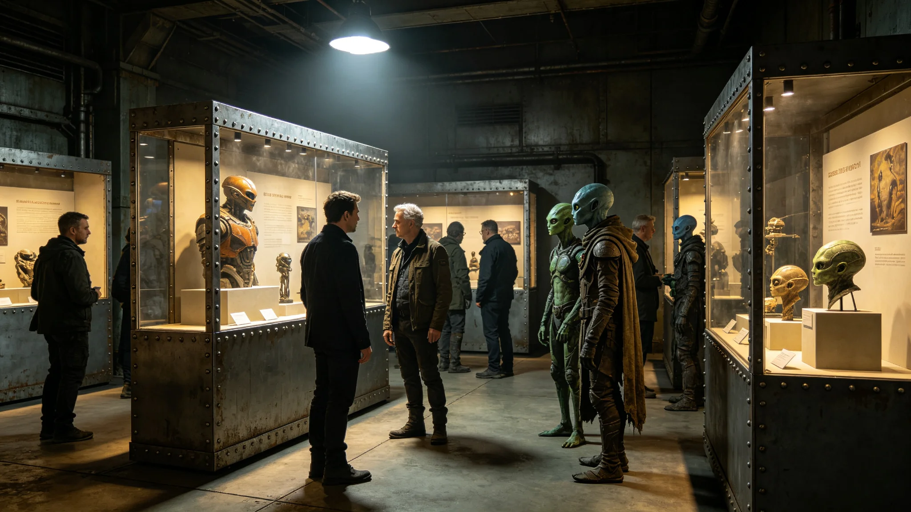

**归档单位**：联合体深空文化署
**归档日期**：3756年8月30日
**档案等级**：内部人事

## 一、基本登记

- 姓名：文传声
- 性别：女
- 出生：3714年，跨星系港第四区出生
- 现任：文化交流特使（3749年3月任命）
- 工号：FOR-CUL-3749-004
- 驻节地："晶环"站使馆文化处

## 二、历轮考勤摘要

文传声自3732年入役文化署至3756年7月，共组织跨文明文化活动十八次，累计在岗约二千八百天。考勤摘要如下：

| 时段 | 职务 | 活动次数 | 缺勤 | 迟到 | 备注 |
|---|---|---|---|---|---|
| 3732-3737 | 文化随员 | 4 | 0 | 0 | 随前使团见习 |
| 3737-3744 | 文化三等秘书 | 4 | 0 | 0 | 跨星系文化巡展 |
| 3744-3749 | 文化二等秘书 | 4 | 0 | 0 | 建交预交流 |
| 3749-3756 | 文化交流特使 | 6 | 0 | 0 | 驻"晶环"站文化处 |

十八次活动中零缺勤零迟到。

## 三、文化摩擦签认记录

文传声任文化交流特使以来，经历文化摩擦三次：

1. 3749年10月，我方赠送异星方一批老地球音乐唱片，异星方表示部分曲目节奏过于急促，不适宜其方聆听习惯，文传声签认礼品文化背景调查不足；
2. 3751年6月，跨文明艺术展（见GS-3784-01）开幕前，一幅我方抽象画作被异星方审查员认为图案具有攻击性，文传声签认展前审核流程未征求异星方意见；
3. 3753年9月，我方文化代表团在异星方宗教场所拍照，引发对方不满，文传声签认行前文化禁忌培训不到位。

三次摩擦均未造成外交降级，事后均以书面说明方式解决。

## 四、体检摘要

| 年份 | 视力 | 听力 | 语音表达 | 情绪稳定性 |
|---|---|---|---|---|
| 3737 | 1.0/1.0 | 正常 | 良好 | 良好 |
| 3744 | 1.0/1.0 | 正常 | 良好 | 良好 |
| 3749 | 0.9/1.0 | 正常 | 良好 | 良好 |
| 3756 | 0.9/0.9 | 正常 | 良好 | 良好 |

文传声身体状况良好。

## 五、家庭与家属

文传声配偶在跨星系港交响乐团任演奏员，未随驻。无子女。文传声按制度每驻满十八个月轮休一次，3750年10月首次轮休返港，无超假。

## 六、任文化交流特使七年工作摘要

文传声主持使馆文化处日常工作，下辖文化随员一人。七年间组织跨文明文化节三届（见GS-3781-01）、跨文明艺术展两届（见GS-3784-01）、联合天文观测共祭活动两次（见GS-3782-01）。

据文化处工作日志，文传声每次组织跨文化活动前，都要与异星方文化官员逐项核对活动内容，确认是否触及对方文化禁忌。这条规矩是3749年10月唱片事件后增设的。

## 七、三次摩擦的来龙去脉

3749年10月那次唱片事件，发生在使馆开馆初期。我方按惯例准备了一批老地球古典音乐唱片作为赠礼，未事先询问异星方音乐偏好。赠送后异星方联络员在一次非正式场合表示：部分曲目节奏太快，听了之后体内节律不适。文传声在摩擦签认书上写：音乐不是老地球人独享的东西，送之前先问问对方听不听得惯。此后所有文化赠品均须经异星方文化官员预审。

3751年6月那次艺术展争议，发生在跨文明艺术展开幕前一周。我方选送的一幅抽象画作，画面由密集线条构成，异星方审查员认为其线条排列方式与其方某种禁忌符号相似。文传声接到反馈后立即与异星方审查员面谈，确认对方顾虑，将该画作撤出展览。文传声在签认书上写：抽象画在不同文明眼里可以完全是另一种意思，展前必须让对方看一遍。此后所有参展作品均须经双方审查员联合审核。

3753年9月那次拍照事件，发生在我方文化代表团访问异星方宗教场所期间。代表团一名年轻团员在场所内拍照，异星方管理员当场制止，随后向使馆提出正式投诉。文传声接到投诉后向异星方书面道歉，并对全团进行文化禁忌补课。文传声在签认书上写：行前培训不能走过场，每个团员都得知道什么能看什么不能拍。此后行前培训增加实地模拟环节。

## 八、日常工作节奏

文传声在文化处有固定办公隔间，约六平方米。桌上放着异星文化研究笔记三册、历次文化活动照片一本。她每日早班先看异星方文化活动通告，再排当日文化处工作。据馆员笔记，文传声在每次跨文化活动前都要独自去场地走一遍，从入场到离场全程模拟一遍。

## 九、文化节组织流程

文传声组织每届跨文明文化节时，都要经过以下流程：提前三个月与异星方文化官员协商活动主题、提前两个月确定节目单并提交双方审核、提前一个月完成场地布置彩排、活动当天提前四小时到场检查。文化节通常持续三天，每天活动结束后文传声都要与异星方文化官员复盘当天情况。

据文化处工作日志，文传声在文化节期间每天工作不少于十四小时。她在3751年第二届文化节结束后因疲劳过度感冒一次，航医建议她文化节期间每天保证六小时睡眠，她书面承诺但实际未完全执行。

## 十、末段签批

本档案袋经文化署审阅，确认文传声十八次活动考勤、三次摩擦签认、体检记录完整。档案袋密封后存于文化署恒温柜。本档案不公开，仅在其离任或晋升时启封。
