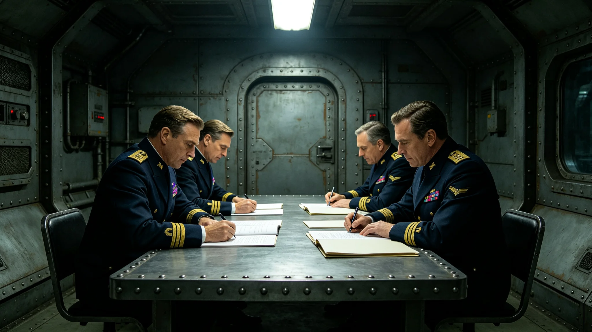

**发布单位**：联合体深空外交署
**发布日期**：3749年2月3日
**公报编号**：DIP-JIAO-3749-001

## 一、建交决定

联合体与异星文明经四年谈判，兹决定自3749年2月3日起正式建立外交关系。双方互设常驻使馆，我方驻异星文明首都环轨站"晶环"，异星文明驻我方跨星系港。首任大使由沈远谟（见GS-3751-01）担任，于3749年2月3日向异星文明执政团递交国书。

## 二、建交原则

双方建交遵循以下原则：

1. 互相尊重文明主权与领土完整；
2. 互不干涉对方内部事务；
3. 平等互利，和平共处；
4. 以和平方式解决一切争端，不使用武力或以武力相威胁；
5. 不与第三方缔结针对对方的军事同盟。

## 三、外交使团地位

双方常驻使馆及其人员享有外交使团豁免权（见GS-3760-01）。使馆馆舍不可侵犯，外交代表人身不可侵犯，外交代表在驻在国行政管辖范围内享有豁免。

## 四、贸易关系

双方同意在平等互利基础上开展跨文明贸易，具体条款另行商定（见GS-3761-01）。自建交之日起，双方互予最惠国待遇。

## 五、文化交流

双方同意建立跨文明文化交流机制，互办文化节与艺术展（见GS-3781-01、GS-3784-01）。文化交流活动不得损害对方文化主权与宗教情感。

## 六、联合科考

双方同意开展跨文明联合科考，科考资源共享安排另行商定（见GS-3764-01）。联合科考不得危害对方生态环境与生物安全。

## 七、争端解决

双方之间一切争端应通过外交途径或跨文明争端仲裁庭（见GS-3763-01）解决，不得采取单边制裁或报复措施。

## 八、通信安排

双方同意建立外交加密通信专线（见GS-3768-01），确保双方官方往来函件安全传递。通信协议技术标准另行商定。

## 九、公报生效

本公报自双方全权代表签字之日起生效。正本以联合体通用文字与异星文字双语缮写，两种文本同等作准。如有歧义，以双方协商解释为准。

## 十、签署

我方全权代表：沈远谟（首任驻异星大使）
异星方全权代表：（异星文字签名，翻译为"执政团首席代表"）
签署地点："晶环"站双方会晤厅
签署日期：3749年2月3日

## 十一、建交筹备经过

建交谈判自3745年3月开始，历时三年十一个月。谈判分三个阶段：第一阶段（3745年3月至3747年6月），双方就建交原则交换意见，形成原则共识；第二阶段（3747年7月至3748年10月），双方就使馆选址、人员编制、通信安排等技术细节磋商；第三阶段（3748年11月至3749年1月），双方就公报文本逐条审定，最终定稿。

谈判期间双方共举行正式会议三十二次，非正式磋商七十余次。我方谈判代表团由沈远谟牵头（见GS-3751-01），翻译由言通津（见GS-3611-01）担任。谈判地点轮流在我方前哨站与异星方联络点举行。

## 十二、双方立场要点

建交原则第五条"不与第三方缔结针对对方的军事同盟"，系我方提出。我方主张：双方在建交后均不得与第三方向对方所在星区派遣军事力量。异星方最初对此条持保留意见，担心限制其方与其他文明的正常军事往来。经三轮磋商后，双方同意将措辞改为"不缔结针对对方的军事同盟"，不限制与第三方的一般军事合作。

建交原则第四条"以和平方式解决一切争端"，系异星方提出。异星方主张：双方争端不得通过贸易报复或经济制裁方式解决。我方同意，但增加"不使用武力或以武力相威胁"的表述，明确和平方式的底线。

## 十三、签署现场记录

3749年2月3日上午十时，沈远谟与异星方执政团首席代表在"晶环"站双方会晤厅签署公报。仪式由礼宾总长程礼仪（见GS-3754-01）主持。签字台前铺有深色台面，两份公报文本分别以联合体通用文字与异星文字缮写。双方代表各在两份文本上签字，然后交换文本，各执一份。

签字完毕后，双方代表握手致意。在场见证人员共十二人，包括翻译官苏译川（见GS-3752-01）、礼宾员二人、使馆随员三人、异星方官员四人。全程四十七分钟，无差错。

## 十四、附则

本公报由深空外交署存档，副本分发各相关单位。后续建交深化事宜以本公报为基础，另行签署补充协定。本公报不得单方面修改或废除。本公报原件封存于"晶环"站使馆恒温室，副本存于跨星系港外交署档案库。

## 十五、后续深化方向

建交公报签署后，双方同意在以下领域继续深化合作：跨文明贸易（见GS-3761-01）、联合科考（见GS-3764-01）、文化交流（见GS-3781-01）、争端仲裁（见GS-3763-01）。各领域具体安排以本公报为基础，另行签署补充协定。

双方约定每年举行一次外长级会晤，回顾当年建交执行情况，规划下一年度合作方向。首次外长级会晤定于3750年2月在我方跨星系港举行。

## 十五、后续深化方向

双方约定每年举行一次外长级会晤，回顾当年建交执行情况，规划下一年度合作方向。首次外长级会晤定于3750年2月在我方跨星系港举行。会晤由双方外长轮流主持，会晤纪要以双语缮写，双方各执一份。

## 十六、双方代表备注

我方全权代表沈远谟在签署后笔记中写道：建交不是终点，是开始。后面的路比签字长。异星方执政团首席代表通过翻译表示：同意。双方代表在签字后合影留念，照片存于使馆档案室。
