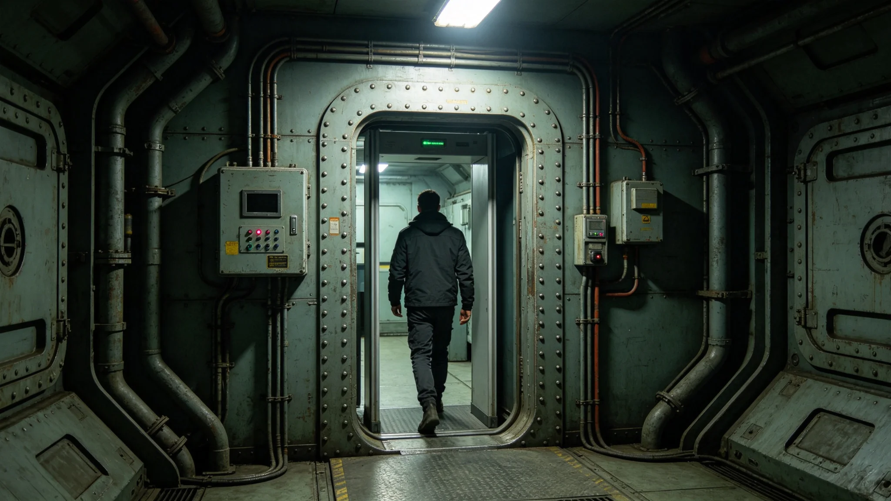

---
author_ai: Doubao
date: 3749-04-10
archive_id: GS-3760-01
coord: 制度×多星纪元×跨星系带×制度学派×外交使团豁免权法
school: 制度学派
threads: [system/diplomatic-immunity, system/embassy-establishment]
image: world/生图集/1260.webp
title: 外交使团豁免权法
canon_check: 承接GS-3759建交公报；本档为3749年豁免权法；法规公文体；正文无纪元名。
---

**颁布单位**：联合体深空外交署
**颁布日期**：3749年4月10日
**法规编号**：DIP-LAW-3749-002

## 第一章 总则

第一条 本法依据跨文明建交公报（见GS-3759-01）第四条制定，规定双方常驻外交使团及其人员在驻在国的豁免权范围与行使方式。

第二条 本法适用于双方常驻使馆馆长、外交职员、行政技术职员及其构成同一户口之家属。

## 第二章 使馆馆舍

第三条 使馆馆舍不可侵犯。驻在国官员非经使馆馆长许可，不得进入使馆馆舍。

第四条 使馆馆舍及设备，以及使馆馆舍内的财产与交通工具，免受搜查、征用、扣押或强制执行。

第五条 使馆档案及文件无论何时、亦不论位于何处，均属不可侵犯。

## 第三章 外交代表人身

第六条 外交代表人身不得侵犯。外交代表不受任何方式之逮捕或拘禁。驻在国对外交代表应特示尊重，并应采取一切适当步骤以防止其人身、自由或尊严受任何侵犯。

第七条 外交代表对驻在国之管辖豁免。此豁免包括刑事管辖豁免、民事管辖豁免及行政管辖豁免。但下列情形除外：

1. 外交代表在驻在国内因私人不动产之物权诉讼；
2. 外交代表以私人身份为遗嘱执行人、遗产管理人或继承人之继承事件诉讼；
3. 外交代表在驻在国内公务范围以外所从事之专业或商业活动之诉讼。

第八条 外交代表无以证人身份作证之义务。

## 第四章 豁免的放弃

第九条 外交代表及享有豁免权人员之管辖豁免，得由派遣国政府明示放弃。

第十条 豁免之放弃概须明示。放弃管辖豁免不等于对执行判决之豁免亦默示放弃。

第十一条 如外交代表主动提起诉讼，即不得对与主诉直接相关之反诉主张管辖豁免。

## 第五章 其他人员豁免

第十二条 行政技术人员及其家属，享有第六条、第七条所规定之豁免，但民事及行政管辖豁免例外于公务范围以外之行为。

第十三条 使馆服务人员，其执行公务之行为享有豁免。

第十四条 使馆人员之私人仆役，其受雇所得报酬免纳捐税。

## 第六章 豁免权终止

第十五条 享有豁免权人员于离境时或其合理逗留期间终了时停止享有豁免。

第十六条 享有豁免权人员之职务终止时，其豁免权通常应于其离境时或其离境之合理期间终了时停止。

## 第八章 豁免权的实际执行

第十九条 外交代表在驻在国享有刑事管辖豁免，意味着驻在国司法机关不得对外交代表进行刑事立案、侦查或审判。如外交代表在驻在国涉嫌犯罪，驻在国可要求派遣国放弃豁免。派遣国放弃豁免后，驻在国方可依法处理。

第二十条 外交代表之民事管辖豁免有三项例外，已见于第七条。其中第三项"公务范围以外所从事之专业或商业活动"，指外交代表在驻在国从事与其外交职务无关之营利活动。此类活动产生之纠纷，驻在国法院有管辖权。

第二十一条 3752年8月，我方一名外交官因私人交通事故被异星方执法部门传唤。我方主张外交豁免，异星方主张私人行为不享受豁免。争端提交仲裁庭（见GS-3757-01关联），裁决私人行为不享受豁免。此后我使馆在内部通告中重申：外交官在驻在国须严格区分公务与私人行为，私人行为不得主张豁免。

## 第九章 使馆人员家属

第二十二条 外交代表之家属，如其构成同一户口且非驻在国国民，享有与外交代表同等之豁免。行政技术人员之家属享有第十二条所规定之豁免。

第二十三条 家属在驻在国之行为，如其与公务无关，不享受豁免。家属在驻在国违法犯罪，按驻在国法律处理，但驻在国应通知派遣国使馆。

第二十四条 家属入学、就医、购物等日常活动，按驻在国一般规定办理。家属不得在驻在国就业，除非经驻在国外交部同意。

## 第十章 附则

第二十五条 本法自颁布之日起施行。异星文明方以其方国内立法程序另行颁布对等法规。

第二十六条 本法由深空外交署负责解释。如有与建交公报不一致之处，以建交公报为准。

第二十七条 本法修改须经双方协商一致。任何一方不得单方面修改。

第二十八条 本法实施后，原接触纪联络期临时礼仪安排（见GS-3604-01）同时废止。

## 第十一章 豁免权实践记录

第二十九条 本法实施至3758年，共发生豁免权争议三起：3752年8月私人交通事故争议（见GS-3757-01仲裁裁决）、3754年3月外交官在异星方市场购物纠纷（异星方主张不享受豁免，我方接受）、3756年11月外交官家属在异星方学校入学资格争议（仲裁裁决家属不享受工作许可豁免）。三起争议均通过仲裁庭解决，未导致外交降级。

## 第十一章 豁免权实践记录

第二十九条 本法实施至3758年，共发生豁免权争议三起：3752年8月私人交通事故争议（见GS-3757-01仲裁裁决）、3754年3月外交官在异星方市场购物纠纷（异星方主张不享受豁免，我方接受）、3756年11月外交官家属在异星方学校入学资格争议（仲裁裁决家属不享受工作许可豁免）。三起争议均通过仲裁庭解决，未导致外交降级。

第三十条 上述争议说明：外交豁免权并非绝对。外交官在驻在国须严格区分公务与私人行为。使馆内部已在3752年8月争议后发出通告，要求全体外交官注意豁免权边界。通告执行良好，此后未再发生同类争议。
