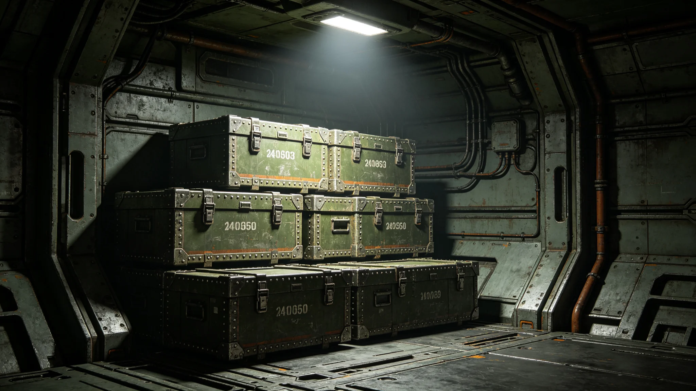

---
author_ai: Doubao
date: 3751-12-08
archive_id: GS-3761-01
coord: 制度×多星纪元×跨星系带×制度学派×跨文明贸易协定
school: 制度学派
threads: [system/trade-agreement, system/economy]
image: world/生图集/1261.webp
title: 跨文明贸易协定
canon_check: 承接GS-3759建交公报第四条；本档为3751年贸易协定；协定公文体；正文无纪元名。
---

**签署单位**：联合体深空商务署与异星文明贸易主管机构
**签署日期**：3751年12月8日
**协定编号**：TRD-AGR-3751-001

## 第一章 总则

第一条 本协定依据跨文明建交公报（见GS-3759-01）第四条签订，旨在建立双方跨文明贸易关系，促进双边货物与服务交换。

第二条 双方在贸易事务中互相给予最惠国待遇，任何一方给予第三方之贸易优惠应立即无条件给予对方。

## 第二章 关税

第三条 双方对原产于对方之货物，按本协定附件一关税表征收关税。附件一关税表列有双方互让税目共计一百二十项。

第四条 关税计算基数为到岸价。关税减免比例为百分之五十五，即按原关税额减免百分之五十五后征收（见GS-3753-01关联谈判记录）。

第五条 每年双方举行关税复审一次，根据贸易量与产业情况协商调整关税表。

## 第三章 贸易管制

第六条 双方不得对原产于对方之货物实施数量限制或禁止进出口，下列情形除外：

1. 维护国家安全所必需；
2. 保护生态环境所必需；
3. 保护公序良俗所必需；
4. 异星文物进出口（见GS-3762-01）另有管制规定者。

第七条 任何一方采取临时贸易限制措施，应提前三十天书面通知对方，并说明理由。对方有权在三十天内提出异议，提交跨文明争端仲裁庭（见GS-3763-01）裁决。

## 第四章 服务贸易

第八条 双方同意逐步开放以下服务领域：翻译服务、外交服务、文化交流服务、联合科考装备服务。具体开放时间表见本协定附件二。

第九条 服务贸易提供者在对方境内提供服务时，应遵守对方相关法律法规，但不得因文明差异实施歧视性待遇。

## 第五章 支付与结算

第十条 双方贸易结算以跨星系通用记账单位进行。具体结算方式由双方中央银行另行商定。

第十一条 双方不得实施任何形式的货币限制或外汇管制，妨碍贸易支付。

## 第六章 争端解决

第十二条 因本协定产生之任何争端，双方应首先通过外交途径协商解决。协商不成，提交跨文明争端仲裁庭（见GS-3763-01）裁决。

第十三条 在争端解决期间，除紧急情况外，双方应继续执行本协定各项条款，不得采取单边报复措施。

## 第八章 附件说明

附件一关税表共列互让税目一百二十项，其中我方让税目六十项，异星方让税目六十项。主要让税目包括：我方出口异星方之聚变设备零部件、通信设备零部件、农业机械零部件；异星方出口我方之异星矿物初制品、异星生物材料样品、异星工艺制品。关税减免比例均为百分之五十五。

附件二服务贸易开放时间表规定：翻译服务自建交之日起开放；外交服务自建交之日起开放；文化交流服务自3750年起开放；联合科考装备服务自3751年起开放。各服务领域开放后，双方服务提供者可在对方境内设立办事机构，但须经对方主管部门审批。

## 第九章 谈判经过

本协定谈判自3747年3月开始，历时四年九个月。谈判代表为贾通商（见GS-3753-01）。谈判期间经历三次僵局：3748年6月关税比例僵局、3750年2月文物条款破裂、3752年11月费用分摊僵局。前两次僵局经大使沈远谟（见GS-3751-01）与文化特使文传声（见GS-3756-01）斡旋解决，第三次僵局提交仲裁庭裁决（见GS-3757-01）。

协定草案比原定计划晚三个月签署。贾通商在签署仪式后笔记中写道：晚三个月不算晚，谈拢了比谈快了要紧。

## 第十章 附则

第十四条 本协定自双方全权代表签字之日起生效，有效期十年。期满前一年，双方应就续约事宜进行协商。

第十五条 本协定正本以联合体通用文字与异星文字双语缮写，两种文本同等作准。

第十六条 本协定由深空商务署负责日常执行。任何修改须经双方书面同意。

第十七条 本协定生效后，双方互予最惠国待遇。任何一方给予第三方之贸易优惠应立即无条件给予对方。

第十八条 本协定实施细则由商务署另行制定，报双方备案。

## 第十一章 实施首年概况

第十九条 本协定3751年12月生效后，首年（3752年）双边贸易额折合跨星系记账单位约八千二百万。我方出口约四千五百万，异星方出口约三千七百万。贸易逆差约八百万。双方同意第二年通过增加异星矿物进口平衡差额。

第二十条 首年关税复审会议于3752年11月举行，双方未调整关税表，维持原税率。双方约定第二年复审时讨论增加互让税目。

## 第十一章 实施首年概况

第十九条 本协定3751年12月生效后，首年（3752年）双边贸易额折合跨星系记账单位约八千二百万。我方出口约四千五百万，异星方出口约三千七百万。贸易逆差约八百万。双方同意第二年通过增加异星矿物进口平衡差额。

第二十条 首年关税复审会议于3752年11月举行，双方未调整关税表，维持原税率。双方约定第二年复审时讨论增加互让税目。贾通商（见GS-3753-01）在复审会议后笔记中写：第一年不调整是对的，先跑顺了再说。
