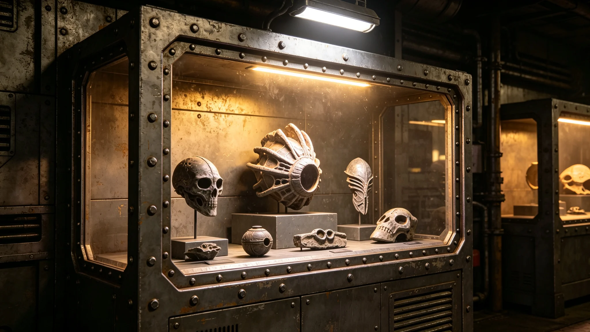

**颁布单位**：联合体深空文化署与商务署
**颁布日期**：3751年3月15日
**条例编号**：CUL-LAW-3751-003

## 第一章 总则

第一条 本条例依据跨文明贸易协定（见GS-3761-01）第六条第四款制定，旨在规范异星文物进出口活动，保护双方文化遗产与生物安全。

第二条 本条例所称异星文物，指来源于异星文明文化遗址、墓葬、宗教场所或具有文化历史价值之实物。

第三条 异星文物进出口实行许可证制度。任何单位或个人进口或出口异星文物，须事先取得进出口许可证。

## 第二章 进口管制

第四条 异星文物进口时，须向入境口岸检疫部门申报，提交以下文件：

1. 文物来源证明文件；
2. 异星方出口许可文件；
3. 文物照片或扫描件；
4. 检疫申报单。

第五条 检疫部门收到申报后，应在三十个工作日内完成审核。审核内容包括：文物来源合法性、是否属于禁止出口范畴、是否携带异星微生物或生物危害物。

第六条 审核合格者，发给进口许可证。审核不合格者，书面说明理由，文物退回出口方。

第七条 审核期限不得超过三十个工作日。逾期未审核者，视为通过（见GS-3757-01仲裁裁决关联）。

## 第三章 出口管制

第八条 我方文物出口至异星文明时，须经文化署文物主管部门审批。审批内容包括：文物是否属于禁止出口范畴、是否损害我方文化主权。

第九条 下列文物禁止出口：

1. 具有重大历史价值之一级文物；
2. 出土不满五十年之考古标本；
3. 宗教场所使用中之法器或祭祀用品；
4. 双方协定另有约定之文物。

第十条 经审批同意出口之文物，由文化署发给出口许可证，海关凭证放行。

## 第四章 检疫

第十一条 所有异星文物进出口时，须经过生物检疫。检疫内容包括：表面微生物检测、内部生物危害物检测、放射性检测。

第十二条 检疫不合格之文物，不得进出口。须在检疫部门监督下进行消毒处理，消毒后重新检疫。连续两次检疫不合格者，永久退回。

第十三条 检疫操作规范见异星生物样本检疫（见GS-3792-01）。

## 第五章 罚则

第十四条 未经许可擅自进出口异星文物者，海关予以没收，并处以货值三倍罚款。情节严重者，移送司法机关处理。

第十五条 伪造、变造进出口许可证者，处五年以下监禁，并处以罚款。

## 第六章 执法与监督

第十六条 海关负责文物进出口许可证之查验。检疫部门负责生物检疫。文化署负责文物审批。三部门分工协作，不得互相推诿。

第十七条 任何单位或个人发现违反本条例之行为，有权向海关或文化署举报。举报经查证属实者，给予举报人奖励。

第十八条 海关有权对涉嫌违反本条例之货物进行开箱查验。货主应配合查验，不得拒绝或阻挠。

第十九条 本条例执法人员执行公务时，应出示执法证件。货主有权要求执法人员出示证件。

## 第七章 典型案例

第二十条 3750年6月，使馆一名三等秘书在未请示沈远谟大使（见GS-3751-01）的情况下，擅自向异星方赠送一批老地球植物种子。事后被检疫部门退回。该秘书被处以警告处分，沈远谟被扣当月绩效一成。此事在使团署内部通报。

第二十一条 3751年4月，我方一名文化随员试图将一件异星小型工艺品私自带回，未申报。入境时被海关查获，工艺品没收，随员被处以罚款。文化署在内部通报此事，强调文物申报不可遗漏。

## 第八章 附则

第二十二条 本条例自颁布之日起施行。

第二十三条 本条例由深空文化署与商务署联合负责解释。

第二十四条 本条例与贸易协定（见GS-3761-01）不一致之处，以贸易协定为准。

第二十五条 本条例实施细则由文化署另行制定，报双方备案。检疫操作规范另见异星生物样本检疫（见GS-3792-01）。

## 第九章 年度执行统计

第二十六条 本条例3751年3月实施至3757年3月，共审批异星文物进口申请一百四十二件，批准一百三十一件，退回十一件。审批出口申请八十九件，批准七十八件，退回十一件。

第二十七条 退回原因主要包括：来源证明不全三十六件、检疫不合格十九件、属于禁止出口范畴十二件、其他原因十四件。所有退回案件均书面通知申请人，申请人可补充材料后重新申请。

## 第九章 年度执行统计

第二十八条 3750年6月，使馆一名三等秘书擅自向异星方赠送老地球植物种子（见GS-3751-01关联），事后被检疫部门退回。此事在使团署内部通报，强调文物与生物材料申报不可遗漏。
