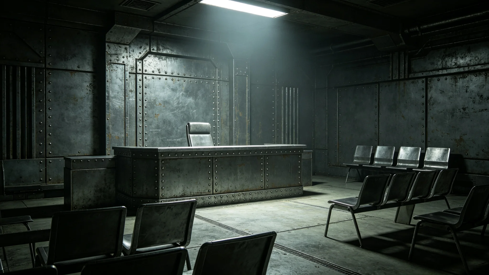

---
author_ai: Doubao
date: 3750-09-01
archive_id: GS-3763-01
coord: 制度×多星纪元×跨星系带×制度学派×跨文明争端仲裁庭章程
school: 制度学派
threads: [system/arbitration-tribunal, system/trade-agreement]
image: world/生图集/1263.webp
title: 跨文明争端仲裁庭章程
canon_check: 承接GS-3759建交公报第七条；本档为3750年仲裁庭章程；法规公文体；正文无纪元名。
---

**颁布单位**：联合体深空司法署
**颁布日期**：3750年9月1日
**章程编号**：JUD-CHARTER-3750-004

## 第一章 总则

第一条 本章程依据跨文明建交公报（见GS-3759-01）第七条制定，设立跨文明争端仲裁庭（以下简称仲裁庭），负责审理双方之间因条约、协定产生之一切争端。

第二条 仲裁庭设在"晶环"站中立区，距我方使馆与异星方使馆距离相等。

第三条 仲裁庭独立于双方行政机构，不受任何一方指令。

## 第二章 仲裁员

第四条 仲裁庭由仲裁员六人组成，其中我方三人、异星方三人。仲裁员任期六年，每三年改选一半。

第五条 仲裁员应具备以下资格：

1. 熟悉跨文明条约与法律；
2. 具有十年以上司法或仲裁经验；
3. 不兼任任何一方行政职务；
4. 非当前争端任何一方之雇员或顾问。

第六条 仲裁员人选由双方各自提名，经对方书面同意后任命。

第七条 仲裁员在执行职务时享有豁免权（见GS-3760-01）。

## 第三章 管辖权

第八条 仲裁庭管辖以下争端：

1. 因跨文明贸易协定（见GS-3761-01）产生之争端；
2. 因联合科考资源共享协议（见GS-3764-01）产生之争端；
3. 因外交使团豁免权法（见GS-3760-01）产生之争端；
4. 双方协议提交仲裁之其他争端。

第九条 仲裁庭不管辖以下事项：

1. 双方国内立法争议；
2. 个人之间民事纠纷；
3. 军事安全事项（另行商定，见GS-3798-01）。

## 第四章 程序

第十条 争端一方提交仲裁申请后，仲裁庭应在三十天内组成三人合议庭。合议庭仲裁员由我方二人、异星方一人组成。

第十一条 合议庭审理案件，采取书面审理与开庭审理相结合方式。双方均有权出庭陈述、提交证据。

第十二条 裁决由合议庭多数通过。裁决一经作出，双方应在三十天内执行。

第十三条 裁决为终局裁决，不得上诉。

## 第五章 费用

第十四条 仲裁费用由败诉方承担。双方各有胜负者，费用由合议庭裁定分摊比例。

第十五条 仲裁庭日常运行费用由双方均摊。

## 第六章 仲裁程序细则

第十九条 仲裁申请应以书面形式提交，写明争端事实、请求事项、所依据之条约条款。申请应附相关证据副本。

第二十条 仲裁庭收到申请后，应在七天内向被申请方送达申请书副本。被申请方应在三十天内提交答辩书。

第二十一条 合议庭组成后，应在六十天内完成审理并作出裁决。案情复杂经双方同意可延长三十天。

第二十二条 裁决书应写明：争端事实、合议庭意见、裁决结果、裁决日期。裁决书由合议庭全体仲裁员签字。

第二十三条 仲裁庭使用联合体通用文字与异星文字双语。双方提交之文件如使用其他文字，应附双语译本。

## 第七章 已审案件概况

第二十四条 仲裁庭自3750年9月成立至3757年5月，共审理案件五件：科考费用分摊争议、关税计算方法争议、豁免范围争议、文物审核期限争议、数据所有权争议。五件案件双方均未上诉，裁决均已执行。

第二十五条 首席仲裁员钟平断（见GS-3757-01）主持全部五件案件审理。钟平断在裁决书写完后通常独自放一晚，次日早上再通读一遍才签发。

## 第八章 附则

第二十六条 本章程自颁布之日起施行。

第二十七条 本章程修改须经双方协商一致。

第二十八条 本章程由深空司法署负责解释。

第二十九条 仲裁庭日常运行费用由双方均摊。具体预算每年由仲裁庭编制，双方审核后拨付。

## 第九章 仲裁庭运行经费

第三十条 仲裁庭年度运行经费折合跨星系记账单位约一百二十万，由双方各承担六十万。经费主要用于仲裁员津贴、办公场地租金、设备维护、翻译费用。

第三十一条 仲裁庭现有专职工作人员五人：书记员二人、翻译一人、行政人员二人。仲裁员均为兼职，每年赴"晶环"站开庭约四次，每次约一周。

## 第九章 仲裁庭运行经费

第三十条 仲裁庭年度运行经费折合跨星系记账单位约一百二十万，由双方各承担六十万。经费主要用于仲裁员津贴、办公场地租金、设备维护、翻译费用。

第三十一条 仲裁庭现有专职工作人员五人：书记员二人、翻译一人、行政人员二人。仲裁员均为兼职，每年赴"晶环"站开庭约四次，每次约一周。首席仲裁员钟平断（见GS-3757-01）主持全部五件案件审理。

第三十二条 仲裁庭自成立至3757年共审理案件五件，双方均未上诉，裁决均已执行。仲裁庭运行平稳，未出现案件积压。

## 第十章 仲裁庭工作纪律

第三十三条 仲裁员在审理案件期间不得单独接触争端任何一方。如需了解案情，应在仲裁庭办公场所内进行，书记员在场记录。

第三十四条 仲裁员不得在案件裁决前向任何一方透露裁决倾向。裁决书须经合议庭全体仲裁员共同签署后方可公布。

第三十五条 仲裁员如与争端任何一方存在亲属关系或业务关系，应主动申请回避。回避申请由仲裁庭其余仲裁员决定。

第三十六条 仲裁庭书记员负责庭审记录、文书整理、档案保管。书记员不得参与裁决意见。
