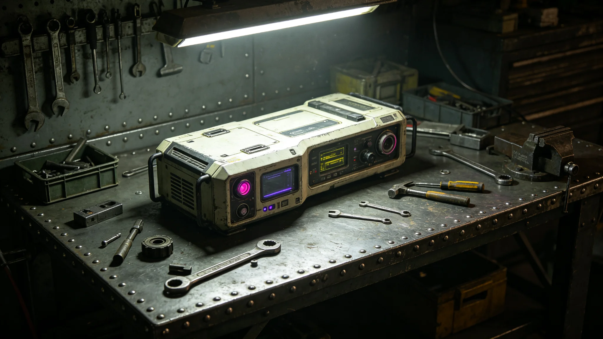

**签署单位**：联合体深空科考署与异星文明科考主管机构
**签署日期**：3748年6月20日
**协议编号**：SCI-AGR-3748-005

## 第一章 总则

第一条 本协议依据跨文明建交公报（见GS-3759-01）第六条签订，旨在建立双方联合科考资源共享机制，促进跨文明科学合作。

第二条 本协议所称联合科考资源，指双方为联合科考项目投入之设备、数据、人员、舱段及其他物资。

## 第二章 资源投入

第三条 双方为联合科考项目投入以下资源：

我方投入：科考队员三人、采样设备一套、通信设备一套、异星环境适配舱一个；
异星方投入：科考队员三人、地表探测设备一套、异星生物样本采集设备一套、科考舱段一个。

第四条 联合科考队队长由我方派人担任（见GS-3755-01），副队长由异星方派人担任。重大科考决策须经双方队长共同同意。

第五条 双方投入之设备在联合科考期间由联合科考队统一调度。设备维护费用由投入方承担。

## 第三章 数据共享

第六条 联合科考采集之数据，双方共享。任何一方可在科考结束后三十天内获取全部原始数据副本。

第七条 数据所有权由双方共同所有。任何一方对外发布数据须经另一方书面同意（见GS-3757-01仲裁裁决关联）。

第八条 数据存储格式采用跨文明数据交换标准（见GS-3769-01）。

## 第四章 费用分摊

第九条 联合科考运行费用由双方分摊。分摊比例按实际使用量占六成、舱段比例占四成加权计算（见GS-3757-01仲裁裁决）。

第十条 每季度结算一次费用，由联合科考队编制费用清单，双方审核后按比例支付。

## 第五章 安全与环保

第十一条 联合科考不得危害对方生态环境。科考结束后，临时安装之设备应全部撤离，科考区域应恢复原状。

第十二条 异星生物样本采集后，须经检疫（见GS-3792-01）方可带回。不得将异星生物样本私自带出隔离区。

第十三条 联合科考发生设备故障时，按双方应急预案处理（见GS-3776-01）。

## 第七章 科考队组成与运作

第十七条 联合科考队共六人，我方三人、异星方三人。我方三人包括队长林勘星（见GS-3755-01）、采样技术员一人、通信技术员一人。异星方三人包括副队长一人、地表探测技术员一人、生物采样技术员一人。

第十八条 科考队每次远征前两周，双方队长逐项核对设备清单与作业时间表。远征期间，双方队长每日早晚各通一次话，确认当日作业安排。

第十九条 3749年8月首次联合地表科考时，因接口不兼容导致数据采集中断六小时（见GS-3776-01）。此后跨文明数据交换标准（见GS-3769-01）的制定工作由林勘星牵头。

## 第八章 费用结算实例

第二十条 3752年费用结算实例：联合科考队全年运行费用共计折合跨星系记账单位约一百二十万。按实际使用量占六成、舱段比例占四成加权计算，我方分摊约六十八万，异星方分摊约五十二万。双方均在季度结算后三十天内支付完毕。

第二十一条 3753年费用结算实例：全年运行费用约一百三十五万。我方分摊约七十五万，异星方分摊约六十万。差异原因是我方当年多使用了一次异星地表探测设备。

## 第九章 附则

第二十二条 本协议自双方全权代表签字之日起生效，有效期五年。期满前六个月协商续约。

第二十三条 本协议正本以联合体通用文字与异星文字双语缮写，两种文本同等作准。

第二十四条 因本协议产生之争端，提交跨文明争端仲裁庭（见GS-3763-01）裁决。

第二十五条 本协议实施细则由科考署另行制定，报双方备案。

## 第十章 联合科考成果统计

第二十六条 本协议3748年6月实施至3757年6月，联合科考队共完成五次远征，采集异星地质样本约一千二百件、生物样本约三百四十件、大气数据约七十二万组。科考成果以双方共同名义发表论文十七篇。

第二十七条 联合科考队在异星地表建立临时观测站三个，均已在科考结束后按协议要求撤离并恢复原状。未发生生态破坏事件。

## 第十章 联合科考成果统计

第二十八条 科考队队长林勘星（见GS-3755-01）在五次远征中共签认设备故障三次（见GS-3776-01），均未造成人员伤亡。故障后均建立预防机制。

## 第十一章 科考队日常管理

第二十九条 科考队每日早八时召开站务会，双方队长共同主持。站务会内容包括：前一日作业完成情况、当日作业计划、设备状态汇报。

第三十条 科考队物资按双方各自编制管理。我方物资由我方后勤人员保管，异星方物资由其方后勤人员保管。共用物资由双方共同管理。

第三十一条 科考队员在异星地表活动时，须两人以上结伴同行，不得单独外出。出舱前须双方队长共同确认安全状态。
