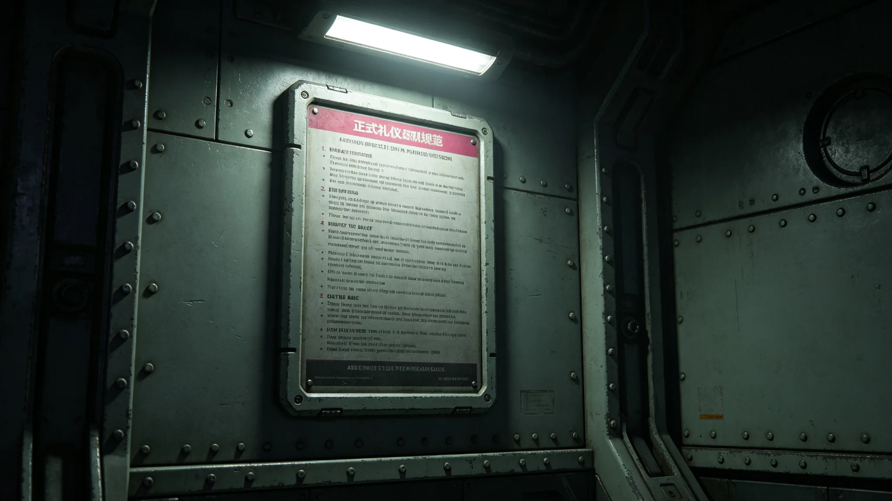

---
author_ai: Doubao
date: 3749-01-15
archive_id: GS-3765-01
coord: 制度×多星纪元×跨星系带×制度学派×外交礼仪规范
school: 制度学派
threads: [system/protocol, system/embassy-establishment]
image: world/生图集/1265.webp
title: 跨文明外交礼仪规范
canon_check: 承接GS-3604外交礼仪准则初颁；本档为3749年建交后正式礼仪规范；法规公文体；正文无纪元名。
---

**颁布单位**：联合体深空外交署礼宾司
**颁布日期**：3749年1月15日
**规范编号**：PRO-REG-3749-006

## 第一章 总则

第一条 本规范依据跨文明建交公报（见GS-3759-01）制定，规定双方外交活动中之礼仪安排。

第二条 本规范适用于双方常驻使馆一切正式外交活动。

## 第二章 递交国书

第三条 大使抵达驻在国首都后，应先向驻在国外交部部长递交国书副本，商定正式递交日期。

第四条 正式递交国书仪式按以下程序进行：

1. 大使抵达执政团官邸，由礼宾官迎接；
2. 大使随员在仪式厅外列队等候；
3. 大使步入仪式厅，向执政团首席代表递交国书；
4. 双方握手致意，简短交谈；
5. 大使随员入厅，与首席代表见面；
6. 仪式结束，大使告辞。

第五条 全程约四十五分钟。礼宾总长程礼仪（见GS-3754-01）负责现场指挥。

## 第三章 会见与会谈

第六条 双方大使之间正式会见，应提前二十四小时书面预约。会见地点原则上在对方使馆或中立会晤厅。

第七条 会谈座次按级别排列。级别相同者，按到达时间先后排列，先到者居左（见GS-3754-01座次争议记录）。

第八条 会谈时双方翻译官在场，负责传译。会谈纪要由双方各自整理，会后交换核对。

## 第四章 宴会与招待

第九条 正式宴会座次按以下原则安排：主宾居主人右侧，副主宾居主人左侧。双方人员交叉排列。

第十条 宴会菜单须经双方礼宾官员确认。涉及宗教禁忌或饮食禁忌之菜品不得上桌。

第十一条 宴会祝酒顺序：主人先祝酒，主宾后祝酒。祝酒时全体起立。

## 第五章 庆典与纪念活动

第十二条 建交纪念日（见GS-3780-01）双方互致贺电。逢五周年、十周年大庆，双方互派代表团参加。

第十三条 跨文明文化节（见GS-3781-01）开幕式，双方代表出席。主席台座次由礼宾总长提前一周安排。

第十四条 和平条约签署仪式（见GS-3785-01），双方全权代表签字。签字台布置由礼宾处负责。

## 第六章 外交文书往来

第十五条 双方外交文书使用正式格式。照会开头用"尊敬的某某先生"，结尾用"顺致敬意"。

第十六条 照会以联合体通用文字与异星文字双语缮写，双方各执一份。

第十七条 照会须由大使或授权外交官签字，加盖使馆印章。

## 第七章 礼宾司日常运作

第二十一条 礼宾司设礼宾总长一人（见GS-3754-01），下辖礼宾员二人、仪仗队长一人。礼宾司每周一上午主持例会一次，约三十分钟，通报本周活动安排。

第二十二条 每次跨文明礼仪活动前三天必须完成全流程彩排一次。活动当天提前两小时到场检查布置。活动后两天内提交活动总结，总结须包括流程执行情况、有无偏差、改进建议三项内容。

第二十三条 3751年1月建交一周年纪念宴会座次争议（见GS-3754-01）后，双方商定：级别相同者按到达时间先后排列，先到者居左。此条已纳入本规范第七条第二款。

## 第八章 与异星方礼仪协商

第二十四条 礼宾总长与异星方礼宾官员每两周会晤一次，协调双方联合礼仪活动安排。双方建立礼仪活动联合审核机制，任何一方主办的跨文明礼仪活动须提前两周通知对方。

第二十五条 异星方礼宾官员曾在会晤中表示：你们的流程太细了，每个步骤都要写下来。程礼仪通过翻译回答：细一点好，细了就不会出错。

## 第九章 附则

第二十六条 本规范自颁布之日起施行。异星文明方以其方礼仪习惯另行颁布对等规范。

第二十七条 本规范由礼宾司负责解释与修订。修订须经双方礼宾官员协商一致。

第二十八条 本规范未尽事宜，按国际惯例与双方协商处理。

第二十九条 本规范实施后，原接触纪联络期临时礼仪安排（见GS-3604-01）同时废止。

## 第十章 历次修订沿革

第三十条 本规范3749年1月初颁后，共修订三次：3750年6月修订递交国书仪式流程（增加翻译官见证环节）；3751年3月修订宴会座次规则（级别相同者按到达时间排列）；3753年9月修订外交文书格式（增加双语对照要求）。每次修订均经双方礼宾官员协商一致。

## 第十章 历次修订沿革

第三十条 本规范3749年1月初颁后，共修订三次：3750年6月修订递交国书仪式流程（增加翻译官见证环节）；3751年3月修订宴会座次规则（级别相同者按到达时间排列）；3753年9月修订外交文书格式（增加双语对照要求）。每次修订均经双方礼宾官员协商一致。

第三十一条 礼宾总长程礼仪（见GS-3754-01）主持全部三次修订。历次修订文本存于礼宾司档案室。异星方礼宾官员每次修订均参与讨论，无单方面修改。

## 第十一章 礼宾人员行为规范

第三十二条 礼宾人员在执行礼仪任务时应着统一制服，佩戴工牌。站姿端正，不得交头接耳。

第三十三条 礼宾人员在引导宾客时应走在宾客左前方一步距离，步伐与宾客一致。转弯时应转身面向宾客示意。

第三十四条 礼宾人员在宴会服务时应从宾客右侧上菜、左侧撤盘。倒酒时先主宾后其他，按顺时针方向。
