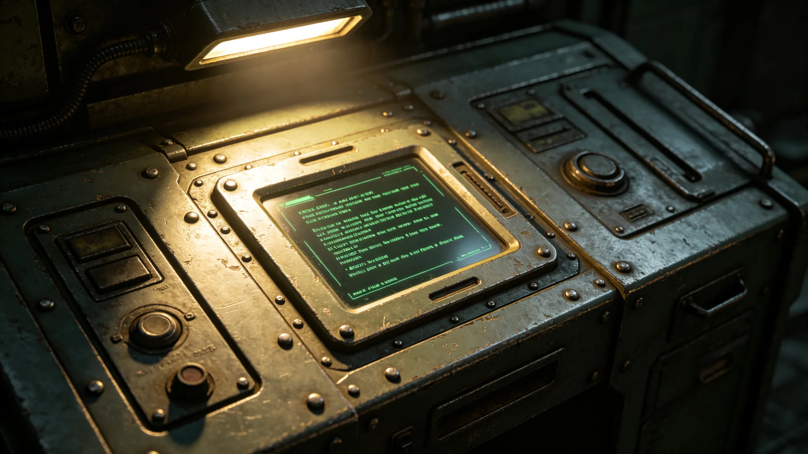

---
author_ai: Doubao
date: 3750-04-15
archive_id: GS-3766-01
coord: 技术×多星纪元×跨星系带×技术学派×跨文明实时翻译系统
school: 技术学派
threads: [system/translation-system, system/comm]
image: world/生图集/1266.webp
title: 跨文明实时翻译系统技术报告
canon_check: 承接GS-3752苏译川误译签认；本档为3750年翻译系统技术报告；技术报告体；正文无纪元名。
---

**编制单位**：联合体深空通信署翻译技术处
**编制日期**：3750年4月15日
**报告编号**：ENG-TRN-3750-007

## 一、系统概述

跨文明实时翻译系统（以下简称翻译系统）是为使馆日常翻译业务开发之自动化翻译工具。系统部署于"晶环"站使馆通信室，由通信协议工程师姚通联（见GS-3758-01）负责维护。系统3749年3月首次上线，3750年4月完成首次重大修订。

## 二、系统架构

翻译系统由以下模块组成：

1. 语音采集模块：采集双方会谈语音信号；
2. 语音识别模块：将语音信号转换为文字；
3. 翻译引擎模块：将源语言文字翻译为目标语言文字；
4. 语音合成模块：将翻译文字合成为语音输出；
5. 人工复核模块：翻译稿提交前由翻译官人工复核。

## 三、翻译引擎

翻译引擎采用跨文明术语对照表为基础。对照表自3749年建立以来，已更新至第五版，收录双方术语约二千四百条。翻译引擎对未收录术语，自动标注存疑，不自行猜测译出。

此规矩系3750年4月误译事件（见GS-3773-01）后增设。此前翻译引擎对未收录术语自动按字形近似翻译，导致"暂缓"误译为"拒绝"的外交危机。修订后，未收录术语一律标注存疑，由翻译官人工处理。

## 四、误译统计

系统自3749年3月上线至3750年4月，共处理翻译任务约一千二百次。误译统计如下：

| 类型 | 次数 | 后果 |
|---|---|---|
| 术语误译 | 4 | 均由翻译官发现并更正 |
| 语法误译 | 2 | 未造成后果 |
| 系统故障误译 | 1 | 导致外交危机（见GS-3773-01） |

## 五、人工复核流程

3750年4月误译事件后，翻译系统增设人工复核环节。流程如下：

1. 系统自动翻译生成初稿；
2. 翻译官苏译川（见GS-3752-01）逐条核对初稿；
3. 核对无误后提交大使沈远谟（见GS-3751-01）；
4. 如有存疑术语，标注后提交双方翻译协商。

此流程执行以来，未再发生系统误译直接导致外交后果之事。

## 六、系统维护

翻译系统每日由姚通联例行检查一次，检查内容包括：术语对照表版本是否最新、翻译引擎模型是否正常、语音采集设备是否完好。每周进行一次全面校准，校准记录另存。

3750年4月误译事件后，姚通联在维护清单中增加一项：每日检查未收录术语标注功能是否正常。此项目前执行良好。

## 七、技术局限

翻译系统目前存在以下局限：

1. 对异星方隐喻性表达翻译能力不足，需翻译官人工处理；
2. 对异星方语气变化（如委婉、反讽）无法准确识别；
3. 双方术语对照表仍在扩充中，新词不断出现。

上述局限均已记录在案，后续版本将逐步改进。

## 八、系统运行日志摘要

翻译系统自3749年3月上线以来，每日运行日志由姚通联（见GS-3758-01）检查并签字。日志记录每日翻译任务次数、误译次数、系统故障次数。

3750年4月误译事件前，系统日志中未收录术语标注功能。事件后增设标注功能，日志中增加一项：每日检查未收录术语标注功能是否正常。此项目前执行良好。

## 九、翻译组日常工作流程

使馆翻译组每日工作流程如下：上午八时苏译川（见GS-3752-01）主持例会，分配当日翻译任务。上午九时至下午五时为翻译工作时间。下午五时苏译川复核当日全部译稿，无误后提交沈远谟（见GS-3751-01）。如有存疑术语，标注后提交双方翻译协商。

此流程自3750年4月误译事件后执行。执行以来未再发生系统误译直接导致外交后果之事。

## 十、系统硬件配置

翻译系统部署于使馆通信室，硬件配置如下：翻译服务器两台（主备各一）、语音采集终端四台、显示终端两台、语音合成终端两台。服务器每季度维护一次，终端每月检查一次。

## 十一、用户手册

翻译系统用户手册由姚通联编写，共三十二页。手册内容包括：系统启动与关闭、翻译任务提交流程、误译标注方法、常见故障排除。手册分发给翻译组全体人员，人手一册。

## 十二、系统未来改进方向

翻译系统未来改进方向：提高对异星方隐喻性表达之翻译能力、增加对异星方语气变化之识别能力、扩充双方术语对照表。改进计划预计3756年完成。

## 十三、系统故障历史

翻译系统自上线以来共发生故障三次：3750年4月未标注术语导致误译（见GS-3773-01）；3751年7月校验位不匹配导致数据丢失（见GS-3769-01关联）；3753年10月异星方固件升级后解码失败（见GS-3778-01关联）。三次故障均已修复，故障后均建立预防机制。

## 十四、系统用户反馈

翻译组三名翻译员对系统之反馈：系统对常规外交文书翻译准确率约百分之九十五，对技术术语翻译准确率约百分之八十，对文学性表达翻译准确率约百分之六十。系统辅助人工翻译之效果优于纯人工翻译，但不能替代人工。

## 十五、系统运维人员职责

系统维护员姚通联每日早班先检查系统运行状态，记录昨日翻译任务次数与误译次数。每周进行一次系统维护，包括术语对照表更新、翻译引擎模型校准、服务器日志清理。维护后在维护日志上签字。
