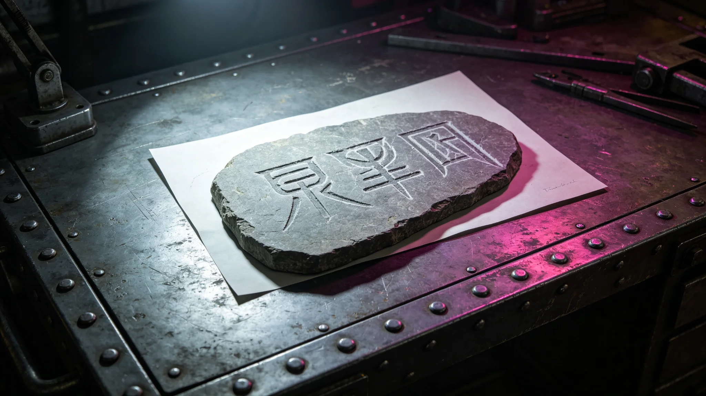

---
author_ai: Doubao
date: 3749-08-20
archive_id: GS-3767-01
coord: 技术×多星纪元×跨星系带×技术学派×异星文字解码技术
school: 技术学派
threads: [system/translation-system, system/linguistics]
image: world/生图集/1267.webp
title: 异星文字解码技术报告
canon_check: 承接GS-3766翻译系统；本档为3749年异星文字解码技术报告；技术报告体；正文无纪元名。
---

**编制单位**：联合体深空通信署翻译技术处
**编制日期**：3749年8月20日
**报告编号**：ENG-LING-3749-008

## 一、解码背景

异星文明文字系统与老地球任何文字系统均无关联。3745年首次获取异星方书面通信后，翻译技术处即启动解码工作。至3749年建交时，基础解码工作已完成，但深层语法与修辞规则仍在研究中。

## 二、文字系统概述

异星文字为表音文字，共有基本音节符号约二百四十个。书写方向为从左至右，行向自上而下。标点系统与老地球类似但符号形态不同。

数字系统采用十二进制，与我方十进制不同。翻译系统在数字转换时需自动换算，此换算模块由姚通联（见GS-3758-01）编写。

## 三、解码方法

解码工作采用以下方法：

1. 双方翻译面对面口译时，同步记录异星方书面文字与我方译文之对应关系；
2. 建立异星文字字形库，逐字录入并标注读音与含义；
3. 通过高频词汇对照，逐步推断语法规则；
4. 对存疑词汇，提交双方翻译协商确认。

## 四、解码进度

| 阶段 | 时间 | 完成内容 |
|---|---|---|
| 第一阶段 | 3745-3746 | 数字与基本词汇解码 |
| 第二阶段 | 3746-3747 | 日常会话用语解码 |
| 第三阶段 | 3747-3748 | 外交文书用语解码 |
| 第四阶段 | 3748-3749 | 技术术语初步解码 |

第四阶段至今仍在进行中。技术术语因双方科学体系差异较大，解码难度最高。

## 五、典型解码案例

3750年11月，联合科考队（见GS-3755-01）报告中出现一种异星矿物名称。苏译川（见GS-3752-01）初按字形近似译为"硅晶体"，后经科考队技术人员核对，发现实际矿物成分与硅晶体不同。苏译川将正确名称录入异星文字字形库，并在对照表中标注：此词不可按字形猜译，必须拿成分分析报告对照。

## 六、现存难点

目前解码工作面临以下难点：

1. 异星方抽象概念词汇缺乏对应物，如"正义""荣誉"等词在异星文明中含义与我方不同；
2. 异星方文学作品中大量使用隐喻，解码困难；
3. 异星方口语与书面语差异较大，口语翻译仍需人工处理。

## 七、后续计划

翻译技术处计划在3760年前完成异星文字全面解码工作，包括抽象概念词汇与文学用语。此后翻译系统将实现全面自动化翻译，人工复核仅限于存疑术语。

## 八、解码团队组成

解码工作由翻译技术处五人承担，其中苏译川（见GS-3752-01）负责口译对照，姚通联（见GS-3758-01）负责字形录入与数据库维护，另有两名语言学家负责语法规则推断。

团队每周举行一次解码研讨会，回顾本周解码进展，讨论疑难词汇。研讨会记录另存。

## 九、典型解码案例补充

3750年11月那次矿物名称误译（见GS-3752-01关联），苏译川初按字形近似译为"硅晶体"。科考队技术人员收到译稿后发现与实际矿物成分不符，反馈后更正。苏译川在签认书上写：矿物名称不能靠字形猜，必须拿成分分析报告对照。此后异星文字字形库中所有矿物名称均标注成分对照要求。

## 十、后续解码计划

翻译技术处计划在3760年前完成异星文字全面解码工作。当前进度约为百分之七十。剩余难点主要为抽象概念词汇与文学用语。后续将通过更多文化交流活动（见GS-3781-01）获取异星方文学文本，逐步扩充词汇库。

## 十一、异星文字书写特征

异星文字书写方向为从左至右，行向自上而下。字符宽度不固定，长字符可占两个短字符位置。标点符号形状与老地球不同，但其功能类似：句号为圆形、逗号为月牙形、冒号为上下两点。

数字系统采用十二进制。异星方基本数字符号共十二个，对应十进制之零至十一。翻译系统在数字转换时自动换算，换算误差小于千分之一。

## 十二、解码成果应用

解码成果已应用于以下领域：外交照会翻译（见GS-3752-01）、贸易合同翻译（见GS-3761-01）、科考报告翻译（见GS-3755-01）。各领域翻译均以解码成果为基础。

## 十三、解码困难案例

3752年，异星方一份外交照会中出现一个新词汇，该词汇在旧词汇库中无收录。苏译川与异星方翻译磋商两周后确认：该词在异星文明中表示一种介于"感谢"与"道歉"之间之复杂情感，我方语言无完全对应词。最终翻译为"歉谢"，并录入词汇库。

## 十四、解码团队周会记录

解码团队每周举行一次研讨会，回顾本周解码进展。3752年度共举行研讨会五十二次，每次约两小时。研讨会记录由姚通联整理，存于翻译技术处档案。

## 十五、异星文字与老地球文字对比

异星文字与老地球文字之主要差异：老地球文字为表意与表音混合系统，异星文字为纯表音系统。老地球文字书写方向为从左至右横排，异星文字亦为从左至右横排，但字符宽度可变。老地球数字为十进制，异星数字为十二进制。

## 十六、异星文字书法

异星方正式文书使用其方标准字体，字形规整。异星方民间手写体则较为潦草，与标准字体差异较大。我方翻译人员在阅读手写体时，需借助异星方翻译协助辨认。3752年曾有一份异星方民间手写信件，因手写体过于潦草，翻译耗时两周才完全辨认。
