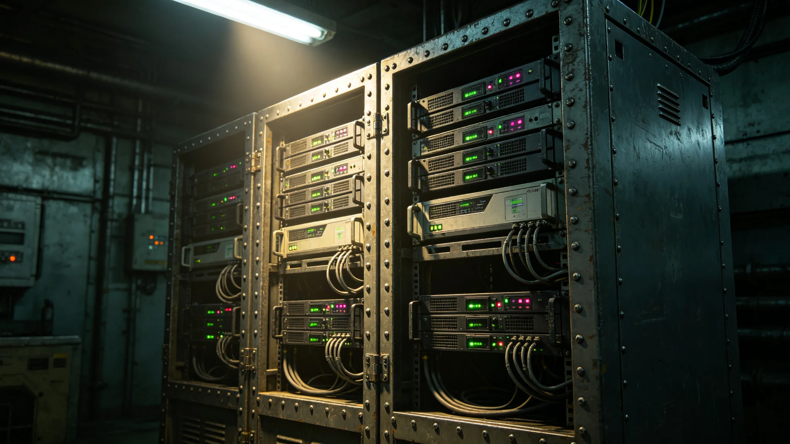

**编制单位**：联合体深空通信署
**编制日期**：3751年3月10日
**规范编号**：ENG-COM-3751-009

## 一、协议概述

外交加密通信协议（以下简称本协议）是双方使馆之间官方往来函件之加密通信标准。协议由通信协议工程师姚通联（见GS-3758-01）牵头编写，3749年5月首次对接，3751年3月正式签署。

## 二、协议版本

本协议经历以下版本：

| 版本 | 日期 | 主要变更 |
|---|---|---|
| 0.9 | 3749-05 | 首次对接，握手失败 |
| 0.9a | 3749-06 | 修正握手帧长度 |
| 1.0 | 3749-09 | 正式试运行 |
| 1.1 | 3750-03 | 增加双向认证 |
| 2.0 | 3751-03 | 正式签署版 |

## 三、握手流程

本协议握手流程如下：

1. 发送方发送握手起始帧（六十四字节）；
2. 接收方确认握手帧，返回握手应答帧（一百二十八字节）；
3. 双方交换密钥协商参数；
4. 双方完成密钥交换；
5. 通信链路建立，开始数据传输。

3749年5月首次对接时，因双方握手帧长度不同（我方六十四字节，异星方一百二十八字节）导致握手失败。此后双方协商统一为一百二十八字节，对接成功。

## 四、加密算法

本协议采用双方协商一致之加密算法。算法基于双方共同选定之数学难题，密钥长度为双方协商确定。每次通信会话使用临时密钥，会话结束后密钥作废。

加密算法之技术细节属机密，不在本规范中公开。具体参数另存于通信室保险柜。

## 五、数据帧格式

本协议数据帧格式如下：

- 帧头：八字节，含帧长度与类型标识；
- 校验位：四字节，含帧数据校验值；
- 数据段：可变长度，含加密后通信内容；
- 帧尾：二字节，帧结束标识。

3751年7月跨文明数据交换标准（见GS-3769-01）试运行时，因双方校验位计算方法不同导致三批照会数据丢失。此后双方统一校验算法，问题解决。

## 六、故障记录

本协议运行以来共发生故障三次：

1. 3749年5月握手失败（见上文）；
2. 3751年7月校验位不匹配（见GS-3778-01）；
3. 3753年10月异星方固件升级后解码失败（见GS-3778-01关联）。

三次故障均未导致外交机密泄露。故障后均建立预防机制。

## 七、维护要求

本协议之维护要求如下：

1. 每日检查通信日志，确认有无丢包或误码；
2. 每季度与异星方通信工程师交换设备维护计划；
3. 任何一方协议升级前须提前三十天通知对方；
4. 通信中断超过两小时须立即报告大使。

## 八、通信日志管理

本协议运行日志由姚通联（见GS-3758-01）每日记录。日志内容包括：当日通信次数、通信时长、有无丢包、有无误码。日志保存三年，以备审查。

通信中断超过两小时须立即报告大使沈远谟（见GS-3751-01）。3753年10月那次固件升级不兼容事件（见GS-3778-01），通信中断六小时，姚通联在中断后第一时间报告沈远谟，符合预案要求。

## 九、双方技术协作

姚通联与异星方通信工程师每月举行一次技术会晤，讨论通信设备运行状态与升级计划。会晤纪要以双语缮写，双方各执一份。

3753年10月事件后，双方在会晤中增加一项固定议程：通报下月设备维护计划。此议程目前执行良好。

## 十、密钥管理

本协议使用之会话密钥每次通信时临时生成，会话结束后作废。长期密钥由双方协商定期更换，更换周期为六个月。密钥更换时须双方技术人员在场，通过安全信道交换。

密钥不存储于终端硬盘，仅存于加密芯片中。芯片损坏时密钥自动作废，无需人工清除。

## 十一、安全审计

通信署每半年对本协议进行一次安全审计。审计内容包括：加密算法是否安全、密钥管理是否规范、通信日志是否完整。审计报告另存。

3752年度审计未发现安全漏洞。3754年度审计计划于6月进行。

## 十二、通信带宽

双方外交通信线路带宽为每秒一百兆比特。日常外交照会传输约占带宽百分之五，贸易统计数据传输约占百分之十，科考数据传输约占百分之二十。峰值时段（贸易谈判期）带宽占用约百分之四十。

## 十三、通信中断记录

本协议运行至3758年，共发生通信中断三次：3749年5月握手失败（见GS-3758-01关联）、3751年7月校验位不匹配（见GS-3769-01关联）、3753年10月固件升级不兼容（见GS-3778-01关联）。三次中断均未导致机密泄露。

## 十四、通信室日常管理

通信室位于使馆办公区一角，约二十平方米。室内设通信终端两台、监测终端一台、打印机一台。通信室门禁需刷卡进入，仅姚通联与值班翻译员有权进入。室内保持恒温恒湿，温度维持在二十至二十四摄氏度。

## 十五、通信协议版本管理

本协议版本由姚通联负责管理。每次版本更新须记录以下内容：版本号、更新日期、更新内容、双方确认人。版本记录存于通信室保险柜。3751年3月正式版本（2.0版）至今未再更新。

## 十六、通信安全审计

通信安全每年由通信署审计一次。审计内容包括：密钥管理记录、加密算法运行状态、通信日志完整性。3753年度审计结论：通信安全状况良好，无未授权访问记录。

## 十七、通信室值班制度

通信室实行二十四小时值班制度，每班一人。值班人员负责监听通信线路状态，如发现异常立即通知姚通联。值班记录每日交接时签字确认。
