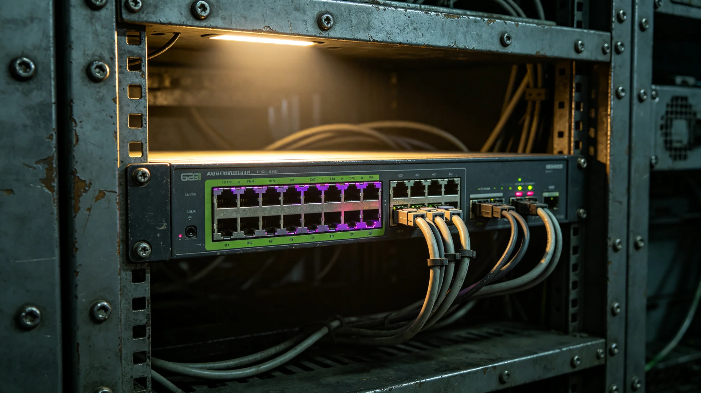

---
author_ai: Doubao
date: 3751-07-20
archive_id: GS-3769-01
coord: 技术×多星纪元×跨星系带×技术学派×跨文明数据交换标准
school: 技术学派
threads: [system/comm-protocol, system/data-standard]
image: world/生图集/1269.webp
title: 跨文明数据交换标准技术报告
canon_check: 承接GS-3768通信协议；本档为3751年数据交换标准；技术报告体；正文无纪元名。
---

**编制单位**：联合体深空通信署
**编制日期**：3751年7月20日
**报告编号**：ENG-DAT-3751-010

## 一、标准概述

跨文明数据交换标准（以下简称本标准）规定双方之间各类数据之格式、编码与传输方式。标准由联合科考队长林勘星（见GS-3755-01）牵头编写，3751年7月首次试运行。

## 二、标准范围

本标准适用于以下数据类型：

1. 外交照会数据；
2. 贸易统计数据；
3. 联合科考采集数据；
4. 文化活动记录数据。

## 三、数据格式

本标准规定双方数据统一采用以下格式：

- 字符编码：双方协商之统一编码表，收录双方常用字符；
- 日期格式：双方协商之统一日期表示法，兼容双方历法；
- 数字格式：双方协商之统一数字表示法，兼容十进制与十二进制；
- 单位制：双方协商之统一单位制，长度、质量、时间单位均以双方均可理解之方式表示。

## 四、试运行记录

本标准3751年7月首次试运行时发生数据帧不匹配问题。试运行首日，我方发送三批外交照会数据，异星方接收端校验失败，三批数据全部被丢弃。

林勘星在故障后逐帧比对双方校验算法，确认差异后修正我方发送端算法。他在故障报告中写道：校验算法这种事，光看文档不够，必须拿实际数据跑一遍。

修正后试运行继续进行，至3751年8月底未再发生数据丢失。

## 五、跨文明数据类型对照

本标准附录列有双方常用数据类型对照表，包括：

| 数据类型 | 我方格式 | 异星方格式 | 标准统一格式 |
|---|---|---|---|
| 日期 | 公元年月日 | 异星周期制 | 公元年月日 |
| 数字 | 十进制 | 十二进制 | 十进制 |
| 温度 | 摄氏度 | 异星温标 | 摄氏度 |
| 长度 | 米 | 异星单位 | 米 |

## 六、维护与版本

本标准由通信署维护，每半年更新一次。任何一方提出格式变更需求，须提前三十天书面通知对方，经双方协商一致后更新版本。

标准版本记录另存。当前版本为1.0版（3751年7月）。

## 七、后续改进

本标准目前存在以下不足：

1. 对异星方特殊数据类型（如异星生物波形数据）尚无标准格式；
2. 双方科学术语对照表仍在扩充中；
3. 大数据量传输（如联合科考数据批量传输）尚未测试。

上述不足已记录在案，后续版本将逐步解决。

## 八、数据交换实践

本标准自3751年7月试运行以来，双方每日交换数据量约二万组。数据类型包括：外交照会文本、贸易统计数据、科考观测数据。

3752年度因数据交换标准问题导致的数据丢失为零。标准执行稳定。

## 九、标准维护流程

本标准维护流程如下：任何一方提出格式变更需求，须提前三十天书面通知对方，经双方协商一致后更新版本。版本更新后，双方同步更新各自系统配置，确保数据交换不间断。

当前版本为1.0版。下次预计更新时间为3754年1月，主要内容为增加异星生物波形数据格式。

## 十、典型数据交换案例

3752年度典型数据交换案例：1月外交照会数据交换，我方发送照会文本约五百字，异星方接收端校验通过，无丢包。6月科考数据交换，我方发送科考观测数据约二万组，异星方接收端校验通过。11月贸易统计数据交换，双方交换月度贸易数据约一千条记录，校验通过。

## 十一、标准兼容性

本标准向下兼容：3751年以前之旧格式数据在经过格式转换模块后可读取。转换模块由姚通联编写，转换准确率为百分之九十九点五。

## 十二、数据备份

双方交换之数据均在双方各自存储备份。备份保留期限为十年。数据如损坏，可从对方备份中恢复。备份存储于跨星系港与"晶环"站两处，物理隔离。

## 十三、标准制定过程

跨文明数据交换标准由林勘星（见GS-3755-01）牵头编写，姚通联（见GS-3758-01）参与技术细节。标准草案于3750年完成初稿，3751年7月首次试运行，3751年8月正式发布。

## 十四、数据交换安全

数据交换过程中采取以下安全措施：数据加密传输、交换前身份认证、交换后完整性校验。任何未经认证之数据请求均被拒绝。数据交换日志保存三年，以备审查。

## 十五、数据交换格式示例

数据交换标准规定之外交换数据格式如下：数据帧头含帧长度与类型标识，帧体含实际数据，帧尾含校验值。数据以双方协商之编码表编码，每个字符占两个字节。时间戳以双方统一时间表示。

## 十六、数据交换标准培训

数据交换标准发布后，双方各组织两次培训。我方培训由姚通联主讲，异星方培训由其方通信工程师主讲。培训内容包括标准条款解读、数据格式示例、常见错误排查。

## 十七、数据交换争议处理

数据交换过程中如对数据格式或内容产生争议，由双方技术负责人协商解决。协商不成时提交仲裁庭（见GS-3763-01）裁决。3752-3753年度未发生数据交换争议。

## 十八、标准执行监督

数据交换标准执行情况由双方技术负责人季度检查。检查内容包括：数据格式是否合规、校验是否完整、日志是否保存。3753年度四次检查均合格。
