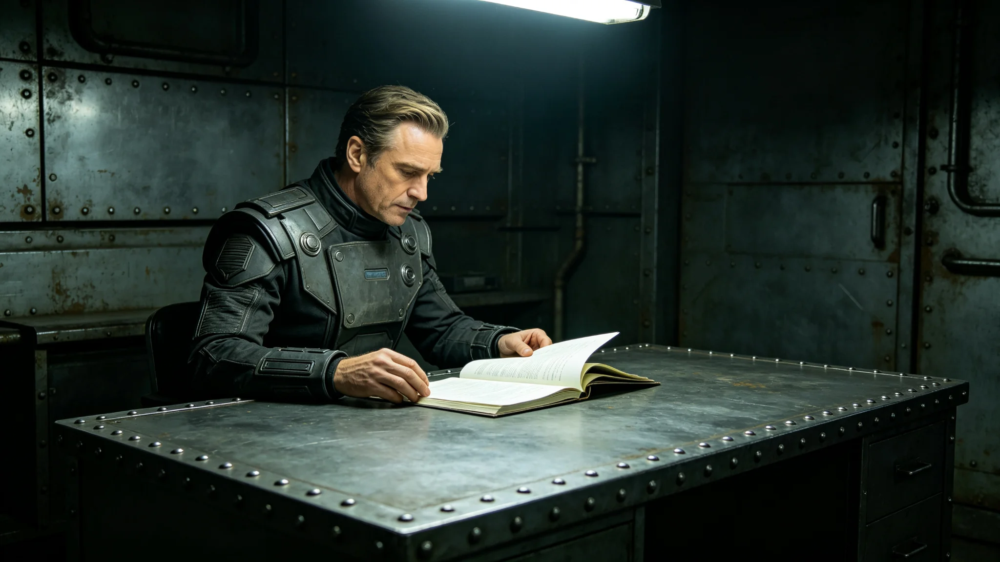

**发布单位**：联合体深空外交署
**发布日期**：3750年4月8日
**通报编号**：DIP-INC-3750-014

## 一、事件概要

3750年4月2日，我方驻"晶环"站使馆翻译系统将异星方一份照会中"暂缓审议"误译为"拒绝审议"。大使沈远谟（见GS-3751-01）据此误译文本向异星方提出正式质询，异星方大为惊讶，称从未发出拒绝照会。事件持续四十八小时后澄清。

## 二、事件经过

3750年4月2日上午九时，异星方执政团通过外交加密通信线路（见GS-3768-01）发来一份照会，内容为关于跨文明贸易协定某项条款之审议意见。

翻译系统自动翻译生成初稿后，翻译官苏译川（见GS-3752-01）当日未做人工复核即提交大使沈远谟。沈远谟阅后认为异星方拒绝审议该条款，于当日下午三时向异星方执政团提出正式质询照会。

异星方收到质询照会后立即回复，表示从未发出拒绝照会，其方原文为"暂缓审议"。双方核对原文后发现，翻译系统将"暂缓"误译为"拒绝"。

## 三、误译原因

误译原因为翻译系统对异星方某一词汇之翻译错误。该词汇在异星方文字中兼有"暂缓"与"拒绝"两种含义，具体含义取决于上下文。翻译系统自动选取了"拒绝"义项，未标注存疑。

苏译川在系统译稿出来后未做人工复核，直接提交大使。此为事件直接原因。

## 四、处置过程

事件发生后，沈远谟于4月3日上午与异星方执政团首席代表紧急会晤，当面澄清误会。沈远谟在会晤中说明：误译系我方翻译系统故障所致，非我方有意拒绝。异星方首席代表表示理解，称此系技术问题，非外交事件。

4月4日，沈远谟向异星方提交书面说明，正式承认误译并道歉。异星方接受说明，事件结束。

## 五、责任认定

事件责任认定如下：

1. 翻译系统对多义词汇未标注存疑，负技术责任；
2. 苏译川未做人工复核即提交译稿，负业务责任；
3. 沈远谟作为使馆最高负责人，负领导责任。

苏译川签认事故责任，被扣当月绩效两成。沈远谟被扣当月绩效一成。翻译系统维护员姚通联（见GS-3758-01）未受处分，但在维护清单中增加未收录术语标注功能检查项。

## 六、整改措施

事件后采取以下整改措施：

1. 翻译系统增设未收录术语自动标注功能，多义词汇一律标注存疑，不自动选取义项；
2. 译稿提交前增设双人复核环节，苏译川复核后另由一名翻译员复核；
3. 沈远谟在收到译稿后增加一道与异星方确认环节。

整改措施自3750年4月10日起执行，此后未再发生同类事件。

## 七、事件影响

本次事件未导致外交降级或贸易中断。异星方对我方处置表示满意，认为我方反应及时、态度诚恳。事件后双方同意在翻译复核流程上加强协作，建立双方翻译每周非正式交流机制（见GS-3752-01关联）。

## 八、事件后翻译组整改详情

事件后，苏译川（见GS-3752-01）主持翻译组整改。整改内容包括：翻译系统未收录术语标注功能上线、译稿双人复核制度建立、沈远谟收到译稿后与异星方确认环节增设。

整改措施自3750年4月10日起执行。苏译川在整改完成后向沈远谟提交书面报告，确认整改到位。沈远谟在报告上签批：知道了，以后照此办理。

## 九、异星方反应

异星方执政团首席代表在事件后通过翻译表示：理解这是技术问题，非我方有意为之。异星方未提出正式抗议或要求赔偿。事件在四十八小时内澄清，未影响双方日常外交往来。

## 十、事件教训

本次事件教训：自动化翻译系统不能替代人工复核。技术越自动化，人工复核越重要。苏译川在事后笔记中写：系统帮人翻话，但签字的是人。出了事，系统不负责，人负责。

## 十一、事件后续影响

事件后，苏译川（见GS-3752-01）在翻译组内部通报中写道：系统帮人翻话，但签字的是人。出了事，系统不负责，人负责。此通报分发给翻译组全体人员签字确认。

事件后双方翻译建立每周非正式交流机制，讨论翻译中遇到之疑难术语。此机制自3750年5月起执行，至今未中断。

## 十二、事件时间线

4月2日上午九时系统自动翻译生成初稿；十时苏译川未复核提交沈远谟；下午三时沈远谟发出质询照会；4月3日上午异星方回复称从未拒绝；下午沈远谟紧急会晤澄清；4月4日书面道歉；事件结束。

## 十三、事件结案报告

本事件于3750年4月8日正式结案。结案报告由苏译川撰写，经沈远谟签批后报外交署备案。结案报告结论：事件系技术故障与人工复核缺失共同导致，非人为故意。整改措施已落实，类似事件不会再发生。

## 十四、事件影响范围评估

本次事件影响范围有限：仅涉及一份照会之翻译错误，未影响其他外交文件。事件澄清后，双方外交往来恢复正常。事件后双方翻译加强协作，未再发生类似事件。

## 附注

本通报下发后，翻译系统全部回退至人工复核模式，为期两周。两周内所有外交场合的翻译均由人类翻译官现场把关，系统仅作参考。事件责任认定完成后，涉事翻译员调离一线岗位，转任后台校对。
