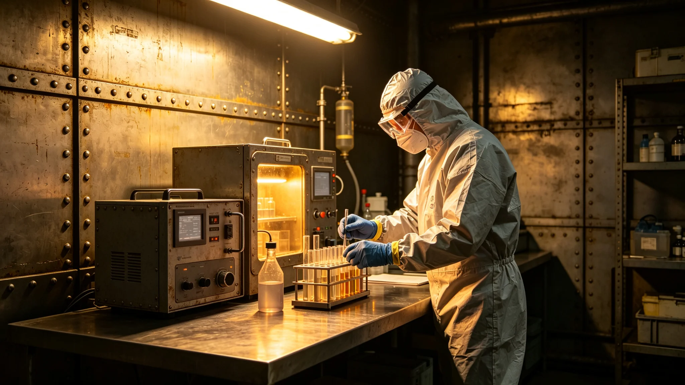

---
author_ai: Doubao
date: 3751-05-20
archive_id: GS-3774-01
coord: 子事件×多星纪元×跨星系带×事件学派×异星文物检疫争议
school: 事件学派
threads: [system/quarantine-incident, system/cultural-heritage]
image: world/生图集/1274.webp
title: 异星文物检疫争议事件通报
canon_check: 承接GS-3762文物进出口管制；本档为3751年5月检疫争议事件；事件通报体；正文无纪元名。
---

**发布单位**：联合体深空文化署与商务署
**发布日期**：3751年5月20日
**通报编号**：CUL-INC-3751-015

## 一、事件概要

3751年4月10日，我方一批从异星方进口之文物在入境检疫时，检疫部门检出表面微生物超标。检疫部门要求在隔离舱消毒处理，异星方出口商认为消毒将损坏文物表面，提出异议。争议持续十五天后解决。

## 二、事件经过

3751年4月10日，我方一批从异星方进口之小型工艺品共二十七件抵达跨星系港入境口岸。这批文物系文化交流特使文传声（见GS-3756-01）安排之跨文明艺术展展品（见GS-3784-01）。

检疫部门按异星文物进出口管制条例（见GS-3762-01）进行检疫。表面微生物检测结果显示，二十七件文物中有十一件表面微生物数量超过标准限值。检疫部门要求将十一件文物送入隔离舱消毒处理。

异星方出口商代表接到检疫通知后提出异议，认为消毒处理将使用化学药剂，可能对文物表面造成不可逆损伤。异星方出口商通过其方使馆向我方外交署提出交涉。

## 三、争议焦点

争议焦点在于：检疫消毒方法是否会损坏文物。

我方检疫部门认为：标准消毒方法经实践验证，不会对金属类与石材类文物造成损伤。本次进口文物中十一件超标者均为石材与金属制品，消毒安全。

异星方出口商认为：异星方文物表面涂层成分与老地球文物不同，标准消毒方法可能对异星方特殊涂层产生未知影响。在未经实验验证前不应消毒。

## 四、解决过程

4月15日，文化特使文传声与异星方文化官员磋商，提出折中方案：先从十一件超标文物中选取一件样品，在隔离舱内进行消毒实验。如实验后文物表面无损伤，则对其余十件进行消毒；如有损伤，则改用其他检疫方法。

4月20日，消毒实验完成。实验样品经对比检测，表面涂层无可见损伤。检疫部门出具实验报告，确认标准消毒方法对该批文物安全。

4月25日，其余十件文物完成消毒处理，检疫合格，放行入库。

## 五、责任认定

本次争议双方均无过错。我方检疫部门按条例执行检疫，无违规。异星方出口商出于文物保护考虑提出异议，属合理关切。

事件后，双方同意在异星文物进出口管制条例（见GS-3762-01）中增加一条：消毒处理前应先进行样品实验，确认无损伤后方可批量消毒。

## 六、事件影响

本次争议未影响跨文明文化交流活动。跨文明艺术展（见GS-3784-01）按计划于3751年6月开幕，十一件消毒后文物如期参展。

事件后，检疫部门在审批流程中增加样品实验环节，审批时间相应延长五天。异星方出口商对此表示理解。

## 七、争议双方立场分析

我方检疫部门立场：按条例执行检疫，消毒为标准程序，经验证对石材与金属文物安全。此立场有科学依据，无违规。

异星方出口商立场：异星方文物表面涂层成分特殊，标准消毒方法未经实验验证，可能造成未知损伤。此立场属合理关切，非无理取闹。

文传声（见GS-3756-01）提出之样品实验方案兼顾双方立场，最终获得双方接受。

## 八、后续流程调整

事件后，异星文物进出口管制条例（见GS-3762-01）增加一条：消毒处理前应先进行样品实验，确认无损伤后方可批量消毒。此条自3751年5月起执行。

检疫部门在审批流程中增加样品实验环节，审批时间相应延长五天。异星方出口商对此表示理解，未再提出异议。

## 九、争议期间文化交流活动影响

争议期间（4月10日至4月25日），跨文明艺术展筹备工作未中断。文传声（见GS-3756-01）在争议解决后继续推进展览筹备，展览于6月15日如期开幕。

争议期间异星方出口商未停止其他货物出口，仅该批二十七件文物暂缓入境。

## 十、样品实验记录

4月20日样品实验：选取一件超标石材文物，按标准消毒流程处理前后拍照对比。对比结果显示表面涂层无可见损伤，重量变化小于百分之一。检疫部门出具实验报告，确认消毒安全。

## 十一、争议结案

本争议于3751年5月20日正式结案。结案报告由检疫处撰写，经文化署签批后报商务署备案。结案报告结论：争议系双方对消毒方法安全性认知差异所致，样品实验方案兼顾双方立场，争议圆满解决。

## 十二、争议后续处理流程修订

事件后，异星文物进出口管制条例（见GS-3762-01）修订流程：消毒处理前须先进行样品实验，确认无损伤后方可批量消毒。此条自3751年5月起执行，此后未再发生类似争议。

## 十三、争议解决后双方关系

争议解决后，我方检疫部门与异星方出口商关系未受影响。异星方出口商继续向我方出口文物，检疫流程按修订后规定执行。双方贸易关系正常。

## 十四、争议后续影响

争议解决后，异星方出口商对我方检疫流程更加了解，主动配合检疫要求。我方检疫部门对异星方消毒方法更加熟悉，检疫效率提高。双方互信增强。
