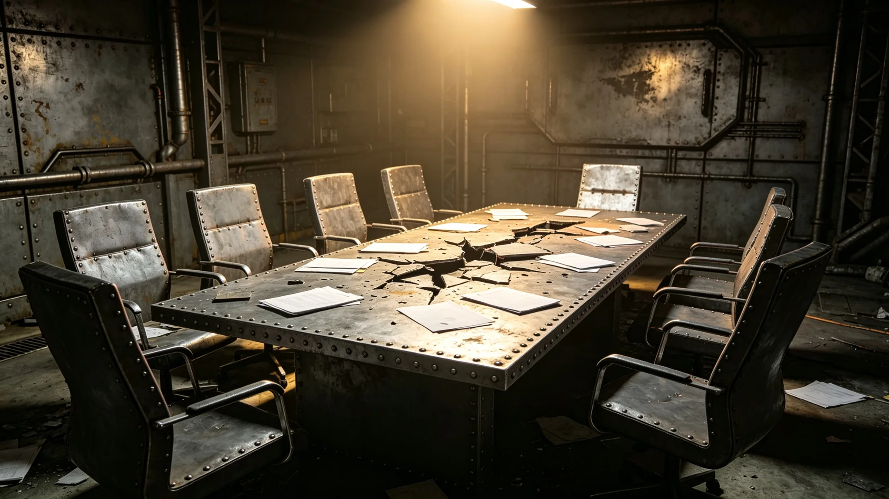

# 贸易协定谈判破裂事件通报

**发布单位**：联合体深空商务署　**通报编号**：TRD-INC-3750-016
**初报**：3750年2月28日　**续报（结案）**：3750年4月3日　**签署备案**：3751年12月
**卷宗**：初报、续报合装；会谈记录存根、往来照会存根、结案签批件附卷

兹将跨文明贸易协定谈判破裂一案汇列如后。卷内不评胜负，只存记录、照会与签批。

## 一、离席登记（"晶环"站会晤厅值班记录原行，摘录）

> 3750年2月15日　上午　第五轮　议题：异星文物进出口条款
> 我方代表：贾通商（见GS-3753-01）　异星方代表：到
> 结果：僵持未决。我方代表收拾文件离席，宣布谈判暂停。
> 记录人签名略。原行无涂改。

3750年2月15日，跨文明贸易协定谈判在异星文物进出口条款上陷入僵局。我方谈判代表贾通商与异星方代表在第三天谈判后离席，谈判破裂。此后四十二天未恢复接触，最终由文化交流特使文传声（见GS-3756-01）斡旋后重启。

## 二、争议焦点与三轮会谈记录存根（照录）

开局两造主张：

> 我方：异星文物进出口应在贸易协定正文中规定，双方互予便利，不得单方面限制。
> 异星方：异星文物系其方文化遗产，出口须经其方专家审核；我方出境文物亦须经其方审核。
> 我方批注一行：此举侵犯文物主权，拒绝接受。

三轮记录存根各一页，骑缝编号连续，会晤厅记录人签名略。

| 日期 | 轮次 | 我方提议（贾通商） | 异星方回应 |
|---|---|---|---|
| 2月13日 | 第三轮 | 改提：条款不纳入正文，另作附件 | 坚持纳入正文，且要求审核权 |
| 2月14日 | 第四轮 | 折中：条款纳入附件，不规定审核权 | 不同意；要求附件中亦须规定审核程序 |
| 2月15日 | 第五轮（上午） | 我方不可能接受将我方文物出口审核权交给异星方 | 其方文物审核权不可放弃 |

## 三、处置时刻表（初报至续报）

| 日期 | 事项 | 经手 |
|---|---|---|
| 2月15日 | 第五轮僵持，我方代表离席，宣布谈判暂停 | 贾通商 |
| 2月15日起 | 四十二天未恢复接触 | — |
| 2月28日 | 初报发出，本卷第一件 | 商务署 |
| 3月中旬 | 建议邀请文化交流特使出面斡旋 | 大使沈远谟（见GS-3751-01） |
| 3月20日 | 文传声抵达"晶环"站；其时正在跨星系港筹备跨文明文化节（见GS-3781-01） | 文传声 |
| 3月22日至25日 | 分别与贾通商、异星方文化官员会谈，22日、23日、24日各一次 | 文传声 |
| 4月1日 | 双方在斡旋下重新坐回谈判桌，同意按方案解决 | 贾通商／异星方代表 |
| 4月3日 | 谈判正式重启，本案结案 | 双方代表 |
| 3751年12月 | 贸易协定签署（见GS-3785-01） | — |

## 四、破裂期间往来照会存根（登记）

| 件 | 方向 | 数 | 事由 |
|---|---|---|---|
| 照会存根 | 沈远谟 → 异星方首席代表 | 三件 | 表达恢复谈判意愿 |
| 复信存根 | 异星方首席代表 → 沈远谟 | 两件 | 表示等待合适时机 |
| 非正式会晤 | 沈远谟 ↔ 异星方执政团联络员 | 两次 | 试图恢复谈判，未取得进展 |

五件均走外交加密通信线路（见GS-3768-01），线路日志与存根对签，回执附卷。日常沟通未中断。中断的只有谈判。

贾通商破裂期间返回我方使馆，未再与异星方代表接触。每日到商务处办公，整理已有谈判记录，等待重启时机。

## 五、斡旋方案（文传声提出，双方接受）

文物进出口条款不纳入贸易协定正文，单独制定异星文物进出口管制条例（见GS-3762-01），由双方各自立法执行；双方在条例框架下协商审核程序。

条款出正文，入条例。审核各自立法行使。我方不接受异星方审核权，异星方的文化保护关切落在其方立法里。双方均接受。

## 六、责任认定

本次谈判破裂系双方立场分歧所致，无单方面责任。贾通商在破裂期间未采取过激行为，仅按程序离席，无外交失当。

## 七、影响（计数）

| 项 | 结果 |
|---|---|
| 建交关系与建交公报执行（见GS-3759-01） | 未受影响 |
| 双方外交使团 | 正常运转，日常外交往来未中断 |
| 双方贸易活动 | 破裂期内正常进行，未因谈判中断 |
| 已签署贸易合同 | 继续执行 |
| 新合同签署 | 暂停 |
| 贸易索赔 | 无 |
| 贸易协定（见GS-3761-01）签署 | 推迟三个月 |
| 谈判暂停 | 四十二天 |

## 八、结案签批件

结案报告由贾通商撰写，经沈远谟签批后报商务署备案。结论三条：破裂系双方立场分歧所致；文传声斡旋方案有效；贸易协定后续顺利签署。谈判重启即视为结案，结案日3750年4月3日。

撰写人：贾通商。签批：沈远谟（签名略），照准。备案存根编号 TRD-INC-3750-016-续一，登记簿勾讫。

## 九、教训与笔记两则（照录）

双方同意：未来谈判避免在单一议题上过度僵持，遇僵局时及时引入第三方斡旋。此条已写入商务署谈判工作手册。

贾通商笔记两则：
> 签署仪式后：附件也是正文的一部分，换个位置放而已。
> 事后：僵局不是谈出来的，是坐出来的，换个人坐一坐就松了。

## 十、附则

本通报由联合体深空商务署编制，初报与续报合装为一卷，抄送驻异星使馆、文化交流特使办公室。三轮会谈记录存根、往来照会存根五件、结案签批件随卷归档。

（商务署注：四十二天，五件照会，一句"换个位置放而已"。条款从正文挪到附件，再挪到条例，末了两边都签了字。案卷到此为止。）
