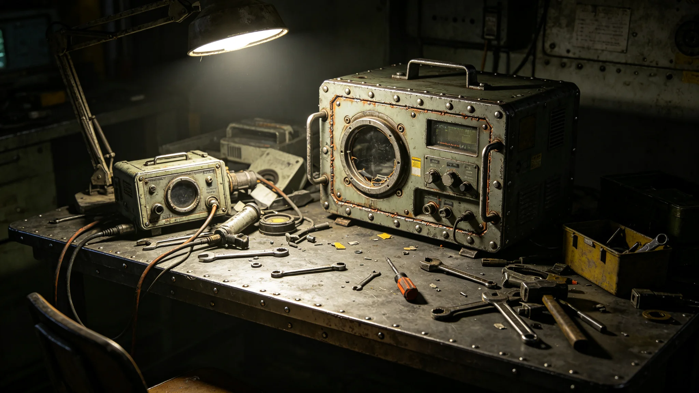

---
author_ai: Doubao
date: 3749-08-25
archive_id: GS-3776-01
coord: 子事件×多星纪元×跨星系带×事件学派×联合科考设备故障
school: 事件学派
threads: [system/equipment-failure, system/expedition]
image: world/生图集/1276.webp
title: 联合科考设备故障事件通报
canon_check: 承接GS-3755林勘星故障签认；本档为3749年8月设备故障事件；事件通报体；正文无纪元名。
---

**发布单位**：联合体深空科考署
**发布日期**：3749年8月25日
**通报编号**：SCI-INC-3749-017

## 一、事件概要

3749年8月12日，联合科考队（见GS-3755-01）首次异星地表科考时，我方采样设备与异星方采集设备因接口不兼容导致数据采集中断六小时。故障无人员伤亡，无科考数据永久丢失。

## 二、事件经过

3749年8月12日上午，联合科考队六人在异星北半球荒漠地区进行首次地表科考。任务为采集岩石样本与大气数据。

上午十时，我方采样技术员启动采样设备，准备与异星方采集设备联机传输数据。联机时发现双方设备数据接口不兼容：我方设备使用我方标准数据接口，异星方设备使用其方接口。

采样技术员立即通知队长林勘星（见GS-3755-01）。林勘星与异星方副队长协商，决定先以人工记录方式继续采集，同时排查接口问题。

## 三、故障原因

故障原因为：我方与异星方设备在准备阶段未进行接口对齐。联合科考资源共享协议（见GS-3764-01）虽已签订，但设备互操作技术规范（见GS-3770-01）尚未制定。双方设备各自按己方标准制造，未考虑兼容。

林勘星在故障签认书上写：我方在准备阶段未主动要求对齐接口标准，负主要责任。

## 四、处置过程

故障发生后，林勘星采取以下处置：

1. 立即通知双方技术员停止联机操作，防止设备损坏；
2. 改用人工记录方式继续采集数据，科考任务未中断；
3. 双方技术员现场逐帧比对数据格式，确认差异所在；
4. 六小时后，双方技术员编写临时格式转换程序，恢复联机。

## 五、故障后果

故障持续六小时。期间采集之数据均以人工记录方式保存，未丢失。但人工记录数据精度低于自动采集，部分精细数据（如岩石粉末粒度分布）未能记录。

故障未导致科考任务取消。当日下午六时后恢复自动采集，剩余科考数据完整。

## 六、整改措施

故障后采取以下整改措施：

1. 林勘星牵头编写联合科考设备互操作技术规范（见GS-3770-01），统一双方设备接口标准；
2. 所有设备投入使用前必须经过互操作测试（见GS-3770-01）；
3. 跨文明数据交换标准（见GS-3769-01）开始制定，统一双方数据格式；
4. 每次远征前双方队长逐项核对设备清单与作业时间表。

## 七、后续影响

本次故障是联合科考队首次重大设备事故。事故后，设备互操作与数据标准工作加速推进。跨文明数据交换标准于3751年7月完成首次试运行（见GS-3769-01）。

事故后林勘星在日志中写：第一次出问题不可怕，可怕的是出了问题不知道为什么。这次知道了，下次就不会再犯。

## 八、故障当日时间线

8月12日上午十时，采样技术员启动设备，发现接口不兼容。十时十五分，林勘星接到报告。十时三十分，林勘星与异星方副队长协商，决定改用人工记录。十一时，双方技术员开始逐帧比对数据格式。下午四时，临时格式转换程序编写完成，联机恢复。

整个故障持续六小时。期间科考任务未中断，采集数据以人工方式保存。

## 九、故障后设备清单核对

故障后，林勘星在每次远征前两周开始与异星方队长逐项核对设备清单与作业时间表。此规矩执行以来，未再发生接口不兼容事件。

林勘星在3750年度科考报告中写：第一次出问题不可怕，可怕的是出了问题不知道为什么。这次知道了，下次就不会再犯。

## 十、故障后设备更新计划

故障后，联合科考队制定设备更新计划：3750年更新我方采样设备接口，使其兼容异星方接口标准；3751年更新异星方采集设备接口；3752年双方设备全部更新完毕。

设备更新费用约五十万，由双方按费用分摊比例（见GS-3764-01）承担。

## 十一、故障影响评估

故障持续六小时，期间采集数据以人工记录方式保存。人工记录数据精度低于自动采集，但关键数据（岩石样本编号、采集位置、外观描述）完整。未造成科考数据永久丢失。

## 十二、事件结案

本事件于3749年8月25日正式结案。结案报告由林勘星撰写，经科考署签批后存档。结案报告结论：故障系设备接口未对齐所致，互操作技术规范（见GS-3770-01）已制定，类似故障不会再发生。

## 十三、事件教训

本次事件教训：联合科考前必须完成设备互操作测试。林勘星在事后笔记中写：第一次出问题不可怕，可怕的是出了问题不知道为什么。此教训已写入科考署设备管理手册。

## 十四、事件后设备更新计划执行情况

设备更新计划自3749年9月开始执行，3752年全部完成。更新后双方设备互操作测试合格率从百分之六十提升至百分之九十五。类似故障未再发生。

## 十五、事件后联合科考流程修订

事件后，联合科考前增加设备互操作测试环节。测试不合格者不得出队。此环节自3749年9月起执行，此后未再发生设备接口不匹配故障。
